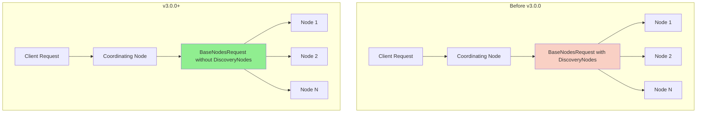

# Node Roles & Configuration

## Summary

OpenSearch v3.0.0 introduces a breaking change to the transport layer that optimizes inter-node communication by removing the `includeDiscoveryNodes` field from `BaseNodesRequest`. This change eliminates redundant discovery node information from transport requests, significantly improving performance in large clusters by reducing network traffic and serialization overhead.

## Details

### What's New in v3.0.0

This release completes the optimization work started in v2.16.0 (PR #14749 and #15131) by making the discovery nodes exclusion the default behavior for all transport node actions. Previously, this was opt-in per action; now it's mandatory for all `TransportNodesAction` requests.

### Technical Changes

#### Architecture Changes



#### API Changes

The `BaseNodesRequest` class has been simplified:

| Change | Before | After |
|--------|--------|-------|
| Constructor | `super(includeDiscoveryNodes, nodesIds)` | `super(nodesIds)` |
| `includeDiscoveryNodes` field | Present (boolean) | Removed |
| `getIncludeDiscoveryNodes()` method | Available | Removed |
| `concreteNodes` access in transport | Conditional based on flag | Always null after AsyncAction |

#### Affected Components

| Component | File | Change |
|-----------|------|--------|
| BaseNodesRequest | `server/.../BaseNodesRequest.java` | Removed `includeDiscoveryNodes` field and related constructors |
| TransportNodesAction | `server/.../TransportNodesAction.java` | Always unsets concrete nodes before transport |
| NodesStatsRequest | `server/.../NodesStatsRequest.java` | Updated constructor calls |
| NodesInfoRequest | `server/.../NodesInfoRequest.java` | Updated constructor calls |
| ClusterStatsRequest | `server/.../ClusterStatsRequest.java` | Updated constructor calls |
| NodesHotThreadsRequest | `server/.../NodesHotThreadsRequest.java` | Updated constructor calls |
| WlmStatsRequest | `server/.../WlmStatsRequest.java` | Updated constructor calls |
| Various Gateway Requests | Multiple files | Updated constructor calls |

### Migration Notes

**For Plugin Developers:**

If your plugin extends `BaseNodesRequest`, update your constructors:

```java
// Before v3.0.0
public MyNodesRequest(String... nodesIds) {
    super(false, nodesIds);  // or super(true, nodesIds)
}

// v3.0.0+
public MyNodesRequest(String... nodesIds) {
    super(nodesIds);
}
```

**Important:** The `concreteNodes` field will be `null` when accessed by transport actions. If your action requires discovery node information, handle it within your action's own request class rather than relying on `BaseNodesRequest`.

### Performance Impact

Based on testing in large clusters (1000+ nodes), this change provides significant performance improvements:

| API | Metric | Improvement |
|-----|--------|-------------|
| `_nodes/stats` | Average latency | ~86% reduction |
| `_cat/nodes` | Average latency | ~96% reduction |
| `_cluster/stats` | Average latency | ~80% reduction |
| `_nodes` | Average latency | ~58% reduction |

## Limitations

- Actions that genuinely require discovery node information must now handle this within their own request classes
- This is a breaking change for plugins that relied on the `includeDiscoveryNodes` parameter
- The `TransportNodesReloadSecureSettingsAction` previously required discovery nodes but has been updated to work without them

## Related PRs

| PR | Description |
|----|-------------|
| [#17682](https://github.com/opensearch-project/OpenSearch/pull/17682) | Unset discovery nodes for every transport node actions request |
| [#15131](https://github.com/opensearch-project/OpenSearch/pull/15131) | Reset discovery nodes in all transport node actions request (predecessor) |
| [#14749](https://github.com/opensearch-project/OpenSearch/pull/14749) | Optimise TransportNodesAction to not send DiscoveryNodes (initial optimization) |

## References

- [Issue #17008](https://github.com/opensearch-project/OpenSearch/issues/17008): Feature request for unsetting discoveryNodes from BaseNodeRequest
- [Issue #14713](https://github.com/opensearch-project/OpenSearch/issues/14713): Original performance issue
- [Nodes APIs Documentation](https://docs.opensearch.org/3.0/api-reference/nodes-apis/index/): Official API documentation

## Related Feature Report

- [Full feature documentation](../../../features/opensearch/transport-nodes-action-optimization.md)
