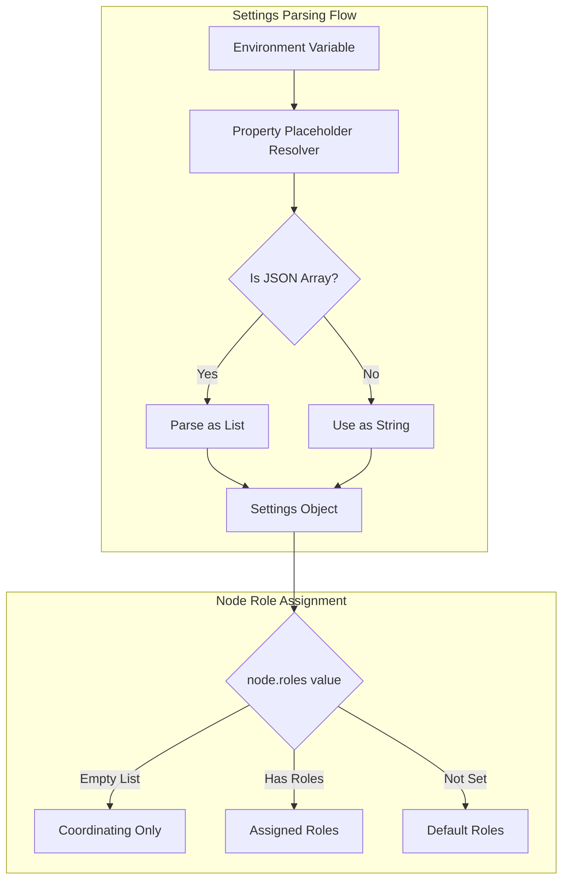

---
tags:
  - domain/core
  - component/server
  - search
---
# Node Roles & Configuration

## Summary

OpenSearch v3.0.0 introduces a breaking change that fixes how list settings (like `node.roles`) are parsed from environment variables. Previously, passing an empty array `[]` via environment variables would fail with an "unknown role" error. This fix enables proper configuration of coordinating-only nodes through environment variables, which is essential for containerized deployments.

## Details

### What's New in v3.0.0

The settings parser now correctly interprets JSON array syntax (`[]`, `["a", "b"]`) when passed through environment variables. This is particularly important for the `node.roles` setting, which requires an empty array to create a dedicated coordinating node.

### Technical Changes

#### Problem Solved

Before this fix, setting `node.roles` via environment variables was problematic:

```bash
# These would fail before v3.0.0
docker run -e 'node.roles=[]' opensearchproject/opensearch:2.x
# Error: unknown role [[]]

docker run -e 'node.roles=' opensearchproject/opensearch:2.x
# Would assign all default roles instead of empty
```

#### Architecture Changes



#### Code Changes

The fix modifies `Settings.java` to parse placeholder values as JSON arrays:

```java
// New method in Settings.Builder
private static Optional<List<String>> tryParseableStringToList(String parsableString) {
    try (XContentParser xContentParser = MediaTypeRegistry.JSON.xContent()
            .createParser(NamedXContentRegistry.EMPTY, 
                         DeprecationHandler.THROW_UNSUPPORTED_OPERATION, 
                         parsableString)) {
        XContentParser.Token token = xContentParser.nextToken();
        if (token != XContentParser.Token.START_ARRAY) {
            return Optional.empty();
        }
        ArrayList<String> list = new ArrayList<>();
        while ((token = xContentParser.nextToken()) != XContentParser.Token.END_ARRAY) {
            if (token != XContentParser.Token.VALUE_STRING) {
                return Optional.empty();
            }
            list.add(xContentParser.text());
        }
        return Optional.of(list);
    } catch (IOException e) {
        return Optional.empty();
    }
}
```

#### New Configuration Options

| Setting | Environment Variable | Example | Result |
|---------|---------------------|---------|--------|
| `node.roles: []` | `node.roles=[]` | Coordinating only | No data, ingest, or cluster_manager roles |
| `node.roles: ["data"]` | `node.roles=["data"]` | Data node only | Only data role assigned |
| `node.roles: ["data", "ingest"]` | `node.roles=["data", "ingest"]` | Data + Ingest | Both roles assigned |

### Available Node Roles

| Role | Description |
|------|-------------|
| `cluster_manager` | Manages cluster state, creates/deletes indexes, tracks nodes |
| `data` | Stores and searches data, performs indexing and aggregations |
| `ingest` | Pre-processes data before storing using ingest pipelines |
| `search` | Dedicated to search operations (introduced in v2.4.0) |
| `remote_cluster_client` | Connects to remote clusters for cross-cluster operations |
| `ml` | Runs machine learning tasks |
| `coordinating_only` | Set `node.roles: []` - routes requests, aggregates results |

### Usage Example

```yaml
# opensearch.yml - Coordinating node
node.name: coordinating-node-1
node.roles: []

# Or via environment variable
# docker run -e 'node.roles=[]' opensearchproject/opensearch:3.0.0
```

```yaml
# opensearch.yml - Dedicated data node
node.name: data-node-1
node.roles: [ data ]

# Or via environment variable
# docker run -e 'node.roles=["data"]' opensearchproject/opensearch:3.0.0
```

### Migration Notes

**For Docker/Kubernetes Deployments:**

You can now properly configure coordinating-only nodes using environment variables:

```bash
# Before v3.0.0 - Required opensearch.yml modification
# v3.0.0+ - Works with environment variables
docker run -e 'node.roles=[]' opensearchproject/opensearch:3.0.0
```

**Breaking Change Notice:**

This is marked as a breaking change because the behavior of parsing `[]` from environment variables has changed. Previously it would fail; now it correctly creates an empty list.

## Limitations

- The JSON array syntax must be valid JSON (e.g., `["a", "b"]` not `[a, b]`)
- Whitespace within the array is handled, but the outer brackets are required
- This fix applies to all list settings, not just `node.roles`

## References

### Documentation
- [Configuration and System Settings](https://docs.opensearch.org/3.0/install-and-configure/configuring-opensearch/configuration-system/): Official documentation
- [Creating a Cluster](https://docs.opensearch.org/3.0/tuning-your-cluster/): Node roles and cluster configuration guide

### Pull Requests
| PR | Description |
|----|-------------|
| [#10625](https://github.com/opensearch-project/OpenSearch/pull/10625) | Treat Setting value with empty array string as empty array |

### Issues (Design / RFC)
- [Issue #3412](https://github.com/opensearch-project/OpenSearch/issues/3412): Bug report for empty node.roles environment variable

## Related Feature Report

- Full feature documentation
