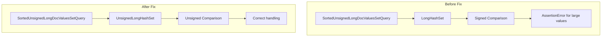

---
tags:
  - performance
---

# Numeric Types

## Summary

This release fixes a critical bug in the handling of unsigned long values in `LongHashSet`, which caused assertion errors when performing terms queries on `unsigned_long` fields with values exceeding the signed long range. The fix introduces a new `UnsignedLongHashSet` class that correctly handles unsigned comparisons.

## Details

### What's New in v3.0.0

A bug was discovered where the `LongHashSet` class used signed comparison (`value >= previousValue`) to validate sorted order, which fails for unsigned long values. When querying `unsigned_long` fields with values greater than `Long.MAX_VALUE` (9223372036854775807), the assertion would fail with "values must be provided in sorted order" error.

### Technical Changes

#### Problem

The original `LongHashSet.java` used signed long comparison:
```java
assert value >= previousValue : "values must be provided in sorted order";
```

This fails for unsigned long values because Java's `long` type is signed. For example:
- `9223372036854775814` (unsigned) is stored as a negative signed value
- When sorted as signed values, these appear out of order

#### Solution

A new `UnsignedLongHashSet` class was created that uses `Long.compareUnsigned()` for proper unsigned comparison:

```java
assert Long.compareUnsigned(value, previousValue) >= 0 : "values must be provided in sorted order";
```

#### New Components

| Component | Description |
|-----------|-------------|
| `UnsignedLongHashSet` | Hash set optimized for unsigned long doc values with proper unsigned comparison |
| `DocValuesUnsignedLongHashSetTests` | Test suite for the new hash set implementation |

#### Architecture Changes



### Usage Example

The fix is transparent to users. Terms queries on `unsigned_long` fields now work correctly:

```json
PUT test_index
{
  "mappings": {
    "properties": {
      "stat": {
        "type": "unsigned_long"
      }
    }
  }
}

POST test_index/_search
{
  "query": {
    "terms": {
      "stat": [
        "9223372036854775814",
        "9223372036854775812",
        "1"
      ]
    }
  }
}
```

### Migration Notes

No migration required. This is a bug fix that makes `unsigned_long` fields work as expected.

## Limitations

- The `unsigned_long` field type still cannot be used as an index sort field
- Aggregations across mixed numeric types with `unsigned_long` may lose precision due to `double` conversion

## References

### Documentation
- [Unsigned Long Documentation](https://docs.opensearch.org/3.0/field-types/supported-field-types/unsigned-long/): Official docs for unsigned_long field type

### Pull Requests
| PR | Description |
|----|-------------|
| [#17207](https://github.com/opensearch-project/OpenSearch/pull/17207) | Fix Bug - Handle unsigned long in sorting order assertion of LongHashSet |

### Issues (Design / RFC)
- [Issue #17206](https://github.com/opensearch-project/OpenSearch/issues/17206): Bug report - Sorted Order Assertion in LongHashSet.java is incorrect

## Related Feature Report

- [Full feature documentation](../../../features/opensearch/unsigned-long.md)
