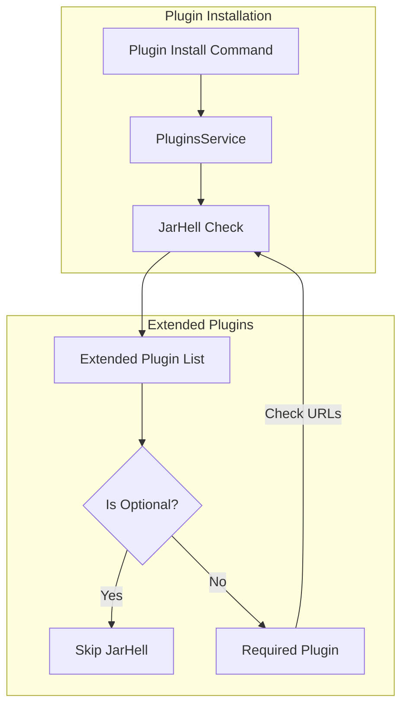

---
tags:
  - security
---

# Plugin System

## Summary

OpenSearch v3.0.0 relaxes the jarHell check for optionally extended plugins, enabling plugins to declare optional dependencies on other plugins without encountering jar conflicts. This change unblocks the Resource Sharing & Access Control framework where plugins need to optionally extend `opensearch-security` for resource-level access control.

## Details

### What's New in v3.0.0

The jarHell check in `PluginsService.checkBundleJarHell()` now skips validation for plugins marked as optional dependencies. Previously, even optional extended plugins were checked for jar conflicts, causing installation failures when plugins shared common transitive dependencies.

### Technical Changes

#### Architecture Changes



#### Code Change

The change modifies `PluginsService.checkBundleJarHell()`:

```java
// Before v3.0.0
if (pluginUrls == null && bundle.plugin.isExtendedPluginOptional(extendedPlugin)) {
    continue;
}

// After v3.0.0
if (bundle.plugin.isExtendedPluginOptional(extendedPlugin)) {
    continue;
}
```

This removes the `pluginUrls == null` condition, allowing the jarHell check to be skipped for all optional extended plugins regardless of whether they are installed.

#### New Components

| Component | Description |
|-----------|-------------|
| `PluginInfo.isExtendedPluginOptional()` | Method to check if an extended plugin is marked as optional |

### Usage Example

Plugins can declare optional dependencies in `plugin-descriptor.properties`:

```properties
name=my-plugin
description=Plugin with optional security integration
version=3.0.0
opensearch.version=3.0.0
java.version=21
classname=org.example.MyPlugin
extended.plugins=opensearch-security
optional.plugins=opensearch-security
```

When `opensearch-security` is listed in both `extended.plugins` and `optional.plugins`, the jarHell check is skipped for that dependency, allowing installation even if both plugins share common JAR files.

### Migration Notes

No migration required. This is a backward-compatible change that relaxes validation rules.

## Limitations

- The jarHell check is only skipped for plugins explicitly marked as optional
- Plugins must still ensure runtime compatibility when optional dependencies are not installed
- Some features may not function without the optional dependencies being installed (a warning is logged)

## References

### Documentation
- [Documentation: Installing plugins](https://docs.opensearch.org/3.0/install-and-configure/plugins/): Official plugin installation guide
- [PR #5240](https://github.com/opensearch-project/security/pull/5240): Security plugin changes for resource access control

### Pull Requests
| PR | Description |
|----|-------------|
| [#17893](https://github.com/opensearch-project/OpenSearch/pull/17893) | Relaxes jarHell check for optionally extended plugins |

### Issues (Design / RFC)
- [Issue #4500](https://github.com/opensearch-project/security/issues/4500): Resource Permissions and Sharing - the feature that required this change

## Related Feature Report

- [Plugin Dependencies](../../../features/opensearch/plugin-dependencies.md)
