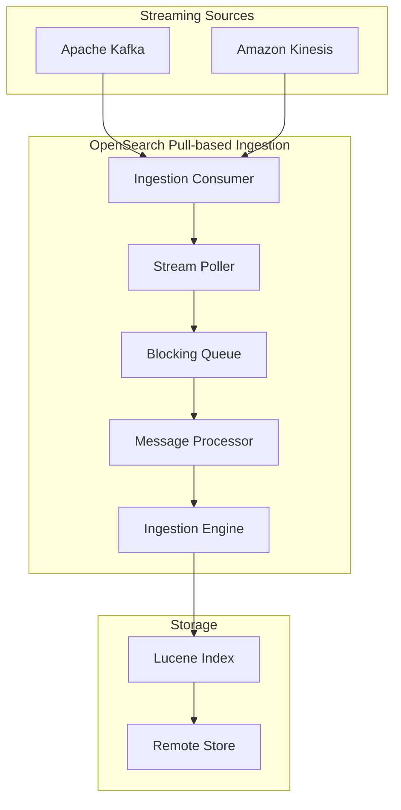

# Pull-based Ingestion

## Summary

Pull-based ingestion is a new experimental feature in OpenSearch 3.0.0 that enables OpenSearch to ingest data directly from streaming sources like Apache Kafka and Amazon Kinesis. Instead of clients pushing data via REST APIs, OpenSearch pulls data from streams, providing exactly-once ingestion semantics and native backpressure handling.

## Details

### What's New in v3.0.0

OpenSearch 3.0.0 introduces the foundational pull-based ingestion framework with:

- Core ingestion engine and APIs
- Kafka plugin (`ingestion-kafka`)
- Kinesis plugin (`ingestion-kinesis`)
- Offset management with rewind support
- Error handling strategies (DROP and BLOCK)
- Ingestion management APIs (pause, resume, get state)
- Update and delete operations support
- External versioning support
- Multi-threaded writer support
- Configurable poll settings

### Technical Changes

#### Architecture



#### New Components

| Component | Description |
|-----------|-------------|
| `IngestionEngine` | Specialized engine for pull-based ingestion, manages stream poller lifecycle |
| `DefaultStreamPoller` | Polls messages from streaming source, handles pause/resume |
| `MessageProcessorRunnable` | Processes messages from internal queue with configurable threads |
| `IngestionShardConsumer` | Interface for source-specific consumers (Kafka, Kinesis) |
| `ingestion-kafka` plugin | Kafka consumer implementation |
| `ingestion-kinesis` plugin | Kinesis consumer implementation |

#### New Configuration

| Setting | Description | Default |
|---------|-------------|---------|
| `ingestion_source.type` | Streaming source type (`kafka` or `kinesis`) | Required |
| `ingestion_source.pointer.init.reset` | Initial position (`earliest`, `latest`, `rewind_by_offset`, `rewind_by_timestamp`) | `earliest` |
| `ingestion_source.pointer.init.reset.value` | Value for offset/timestamp rewind | Required for rewind modes |
| `ingestion_source.error_strategy` | Error handling (`DROP` or `BLOCK`) | `DROP` |
| `ingestion_source.max_batch_size` | Maximum records per poll | - |
| `ingestion_source.poll.timeout` | Poll timeout | - |
| `ingestion_source.num_processor_threads` | Number of processor threads | 1 |
| `ingestion_source.param.topic` | Kafka topic name | Required for Kafka |
| `ingestion_source.param.bootstrap_servers` | Kafka bootstrap servers | Required for Kafka |
| `ingestion_source.param.stream` | Kinesis stream name | Required for Kinesis |
| `ingestion_source.param.region` | AWS region | Required for Kinesis |

#### API Changes

**Create Index with Pull-based Ingestion**
```json
PUT /my-index
{
  "settings": {
    "ingestion_source": {
      "type": "kafka",
      "pointer.init.reset": "earliest",
      "param": {
        "topic": "test",
        "bootstrap_servers": "localhost:9092"
      }
    },
    "index.number_of_shards": 1,
    "index.replication.type": "SEGMENT"
  }
}
```

**Pause Ingestion**
```
POST /<index>/ingestion/_pause
```

**Resume Ingestion**
```
POST /<index>/ingestion/_resume
```

**Get Ingestion State**
```
GET /<index>/ingestion/_state
```

### Usage Example

```json
PUT /logs-kafka
{
  "settings": {
    "ingestion_source": {
      "type": "kafka",
      "pointer.init.reset": "earliest",
      "error_strategy": "DROP",
      "num_processor_threads": 2,
      "param": {
        "topic": "application-logs",
        "bootstrap_servers": "kafka:9092"
      }
    },
    "index.number_of_shards": 3,
    "index.number_of_replicas": 1,
    "index.replication.type": "SEGMENT"
  },
  "mappings": {
    "properties": {
      "timestamp": { "type": "date" },
      "message": { "type": "text" },
      "level": { "type": "keyword" }
    }
  }
}
```

**Message Format**
```json
{"_id":"1", "_source":{"timestamp":"2025-01-01T00:00:00Z", "message":"Log entry", "level":"INFO"}}
{"_id":"2", "_version":"1", "_source":{"timestamp":"2025-01-01T00:00:01Z", "message":"Another entry", "level":"WARN"}, "_op_type":"index"}
{"_id":"1", "_version":"2", "_op_type":"delete"}
```

### Migration Notes

Pull-based ingestion is an experimental feature in v3.0.0. To use it:

1. Install the appropriate ingestion plugin:
   ```bash
   bin/opensearch-plugin install ingestion-kafka
   # or
   bin/opensearch-plugin install ingestion-kinesis
   ```

2. Enable segment replication with remote-backed storage (required)

3. Create indexes with `ingestion_source` settings - existing indexes cannot be converted

## Limitations

- Experimental feature - not recommended for production
- Requires segment replication with remote-backed storage
- Cannot convert existing push-based indexes to pull-based
- Index shards must be >= stream partitions
- Traditional REST API ingestion disabled for pull-based indexes
- Partial upserts not supported

## References

### Documentation
- [Documentation](https://docs.opensearch.org/3.0/api-reference/document-apis/pull-based-ingestion/): Pull-based ingestion
- [Documentation](https://docs.opensearch.org/3.0/api-reference/document-apis/pull-based-ingestion-management/): Pull-based ingestion management

### Pull Requests
| PR | Description |
|----|-------------|
| [#16958](https://github.com/opensearch-project/OpenSearch/pull/16958) | Core pull-based ingestion engine, APIs, and Kafka plugin |
| [#17354](https://github.com/opensearch-project/OpenSearch/pull/17354) | Offset management with rewind by offset/timestamp support |
| [#17427](https://github.com/opensearch-project/OpenSearch/pull/17427) | Error handling strategies (DROP and BLOCK) |
| [#17615](https://github.com/opensearch-project/OpenSearch/pull/17615) | Kinesis plugin support |
| [#17631](https://github.com/opensearch-project/OpenSearch/pull/17631) | Ingestion management APIs (pause, resume, get state) |
| [#17768](https://github.com/opensearch-project/OpenSearch/pull/17768) | Disable index API for ingestion engine |
| [#17822](https://github.com/opensearch-project/OpenSearch/pull/17822) | Update and delete support |
| [#17863](https://github.com/opensearch-project/OpenSearch/pull/17863) | Configurable maxPollSize and pollTimeout |
| [#17918](https://github.com/opensearch-project/OpenSearch/pull/17918) | External versioning support |
| [#17912](https://github.com/opensearch-project/OpenSearch/pull/17912) | Multi-threaded writer support |

### Issues (Design / RFC)
- [Issue #16495](https://github.com/opensearch-project/OpenSearch/issues/16495): RFC - Streaming ingestion (pull based)
- [Issue #16929](https://github.com/opensearch-project/OpenSearch/issues/16929): Pull-based ingestion tracking issue

## Related Feature Report

- [Full feature documentation](../../../features/opensearch/pull-based-ingestion.md)
