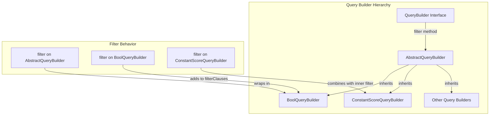

---
tags:
  - search
---

# Query Builders

## Summary

OpenSearch 3.0.0 introduces a new `filter()` method to the Query Builder API, enabling developers to programmatically combine filters with query builders in a fluent, chainable manner. This enhancement simplifies query construction by providing a unified approach to adding filter clauses across different query builder types.

## Details

### What's New in v3.0.0

The PR adds a `filter()` method to the `QueryBuilder` interface and implements it in:
- `AbstractQueryBuilder` - Base implementation that wraps the query in a `BoolQueryBuilder`
- `BoolQueryBuilder` - Adds filter directly to existing filter clauses
- `ConstantScoreQueryBuilder` - Combines filter with the inner filter builder

### Technical Changes

#### Architecture Changes



#### New API Methods

| Class | Method | Behavior |
|-------|--------|----------|
| `QueryBuilder` | `filter(QueryBuilder filter)` | Interface method for combining filters |
| `AbstractQueryBuilder` | `filter(QueryBuilder filter)` | Wraps query in `BoolQueryBuilder` with `must` + `filter` |
| `AbstractQueryBuilder` | `validateFilterParams(QueryBuilder filter)` | Static validation helper |
| `BoolQueryBuilder` | `filter(QueryBuilder filter)` | Adds filter to existing `filterClauses` list |
| `ConstantScoreQueryBuilder` | `filter(QueryBuilder filter)` | Combines filter with inner filter builder |

#### Behavior Changes

| Query Builder Type | Previous Behavior | New Behavior |
|-------------------|-------------------|--------------|
| `BoolQueryBuilder.filter(null)` | Throws `IllegalArgumentException` | Returns `this` unchanged |
| Any `QueryBuilder.filter(filter)` | Not available | Returns query with filter combined |

### Usage Example

```java
// Before: Manual bool query construction
BoolQueryBuilder boolQuery = new BoolQueryBuilder();
boolQuery.must(QueryBuilders.matchQuery("title", "opensearch"));
boolQuery.filter(QueryBuilders.termQuery("status", "published"));

// After: Fluent filter chaining
QueryBuilder query = QueryBuilders.matchQuery("title", "opensearch")
    .filter(QueryBuilders.termQuery("status", "published"));
```

For `BoolQueryBuilder`, filters are added directly:

```java
BoolQueryBuilder boolQuery = new BoolQueryBuilder()
    .must(QueryBuilders.matchQuery("title", "opensearch"))
    .filter(QueryBuilders.termQuery("status", "published"))
    .filter(QueryBuilders.rangeQuery("date").gte("2024-01-01"));
```

For `ConstantScoreQueryBuilder`:

```java
ConstantScoreQueryBuilder csQuery = new ConstantScoreQueryBuilder(
    QueryBuilders.termQuery("category", "tech")
).filter(QueryBuilders.termQuery("active", true));
```

### Migration Notes

- The `BoolQueryBuilder.filter(null)` behavior has changed from throwing an exception to returning `this` unchanged
- Existing code using `BoolQueryBuilder.filter()` will continue to work
- The new `filter()` method on other query builders provides a convenient alternative to manual `BoolQueryBuilder` wrapping

## Limitations

- `SpanGapQueryBuilder` throws `UnsupportedOperationException` when `filter()` is called, as span queries don't support filtering
- The `filter()` method returns a new `BoolQueryBuilder` for most query types, which may affect reference equality checks

## References

### Documentation
- [Query and filter context](https://docs.opensearch.org/3.0/query-dsl/query-filter-context/): Official documentation on query vs filter context
- [Boolean query](https://docs.opensearch.org/3.0/query-dsl/compound/bool/): Boolean query documentation

### Pull Requests
| PR | Description |
|----|-------------|
| [#17409](https://github.com/opensearch-project/OpenSearch/pull/17409) | Add filter function for AbstractQueryBuilder, BoolQueryBuilder, ConstantScoreQueryBuilder |

## Related Feature Report

- [Full feature documentation](../../../features/opensearch/query-builders.md)
