---
tags:
  - domain/core
  - component/server
  - performance
  - search
---
# Query Performance Optimizations

## Summary

OpenSearch 3.0.0 introduces several query performance optimizations that significantly improve search latency and aggregation performance. Key improvements include faster `terms_query` execution by avoiding redundant sorting, approximate `match_all` queries with sort optimization, extended filter rewrite optimization for sub-aggregations, and disabled scoring for keyword term searches by default.

## Details

### What's New in v3.0.0

This release bundles four distinct performance optimizations:

1. **Faster terms_query with pre-sorted terms** - Avoids re-sorting when terms are already in order
2. **ApproximateMatchAllQuery** - Short-circuits match_all queries with sorts after collecting sufficient documents
3. **Sub-aggregation support in filter rewrite** - Extends filter rewrite optimization to work with nested aggregations
4. **Disabled keyword term scoring** - Eliminates unnecessary BM25 scoring overhead for keyword field searches

### Technical Changes

#### Architecture Changes

```mermaid
graph TB
    subgraph "Query Optimizations"
        TQ[Terms Query] --> |"Pre-sorted"| TISQ[TermInSetQuery]
        MAQ[Match All Query] --> |"With Sort"| AMAQ[ApproximateMatchAllQuery]
        AMAQ --> APR[ApproximatePointRangeQuery]
        APR --> |"Short circuit"| Results[Top N Results]
    end
    
    subgraph "Aggregation Optimizations"
        Agg[Range/Date Aggregation] --> FR{Filter Rewrite?}
        FR --> |"Yes"| BKD[BKD Tree Traversal]
        BKD --> SubAgg[Sub-Aggregations]
        SubAgg --> |"DocIdSet per bucket"| Collect[Deferred Collection]
    end
    
    subgraph "Keyword Scoring"
        KW[Keyword Term Query] --> |"useSimilarity=false"| Const[ConstantScoreQuery]
        KW --> |"useSimilarity=true"| BM25[BM25 Scoring]
    end
```



#### New Components

| Component | Description |
|-----------|-------------|
| `ApproximateMatchAllQuery` | Wraps match_all queries with bounded range for early termination |
| `SubAggRangeCollector` | Collects DocIdSets per bucket for deferred sub-aggregation processing |
| `useSimilarity` parameter | New keyword field mapping parameter to control scoring behavior |

#### New Configuration

| Setting | Description | Default |
|---------|-------------|---------|
| `useSimilarity` | Enable BM25 scoring for keyword term queries | `false` |

### Usage Example

#### Keyword Field with Scoring Control

```json
PUT /my-index/_mapping
{
  "properties": {
    "status": {
      "type": "keyword",
      "useSimilarity": false
    }
  }
}
```

#### Date Histogram with Sub-Aggregations (Benefits from Filter Rewrite)

```json
GET /logs/_search
{
  "size": 0,
  "aggs": {
    "by_hour": {
      "date_histogram": {
        "field": "@timestamp",
        "fixed_interval": "1h"
      },
      "aggs": {
        "avg_response": { "avg": { "field": "response_time" } },
        "max_latency": { "max": { "field": "latency" } }
      }
    }
  }
}
```

### Performance Improvements

| Optimization | Workload | Improvement |
|--------------|----------|-------------|
| Sub-agg filter rewrite | Big5 (dense data) | 700-1500ms faster |
| Keyword term scoring disabled | Big5 term query | 10ms vs 200ms (20x faster) |
| ApproximateMatchAllQuery | Match all with sort | Short-circuits after 10,000 docs |
| Pre-sorted terms | Terms query | Avoids O(n log n) sort overhead |

### Migration Notes

**Breaking Change**: Keyword term queries now return a constant score of 1.0 by default instead of BM25-calculated scores. If your application relies on keyword term scoring for relevance ranking:

1. Set `useSimilarity: true` in field mapping to restore previous behavior
2. Or wrap queries in `constant_score` explicitly for consistent behavior

## Limitations

- `ApproximateMatchAllQuery` only applies when sorting on a numeric field with point values
- Filter rewrite sub-aggregation optimization works best with dense data (many docs per bucket)
- For sparse data, the optimization may add overhead due to BKD tree traversal costs
- Composite aggregations are not supported by filter rewrite optimization

## References

### Documentation
- [Terms Query Documentation](https://docs.opensearch.org/3.0/query-dsl/term/terms/)
- [Date Histogram Documentation](https://docs.opensearch.org/3.0/aggregations/bucket/date-histogram/)
- [Forum Discussion](https://forum.opensearch.org/t/avoid-re-sorting-when-initializing-terminsetquery/23865): TermInSetQuery sorting overhead

### Pull Requests
| PR | Description |
|----|-------------|
| [#17714](https://github.com/opensearch-project/OpenSearch/pull/17714) | Pass in-order terms as sorted to TermInSetQuery |
| [#17772](https://github.com/opensearch-project/OpenSearch/pull/17772) | Add ApproximateMatchAllQuery for match_all with sort |
| [#17447](https://github.com/opensearch-project/OpenSearch/pull/17447) | Support sub agg in filter rewrite optimization |
| [#17889](https://github.com/opensearch-project/OpenSearch/pull/17889) | Disable scoring of keyword term search by default |

### Issues (Design / RFC)
- [Issue #12602](https://github.com/opensearch-project/OpenSearch/issues/12602): Proposal for sub-aggregation support in filter rewrite
- [Issue #17823](https://github.com/opensearch-project/OpenSearch/issues/17823): Keyword term search performance regression since 2.18
- [Lucene Issue #14445](https://github.com/apache/lucene/issues/14445): Keyword term query performance regression
