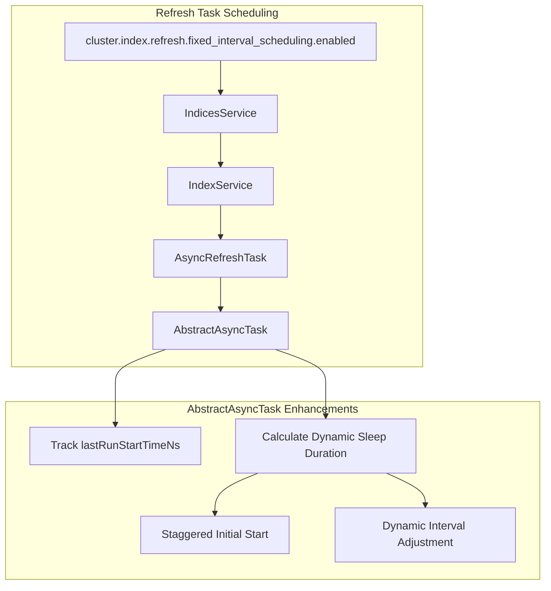

---
tags:
  - domain/core
  - component/server
  - indexing
---
# Refresh Task Scheduling

## Summary

OpenSearch v3.0.0 introduces fixed interval refresh task scheduling, a feature that ensures consistent intervals between index refreshes. This enhancement addresses the problem of variable refresh timing caused by the duration of refresh operations themselves, improving data freshness predictability for remote store indexes.

## Details

### What's New in v3.0.0

This release adds a new cluster-level setting that enables deterministic refresh scheduling. When enabled, the system calculates dynamic sleep durations based on actual refresh execution time, ensuring that refreshes occur at consistent intervals regardless of how long each refresh takes.

### Technical Changes

#### Architecture Changes



#### New Components

| Component | Description |
|-----------|-------------|
| `CLUSTER_REFRESH_FIXED_INTERVAL_SCHEDULE_ENABLED_SETTING` | New cluster setting in `IndicesService` to enable fixed interval scheduling |
| `fixedIntervalSchedulingEnabled` supplier | Supplier passed through `IndexModule` → `IndexService` → `AsyncRefreshTask` |
| `getSleepDuration()` method | New method in `AbstractAsyncTask` that calculates dynamic sleep duration |
| `lastRunStartTimeNs` field | Tracks the start time of the last task execution |

#### New Configuration

| Setting | Description | Default |
|---------|-------------|---------|
| `cluster.index.refresh.fixed_interval_scheduling.enabled` | Enables fixed interval scheduling for refresh tasks | `false` |

### How It Works

The fixed interval scheduling works by tracking when each refresh starts and calculating the appropriate sleep duration for the next refresh:

1. **Initial Staggered Start**: On first execution, a random sleep duration within the interval is used to prevent concurrent refreshes across multiple shards (dense shard packing scenario)

2. **Dynamic Sleep Calculation**: After each refresh, the system calculates:
   - Time elapsed since last refresh started
   - If elapsed time >= configured interval → schedule immediately (`TimeValue.ZERO`)
   - If elapsed time < configured interval → sleep for remaining time

```java
// Simplified logic from AbstractAsyncTask.getSleepDuration()
if (lastRunStartTimeNs == -1) {
    // Stagger initial start with random delay
    return TimeValue.timeValueNanos(random.nextLong(interval.nanos()));
}

long timeSinceLastRunNs = System.nanoTime() - lastRunStartTimeNs;
if (timeSinceLastRunNs >= interval.nanos()) {
    return TimeValue.ZERO;  // Refresh took longer than interval
} else {
    return TimeValue.timeValueNanos(interval.nanos() - timeSinceLastRunNs);
}
```

### Usage Example

Enable fixed interval refresh scheduling cluster-wide:

```json
PUT _cluster/settings
{
  "persistent": {
    "cluster.index.refresh.fixed_interval_scheduling.enabled": true
  }
}
```

### Migration Notes

- This feature is disabled by default for backward compatibility
- Enable it on clusters where consistent refresh timing is important
- Particularly beneficial for remote store indexes where data freshness is critical
- No index-level changes required; the setting applies cluster-wide

## Limitations

- The setting is cluster-wide and cannot be configured per-index
- When refresh duration exceeds the configured interval, refreshes are scheduled immediately (no backpressure mechanism)
- Staggered start only applies to the initial refresh; subsequent refreshes follow the calculated schedule

## References

### Blog Posts
- [Blog: Optimize OpenSearch Refresh Interval](https://opensearch.org/blog/optimize-refresh-interval/): Background on refresh interval optimization
- [Blog: Adaptive refresh for resilient segment replication](https://opensearch.org/blog/adaptive-refresh-for-resilient-segment-replication/): Related refresh improvements

### Pull Requests
| PR | Description |
|----|-------------|
| [#17777](https://github.com/opensearch-project/OpenSearch/pull/17777) | Implement fixed interval refresh task scheduling |

### Issues (Design / RFC)
- [Issue #17776](https://github.com/opensearch-project/OpenSearch/issues/17776): META - Improve Data Freshness for Remote Store Indexes

## Related Feature Report

- Full feature documentation
