---
tags:
  - indexing
  - ml
  - search
---

# Rule-Based Auto-Tagging

## Summary

Rule-Based Auto-Tagging is a new feature in OpenSearch v3.0.0 that automatically assigns feature values (such as workload group IDs) to incoming queries based on specified attributes like index patterns. This enables automatic query categorization and management without manual intervention.

## Details

### What's New in v3.0.0

This release introduces the foundational components for rule-based auto-tagging:

1. **Rule Schema** - A flexible rule object model supporting single feature types with multiple attributes
2. **In-Memory Attribute Value Store** - Patricia Trie-based storage for efficient prefix matching
3. **Rule Processing Service** - Service for managing rules and evaluating labels for incoming requests
4. **Rule Lifecycle API** - REST API for creating, updating, retrieving, and deleting rules

### Technical Changes

#### Architecture

```mermaid
graph TB
    subgraph "Rule-Based Auto-Tagging"
        API[Rule Lifecycle API]
        RPS[Rule Processing Service]
        AVS[Attribute Value Store]
        Registry[AutoTagging Registry]
    end
    
    subgraph "Core Components"
        Rule[Rule Object]
        Attr[Attribute]
        FT[FeatureType]
    end
    
    subgraph "Storage"
        Trie[Patricia Trie]
        Index[Rules Index]
    end
    
    API --> RPS
    RPS --> AVS
    AVS --> Trie
    RPS --> Registry
    Registry --> FT
    Rule --> Attr
    Rule --> FT
    API --> Index
```



#### Data Flow


#### New Components

| Component | Description |
|-----------|-------------|
| `Rule` | Core object representing auto-tagging rules with description, attributes, feature type, and feature value |
| `Attribute` | Interface for rule attributes (e.g., `index_pattern`) |
| `FeatureType` | Interface defining feature categories (e.g., `workload_group`) |
| `AutoTaggingRegistry` | Central registry for managing feature types |
| `RuleValidator` | Validates rule constraints (description length, attribute values) |
| `AttributeValueStore` | Interface for storing and retrieving attribute values |
| `DefaultAttributeValueStore` | Patricia Trie-based implementation with prefix matching |
| `InMemoryRuleProcessingService` | Service for rule management and label evaluation |
| `AttributeExtractor` | Interface for extracting attributes from requests |

#### New Configuration

| Setting | Description | Default |
|---------|-------------|---------|
| `MAX_DESCRIPTION_LENGTH` | Maximum rule description length | 256 |
| `MAX_FEATURE_TYPE_NAME_LENGTH` | Maximum feature type name length | 30 |
| `DEFAULT_MAX_ATTRIBUTE_VALUES` | Maximum values per attribute | 10 |
| `DEFAULT_MAX_ATTRIBUTE_VALUE_LENGTH` | Maximum character length per attribute value | 100 |

#### API Endpoints

| Method | Endpoint | Description |
|--------|----------|-------------|
| `PUT/POST` | `/_rules/{feature_type}` | Create a rule |
| `PUT/POST` | `/_rules/{feature_type}/{_id}` | Update a rule |
| `GET` | `/_rules/{feature_type}/{_id}` | Get a specific rule |
| `GET` | `/_rules/{feature_type}` | List rules for a feature type |
| `DELETE` | `/_rules/{feature_type}/{_id}` | Delete a rule |

### Usage Example

Create a rule to assign queries targeting `log*` or `event*` indexes to a specific workload group:

```json
PUT _rules/workload_group
{
  "description": "Route log and event queries to analytics workload group",
  "index_pattern": ["log*", "event*"],
  "workload_group": "EITBzjFkQ6CA-semNWGtRQ"
}
```

Response:
```json
{
  "_id": "wi6VApYBoX5wstmtU_8l",
  "description": "Route log and event queries to analytics workload group",
  "index_pattern": ["log*", "event*"],
  "workload_group": "EITBzjFkQ6CA-semNWGtRQ",
  "updated_at": "2025-04-04T20:54:22.406Z"
}
```

### Migration Notes

This is a new feature with no migration required. To adopt:

1. Identify query patterns that should be automatically categorized
2. Create workload groups using the Workload Group Lifecycle API
3. Define rules using the Rule Lifecycle API to map index patterns to workload groups

## Limitations

- Rules are stored in a system index and require cluster write access
- Prefix matching uses Patricia Trie which is optimized for string prefixes
- Each rule can have only one feature value but multiple attribute values
- Rule evaluation requires all attribute conditions to match (AND logic)

## References

### Documentation
- [Rule Lifecycle API Documentation](https://docs.opensearch.org/3.0/tuning-your-cluster/availability-and-recovery/rule-based-autotagging/rule-lifecycle-api/)
- [Workload Management](https://docs.opensearch.org/3.0/tuning-your-cluster/availability-and-recovery/workload-management/wlm-feature-overview/)

### Pull Requests
| PR | Description |
|----|-------------|
| [#17238](https://github.com/opensearch-project/OpenSearch/pull/17238) | Add rule schema for auto tagging |
| [#17342](https://github.com/opensearch-project/OpenSearch/pull/17342) | Add in-memory attribute value store |
| [#17365](https://github.com/opensearch-project/OpenSearch/pull/17365) | Add in-memory rule processing service |

### Issues (Design / RFC)
- [Issue #16797](https://github.com/opensearch-project/OpenSearch/issues/16797): RFC - Automated labeling of search requests

## Related Feature Report

- [Full feature documentation](../../../features/opensearch/opensearch-rule-based-auto-tagging.md)
