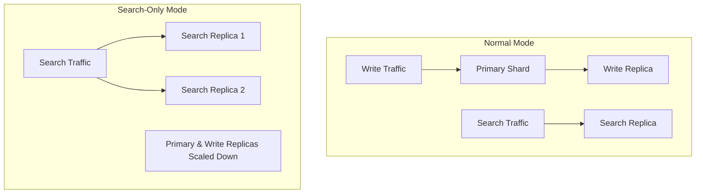

# Search Replica & Reader-Writer Separation

## Summary

OpenSearch 3.0.0 introduces significant enhancements to the reader-writer separation feature, enabling scale-to-zero deployments and improved workload isolation. These changes allow users to designate indexes as search-only, automatically scale search replicas based on cluster size, and control search request routing behavior.

## Details

### What's New in v3.0.0

This release adds three key capabilities to the reader-writer separation feature:

1. **Scale-to-Zero (Search-Only Mode)**: New `_scale` API to enable/disable search-only mode on indexes
2. **Auto-Expand Search Replicas**: New `index.auto_expand_search_replicas` setting for automatic scaling
3. **Strict Search Routing**: New `cluster.routing.search_only.strict` setting to control search request routing

### Technical Changes

#### Architecture Changes



#### New Components

| Component | Description |
|-----------|-------------|
| `ScaleAction` | REST action handler for the `_scale` API |
| `SearchOnlyBlockService` | Manages search-only index blocks |
| `AutoExpandSearchReplicas` | Handles automatic search replica scaling |

#### New Configuration

| Setting | Description | Default |
|---------|-------------|---------|
| `index.auto_expand_search_replicas` | Auto-expand search replicas based on search nodes (e.g., `0-3`, `0-all`) | `false` |
| `cluster.routing.search_only.strict` | When `true`, route search requests only to search replicas | `true` |

#### API Changes

**New Scale API**

```
POST /<index>/_scale
{
  "search_only": true | false
}
```

- `search_only: true`: Enables search-only mode, scales down primary and write replicas
- `search_only: false`: Disables search-only mode, restores primary and write replicas

### Usage Example

#### Enable Search-Only Mode

```bash
# Enable search-only mode for an index
POST /my-index/_scale
{
  "search_only": true
}
```

#### Configure Auto-Expand Search Replicas

```bash
# Create index with auto-expanding search replicas
PUT /my-index
{
  "settings": {
    "index": {
      "number_of_shards": 1,
      "number_of_replicas": 1,
      "number_of_search_replicas": 1,
      "auto_expand_search_replicas": "0-3"
    }
  }
}
```

#### Configure Strict Routing

```bash
# Allow fallback to primary/write replicas if search replicas unavailable
PUT /_cluster/settings
{
  "persistent": {
    "cluster.routing.search_only.strict": false
  }
}
```

### Migration Notes

- Requires remote store to be enabled for search-only mode
- Set `cluster.remote_store.state.enabled: true` for seamless search replica recovery
- Search replicas are allocated only to nodes with the `search` role

### Search Replica Recovery Scenarios

| Scenario | Remote Store State | Persistent Data | Recovery Behavior |
|----------|-------------------|-----------------|-------------------|
| Normal restart | Enabled | Yes | Seamless recovery |
| No persistent data | Enabled | No | Auto-recovery from remote store |
| No persistent data | Disabled | No | Requires manual `_remotestore/_restore` |

## Limitations

- Search-only mode requires remote store to be enabled
- Search replicas cannot be promoted to primary shards
- Auto-expand search replicas only considers nodes with the `search` role
- When all search replicas are unassigned and strict routing is enabled, search requests fail with a clear error message

## Related PRs

| PR | Description |
|----|-------------|
| [#17299](https://github.com/opensearch-project/OpenSearch/pull/17299) | Scale-to-zero (search_only mode) with Reader/Writer Separation |
| [#17741](https://github.com/opensearch-project/OpenSearch/pull/17741) | Support AutoExpand for SearchReplica |
| [#17803](https://github.com/opensearch-project/OpenSearch/pull/17803) | Added Search Only strict routing setting |

## References

- [Issue #15306](https://github.com/opensearch-project/OpenSearch/issues/15306): META - Reader/Writer Separation
- [Issue #16720](https://github.com/opensearch-project/OpenSearch/issues/16720): Scale to Zero feature request
- [Issue #17310](https://github.com/opensearch-project/OpenSearch/issues/17310): Auto-expand-replica for search replicas
- [Issue #17424](https://github.com/opensearch-project/OpenSearch/issues/17424): Strict routing for search replicas
- [Documentation: Scale API](https://docs.opensearch.org/3.0/api-reference/index-apis/scale/)
- [Documentation: Separate Index and Search Workloads](https://docs.opensearch.org/3.0/tuning-your-cluster/separate-index-and-search-workloads/)
- [Blog: Improve OpenSearch cluster performance by separating search and indexing workloads](https://opensearch.org/blog/improve-opensearch-cluster-performance-by-separating-search-and-indexing-workloads/)

## Related Feature Report

- [Full feature documentation](../../../features/opensearch/search-replica-reader-writer-separation.md)
