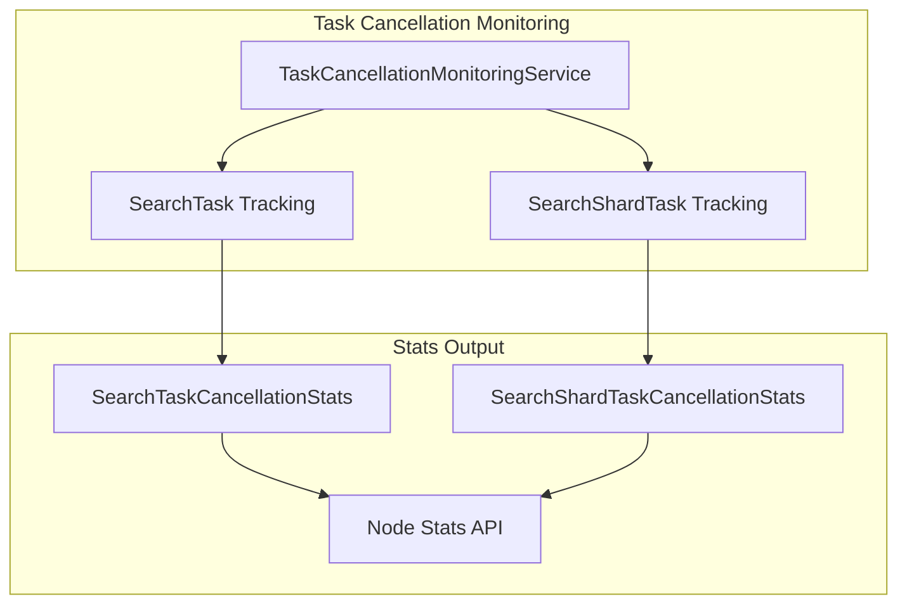

# Search Task Management

## Summary

This release extends the Task Cancellation Monitoring Service to track long-running SearchTask (coordinator-level) tasks in addition to the existing SearchShardTask (shard-level) tracking. This enhancement enables operators to monitor "rogue queries" that continue running after cancellation at both the coordinator and shard levels.

## Details

### What's New in v3.0.0

The `TaskCancellationMonitoringService` now tracks both `SearchTask` and `SearchShardTask` types. Previously, only `SearchShardTask` was monitored for post-cancellation behavior. This change provides visibility into queries that have been cancelled but continue consuming resources at the coordinator level.

### Technical Changes

#### Architecture Changes



#### New Components

| Component | Description |
|-----------|-------------|
| `SearchTaskCancellationStats` | New class to hold cancellation statistics for coordinator-level search tasks |
| `BaseSearchTaskCancellationStats` | New abstract base class providing common functionality for both task types |

#### API Response Changes

The `/_nodes/stats` API response now includes `search_task` statistics alongside the existing `search_shard_task`:

```json
{
  "task_cancellation": {
    "search_task": {
      "current_count_post_cancel": 0,
      "total_count_post_cancel": 5
    },
    "search_shard_task": {
      "current_count_post_cancel": 0,
      "total_count_post_cancel": 12
    }
  }
}
```

#### New Configuration

| Setting | Description | Default |
|---------|-------------|---------|
| N/A | No new settings required - uses existing monitoring service configuration | - |

### Usage Example

```bash
# Get task cancellation stats including SearchTask tracking
GET _nodes/stats

# Response includes task_cancellation section with both task types
{
  "nodes": {
    "node_id": {
      "task_cancellation": {
        "search_task": {
          "current_count_post_cancel": 2,
          "total_count_post_cancel": 15
        },
        "search_shard_task": {
          "current_count_post_cancel": 5,
          "total_count_post_cancel": 42
        }
      }
    }
  }
}
```

### Migration Notes

- No migration required
- The new `search_task` field is automatically included in stats responses after upgrading to v3.0.0
- Version compatibility is handled automatically - older nodes will not receive the new field

## Limitations

- Statistics are reset when the node restarts
- Mixed-version clusters: nodes running versions prior to 3.0.0 will not report `search_task` statistics
- The monitoring service must be enabled for tracking to occur

## References

### Documentation
- [Search Backpressure Documentation](https://docs.opensearch.org/3.0/tuning-your-cluster/availability-and-recovery/search-backpressure/): Related search backpressure feature

### Pull Requests
| PR | Description |
|----|-------------|
| [#17726](https://github.com/opensearch-project/OpenSearch/pull/17726) | Add tracking for long-running SearchTask post cancellation |

### Issues (Design / RFC)
- [Issue #17719](https://github.com/opensearch-project/OpenSearch/issues/17719): Track long running SearchTask post cancellation

## Related Feature Report

- [Full feature documentation](../../../features/opensearch/task-cancellation-monitoring.md)
