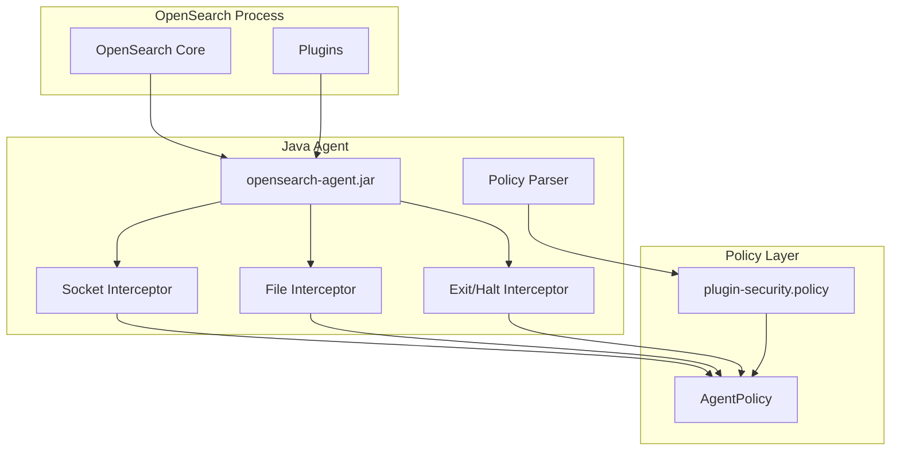

# Security Manager Replacement (Java Agent)

## Summary

OpenSearch 3.0.0 replaces the deprecated Java Security Manager (JSM) with a custom Java agent for security enforcement. This change prepares OpenSearch for JDK 24+ where JSM will be fully removed, while maintaining plugin sandboxing capabilities and enabling future adoption of virtual threads.

## Details

### What's New in v3.0.0

OpenSearch 3.0.0 introduces a complete replacement for the Java Security Manager using a two-pronged approach:

1. **Java Agent**: A custom agent that intercepts privileged operations (socket connections, file access, process termination) and validates permissions against policy files
2. **systemd Hardening**: Operating system-level protections for Linux distributions using systemd

### Technical Changes

#### Architecture Changes



#### New Components

| Component | Location | Description |
|-----------|----------|-------------|
| `Agent` | `libs/agent-sm/agent` | Main Java agent entry point with ByteBuddy instrumentation |
| `AgentPolicy` | `libs/agent-sm/bootstrap` | Policy management and permission checking |
| `SocketChannelInterceptor` | `libs/agent-sm/agent` | Intercepts `Socket::connect` calls |
| `FileInterceptor` | `libs/agent-sm/agent` | Intercepts file system operations |
| `SystemExitInterceptor` | `libs/agent-sm/agent` | Intercepts `System::exit` calls |
| `RuntimeHaltInterceptor` | `libs/agent-sm/agent` | Intercepts `Runtime::halt` calls |
| `PolicyFile` | `libs/secure-sm` | Custom policy parser for JDK 24+ compatibility |
| `StackCallerChainExtractor` | `libs/agent-sm/agent` | Extracts ProtectionDomains from call stack |

#### New Configuration

| Setting | Description | Default |
|---------|-------------|---------|
| `-javaagent:agent/opensearch-agent.jar` | JVM argument to attach the Java agent | Enabled in jvm.options for JDK 21+ |

### Usage Example

Plugin developers continue using the same `plugin-security.policy` format:

```java
// plugin-security.policy
grant {
  permission java.net.SocketPermission "*", "connect,resolve";
  permission java.io.FilePermission "/tmp/-", "read,write";
}
```

The Java agent automatically enforces these permissions at runtime.

### Migration Notes

1. **No code changes required for most plugins**: The `plugin-security.policy` format remains unchanged
2. **Remove JSM-specific code**: Code using `System.setSecurityManager()` should be removed
3. **Update AccessController usage**: Replace `java.security.AccessController.doPrivileged()` with `org.opensearch.secure_sm.AccessController.doPrivileged()` (see [AccessController feature](../../../features/opensearch/java-agent-accesscontroller.md))
4. **Breaking change warning**: Third-party plugins may need updates due to changes in security verification

## Limitations

- The Java agent focuses on high-risk operations (file I/O, network, process termination)
- Not all JSM permission types are covered (e.g., reflection permissions are delegated to systemd)
- systemd hardening is only available on Linux distributions using systemd
- Virtual threads do not carry permissions (by design in JDK)

## Related PRs

| PR | Description |
|----|-------------|
| [#17724](https://github.com/opensearch-project/OpenSearch/pull/17724) | Create initial Java Agent to intercept Socket::connect calls |
| [#17746](https://github.com/opensearch-project/OpenSearch/pull/17746) | Enhance Java Agent to intercept System::exit |
| [#17753](https://github.com/opensearch-project/OpenSearch/pull/17753) | Add a policy parser for Java agent security policies |
| [#17757](https://github.com/opensearch-project/OpenSearch/pull/17757) | Enhance Java Agent to intercept Runtime::halt |
| [#17760](https://github.com/opensearch-project/OpenSearch/pull/17760) | Implement File Interceptor and add integration tests |
| [#17861](https://github.com/opensearch-project/OpenSearch/pull/17861) | Phase off SecurityManager usage in favor of Java Agent |

## References

- [Issue #17658](https://github.com/opensearch-project/OpenSearch/issues/17658): Parent issue for Security Manager replacement
- [Issue #17659](https://github.com/opensearch-project/OpenSearch/issues/17659): Add support of Java policies
- [Issue #17660](https://github.com/opensearch-project/OpenSearch/issues/17660): Create initial Java Agent to intercept Socket::connect calls
- [Issue #17662](https://github.com/opensearch-project/OpenSearch/issues/17662): Phase off SecurityManager usage in favor of Java Agent
- [Issue #1687](https://github.com/opensearch-project/OpenSearch/issues/1687): Original JSM replacement discussion
- [JEP 411](https://openjdk.org/jeps/411): Deprecate the Security Manager for Removal
- [JEP 486](https://openjdk.org/jeps/486): Permanently Disable the Security Manager
- [Blog: Finding a replacement for JSM in OpenSearch 3.0](https://opensearch.org/blog/finding-a-replacement-for-jsm-in-opensearch-3-0/)

## Related Feature Report

- [Full feature documentation](../../../features/opensearch/security-manager-replacement.md)
