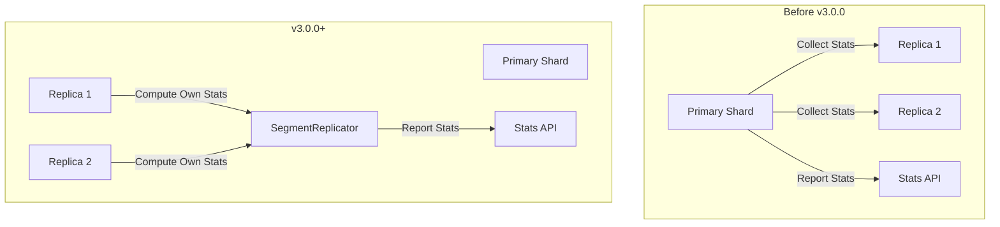

---
tags:
  - indexing
  - observability
---

# Segment Replication Improvements

## Summary

OpenSearch 3.0.0 introduces significant improvements to segment replication, including shard-level stats computation, improved lag metrics accuracy, configurable checkpoint retry timeout, and increased segment counter step size for replica promotion. These changes enhance observability, reliability, and stability of segment replication in production environments.

## Details

### What's New in v3.0.0

This release includes four key improvements to segment replication:

1. **Shard-level stats computation** - Replication stats are now computed at the shard level on replicas instead of relying on the primary shard
2. **Accurate lag metrics** - Fixed skewed replication lag metrics caused by duplicate checkpoint publishing
3. **Configurable checkpoint retry timeout** - New cluster setting for publish checkpoint retry timeout with "never give up" retry strategy
4. **Increased segment counter step size** - Default step size increased from 10 to 100,000 to prevent segment file name conflicts during replica promotion

### Technical Changes

#### Architecture Changes



#### New Components

| Component | Description |
|-----------|-------------|
| `ReplicationCheckpointStats` | Tracks bytes behind and timestamp for each checkpoint version |
| `IndexIOStreamHandlerFactory` | Factory interface for versioned stream handlers |
| `RemoteSegmentMetadataHandlerFactory` | Factory for creating metadata handlers based on version |
| `segmentReplicationStatsProvider` | Function to retrieve replication stats for a shard |

#### New Configuration

| Setting | Description | Default |
|---------|-------------|---------|
| `indices.publish_check_point.retry_timeout` | Retry timeout for publish checkpoint action | `5m` |
| `index.segment_counter_increment_step` | Segment counter step size when replica promoting | `100000` |

#### API Changes

Stats computation moved from primary to replica shards:
- `/_nodes/stats` - Now reports stats from replica shards directly
- `/_cluster/stats` - Aggregates stats from all replica shards
- `/_stats` - Index-level stats computed at shard level

### Usage Example

Configure publish checkpoint retry timeout:

```json
PUT /_cluster/settings
{
  "persistent": {
    "indices.publish_check_point.retry_timeout": "10m"
  }
}
```

Check segment replication stats (now computed at replica level):

```
GET _cat/segment_replication?v
```

### Migration Notes

- Stats computation behavior changed: Primary shards no longer report replica stats; each replica reports its own stats
- The `RemoteSegmentMetadata` version increased from 1 to 2 to include checkpoint timestamp
- Existing indexes using segment replication will automatically benefit from these improvements

## Limitations

- The checkpoint retry timeout setting is cluster-wide and cannot be configured per-index
- Stats computation requires replicas to be active; stats are empty for shards without active replicas

## References

### Documentation
- [Segment Replication Documentation](https://docs.opensearch.org/3.0/tuning-your-cluster/availability-and-recovery/segment-replication/index/): Official documentation
- [CAT Segment Replication API](https://docs.opensearch.org/3.0/api-reference/cat/cat-segment-replication/): API reference

### Pull Requests
| PR | Description |
|----|-------------|
| [#17055](https://github.com/opensearch-project/OpenSearch/pull/17055) | Implemented computation of segment replication stats at shard level |
| [#17831](https://github.com/opensearch-project/OpenSearch/pull/17831) | Avoid skewed segment replication lag metric |
| [#17568](https://github.com/opensearch-project/OpenSearch/pull/17568) | Increase the default segment counter step size when replica promoting |
| [#17749](https://github.com/opensearch-project/OpenSearch/pull/17749) | Add cluster setting for retry timeout of publish checkpoint tx action |

### Issues (Design / RFC)
- [Issue #16801](https://github.com/opensearch-project/OpenSearch/issues/16801): Feature request for redefining segment replication metrics computation
- [Issue #10764](https://github.com/opensearch-project/OpenSearch/issues/10764): Bug report for skewed lag metric when same checkpoint published twice
- [Issue #17566](https://github.com/opensearch-project/OpenSearch/issues/17566): Feature request for increased segment counter step size
- [Issue #17595](https://github.com/opensearch-project/OpenSearch/issues/17595): Bug report for segment replication stopping when publish checkpoint fails

## Related Feature Report

- [Full feature documentation](../../../features/opensearch/segment-replication.md)
