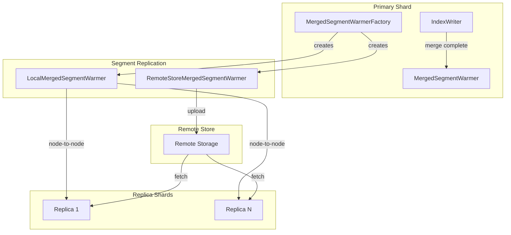

# Segment Warmer

## Summary

OpenSearch v3.0.0 introduces `MergedSegmentWarmerFactory`, an extensible framework for pre-copying merged segments to replica shards during segment replication. This feature significantly reduces replica visibility delay by allowing merged segments to be transferred to replicas before the primary shard's refresh completes, reducing lag time by over 20x in benchmarks.

## Details

### What's New in v3.0.0

This release introduces the foundational infrastructure for merged segment pre-copy in segment replication scenarios. The feature leverages Lucene's `IndexWriter.IndexReaderWarmer` interface to initiate segment transfer to replicas immediately after merge completion, rather than waiting for the standard segment replication cycle.

### Technical Changes

#### Architecture Changes



#### New Components

| Component | Description |
|-----------|-------------|
| `MergedSegmentWarmerFactory` | Factory class that creates appropriate `IndexReaderWarmer` based on replication type (local segment replication, remote store, or document replication) |
| `LocalMergedSegmentWarmer` | Implementation for local on-disk segment replication - transfers segments directly to replicas via node-to-node communication |
| `RemoteStoreMergedSegmentWarmer` | Implementation for remote store - uploads merged segments to remote storage for replica consumption |
| `MergedSegmentWarmer` | Unified warmer implementation (in main branch) that handles both local and remote scenarios |

#### New Configuration

| Setting | Description | Default |
|---------|-------------|---------|
| `opensearch.experimental.feature.merged_segment_warmer.enabled` | Feature flag to enable merged segment warmer functionality | `false` |

### How It Works

1. **Merge Completion**: When `IndexWriter` completes a segment merge, it invokes the configured `IndexReaderWarmer`
2. **Warmer Selection**: `MergedSegmentWarmerFactory` selects the appropriate warmer based on index settings:
   - Local segment replication → `LocalMergedSegmentWarmer`
   - Remote store enabled → `RemoteStoreMergedSegmentWarmer`
   - Document replication → No warmer (returns null)
3. **Pre-copy Execution**: The warmer initiates segment transfer to replicas before the merged segment becomes visible
4. **Segment Replication**: When the primary refreshes, replicas can reuse pre-copied segment files, dramatically reducing replication lag

### Usage Example

Enable the experimental feature flag in `opensearch.yml`:

```yaml
opensearch.experimental.feature.merged_segment_warmer.enabled: true
```

Create an index with segment replication:

```json
PUT /my-index
{
  "settings": {
    "index": {
      "replication.type": "SEGMENT",
      "number_of_replicas": 1
    }
  }
}
```

### Performance Results

Benchmarks using the `nyc_taxis` workload with 2 primary shards and 1 replica showed:

| Metric | Without Pre-copy | With Pre-copy | Improvement |
|--------|------------------|---------------|-------------|
| Maximum Replica Lag | 66 seconds | 2.9 seconds | **>20x reduction** |
| CPU Utilization | Baseline | No significant change | Neutral |
| P99 Read Latency | Baseline | No significant change | Neutral |

## Limitations

- **Experimental Feature**: Requires enabling the feature flag; not enabled by default
- **Segment Replication Only**: Only applicable to indexes using segment replication (`replication.type: SEGMENT`)
- **Implementation Pending**: The `warm()` methods in `LocalMergedSegmentWarmer` and `RemoteStoreMergedSegmentWarmer` contain TODO placeholders in v3.0.0; full implementation is ongoing

## Related PRs

| PR | Description |
|----|-------------|
| [#17881](https://github.com/opensearch-project/OpenSearch/pull/17881) | Introducing MergedSegmentWarmerFactory to support the extension of IndexWriter.IndexReaderWarmer |

## References

- [Issue #17528](https://github.com/opensearch-project/OpenSearch/issues/17528): RFC - Introduce Pre-copy Merged Segment into Segment Replication
- [Issue #1694](https://github.com/opensearch-project/OpenSearch/issues/1694): Original Segment Replication feature request
- [Segment Replication Documentation](https://docs.opensearch.org/3.0/tuning-your-cluster/availability-and-recovery/segment-replication/index/): Official docs

## Related Feature Report

- [Full feature documentation](../../../../features/opensearch/segment-warmer.md)
