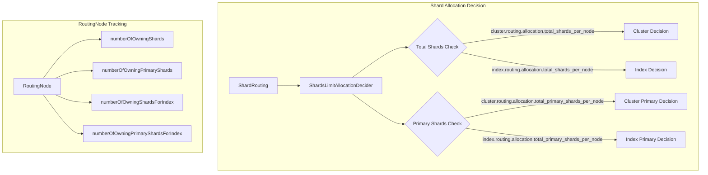

---
tags:
  - indexing
---

# Shard Management

## Summary

OpenSearch 3.0.0 introduces new cluster and index level settings to limit the total number of primary shards per node. These settings provide explicit control over primary shard distribution, addressing CPU skew issues in segment replication clusters where primary shards perform CPU-intensive segment creation.

## Details

### What's New in v3.0.0

Two major enhancements to shard management:

1. **Primary Shard Limit Settings**: New settings to constrain primary shards per node at both cluster and index levels
2. **Primary Constraint Weight Adjustment**: A setting to tune the weight applied by primary balance constraints during allocation

### Technical Changes

#### Architecture Changes



#### New Components

| Component | Description |
|-----------|-------------|
| `RelocatingShardsBucket` | Tracks relocating shards and primary shards separately for accurate counting |
| `numberOfOwningPrimaryShards()` | New method in `RoutingNode` to count non-relocating primary shards |
| `numberOfOwningPrimaryShardsForIndex()` | New method to count primary shards per index on a node |
| `getIndexTotalPrimaryShardsPerNodeLimit()` | New method in `IndexMetadata` to retrieve index-level primary shard limit |

#### New Configuration

| Setting | Description | Default | Scope |
|---------|-------------|---------|-------|
| `cluster.routing.allocation.total_primary_shards_per_node` | Maximum primary shards per node cluster-wide | `-1` (unlimited) | Cluster |
| `index.routing.allocation.total_primary_shards_per_node` | Maximum primary shards per node for an index | `-1` (unlimited) | Index |
| `cluster.routing.allocation.primary_constraint.threshold` | Weight added by primary constraints during allocation | `10` | Cluster |

### Usage Example

Limit primary shards per node at cluster level (requires remote store enabled):

```json
PUT /_cluster/settings
{
  "persistent": {
    "cluster.routing.allocation.total_primary_shards_per_node": 3
  }
}
```

Limit primary shards per node for a specific index:

```json
PUT /my-index
{
  "settings": {
    "index.routing.allocation.total_primary_shards_per_node": 1,
    "index.number_of_shards": 6,
    "index.number_of_replicas": 1
  }
}
```

Adjust primary constraint weight for allocation decisions:

```json
PUT /_cluster/settings
{
  "persistent": {
    "cluster.routing.allocation.primary_constraint.threshold": 20
  }
}
```

### Migration Notes

- The primary shard limit settings (`total_primary_shards_per_node`) are only applicable for **remote store enabled clusters**
- Attempting to use these settings on non-remote-store clusters will result in an `IllegalArgumentException`
- Existing `total_shards_per_node` settings continue to work for all cluster types

## Limitations

- Primary shard limit settings require remote store to be enabled on the cluster
- Setting limits too low may result in unassigned primary shards if nodes cannot accommodate them
- The constraint weight setting affects both allocation and rebalancing decisions

## References

### Documentation
- [Cluster Settings Documentation](https://docs.opensearch.org/3.0/install-and-configure/configuring-opensearch/cluster-settings/): Official cluster routing allocation settings

### Pull Requests
| PR | Description |
|----|-------------|
| [#17295](https://github.com/opensearch-project/OpenSearch/pull/17295) | Add cluster and index level settings to limit total primary shards per node |
| [#16471](https://github.com/opensearch-project/OpenSearch/pull/16471) | Add setting to adjust the primary constraint weights |

### Issues (Design / RFC)
- [Issue #17293](https://github.com/opensearch-project/OpenSearch/issues/17293): Feature request for primary shard count constraint
- [Issue #16470](https://github.com/opensearch-project/OpenSearch/issues/16470): Bug report for high primary shard weight causing uneven distribution
- [Documentation Issue #9301](https://github.com/opensearch-project/documentation-website/issues/9301): Public documentation for primary shard limit settings

## Related Feature Report

- [Full feature documentation](../../../features/opensearch/shard-allocation.md)
