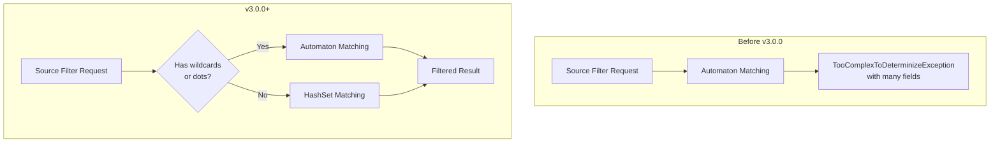

# Source Field Matching

## Summary

This release introduces a performance optimization for source field filtering in OpenSearch. When filtering `_source` fields using simple field names (without wildcards or dot-paths), OpenSearch now uses a HashSet-based matching approach instead of the more complex automaton-based matching. This prevents `TooComplexToDeterminizeException` errors when processing documents with many long field names.

## Details

### What's New in v3.0.0

The `XContentMapValues.filter()` method now intelligently selects between two filtering strategies:

1. **HashSet-based filtering**: Used when field names are simple (no wildcards `*` or dots `.`)
2. **Automaton-based filtering**: Used for complex patterns with wildcards or dot-paths

### Technical Changes

#### Architecture Changes



#### New Components

| Component | Description |
|-----------|-------------|
| `hasNoWildcardsOrDots()` | Helper method to check if field names contain wildcards or dots |
| `createSetBasedFilter()` | Creates a HashSet-based filter for exact field name matching |
| `createAutomatonFilter()` | Creates an automaton-based filter for complex pattern matching |

#### Implementation Details

The optimization works by:

1. Checking if all include/exclude field names are simple (no `*` or `.` characters)
2. If simple: Creating `HashSet` collections for O(1) lookup performance
3. If complex: Falling back to the existing automaton-based approach

For document keys containing dots, the filter extracts the prefix before the first dot to match against the include/exclude sets, preserving the existing behavior where dots in field names are treated as sub-objects.

### Usage Example

```json
// Search request with simple field names - uses HashSet optimization
GET /my_index/_search
{
  "_source": {
    "includes": ["title", "author", "price"],
    "excludes": ["internal_id"]
  },
  "query": {
    "match_all": {}
  }
}
```

```json
// Search request with wildcards - uses automaton matching
GET /my_index/_search
{
  "_source": {
    "includes": ["user.*", "meta.tags"],
    "excludes": ["*.internal"]
  },
  "query": {
    "match_all": {}
  }
}
```

### Migration Notes

This is a transparent optimization with no API changes. Existing queries will automatically benefit from the improved performance when using simple field names.

## Limitations

- The HashSet optimization only applies when **all** include and exclude field names are simple (no wildcards or dots)
- If any field name contains a wildcard (`*`) or dot (`.`), the automaton-based approach is used for all fields
- Documents with dotted field names in their keys still work correctly, but the optimization checks the prefix before the first dot

## Related PRs

| PR | Description |
|----|-------------|
| [#17160](https://github.com/opensearch-project/OpenSearch/pull/17160) | Add HashSet based filtering optimization to XContentMapValues |

## References

- [Issue #17114](https://github.com/opensearch-project/OpenSearch/issues/17114): Original bug report - Fetching source uses automata even for simple matching
- [Source Field Documentation](https://docs.opensearch.org/3.0/field-types/metadata-fields/source/): Official documentation for `_source` field
- [Retrieve Specific Fields](https://docs.opensearch.org/3.0/search-plugins/searching-data/retrieve-specific-fields/): Documentation on source filtering

## Related Feature Report

- [Full feature documentation](../../../features/opensearch/source-field-matching.md)
