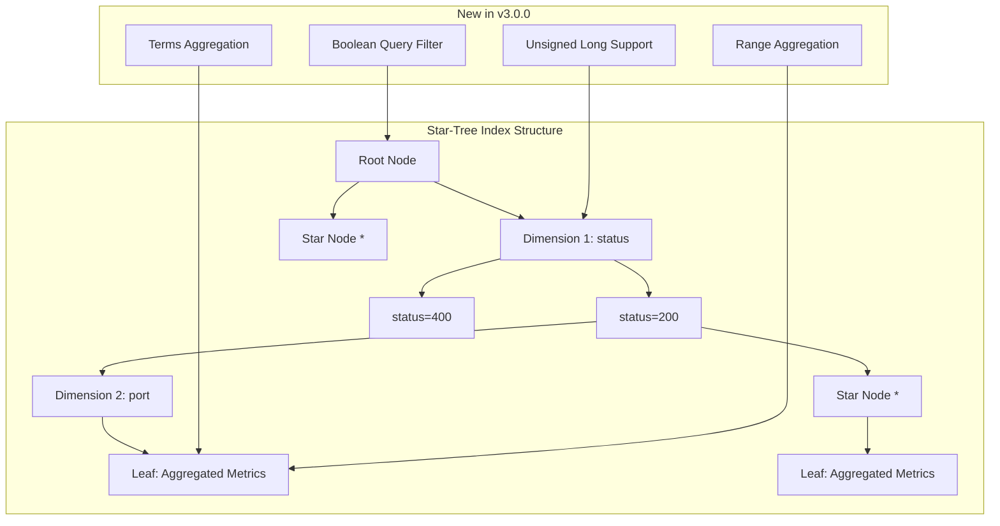

# Star Tree Index Enhancements

## Summary

OpenSearch v3.0.0 significantly expands the star-tree index capabilities with support for new aggregation types and query patterns. Star-tree index is a multi-field index that precomputes aggregations during indexing, dramatically reducing query latency for analytics workloads. This release adds support for keyword/numeric terms aggregations, range aggregations, boolean queries, and unsigned-long data type support.

## Details

### What's New in v3.0.0

The star-tree index feature, introduced as experimental in OpenSearch 2.18, receives major enhancements in v3.0.0:

1. **Keyword and Numeric Terms Aggregations** - Terms aggregations on both keyword and numeric fields can now leverage star-tree optimization
2. **Range Aggregations** - Numeric range aggregations with metric sub-aggregations are now supported
3. **Boolean Query Support** - Complex boolean queries with MUST and SHOULD clauses can be resolved via star-tree
4. **Unsigned Long Support** - The unsigned-long data type is now fully supported in star-tree indexing and search operations

### Technical Changes

#### Architecture Changes



#### New Components

| Component | Description |
|-----------|-------------|
| `BoolStarTreeFilterProvider` | Handles boolean queries for star-tree traversal |
| `DimensionFilterMerger` | Manages filter intersections for MUST/SHOULD clauses |
| `StarTreeTermsAggregator` | Resolves terms aggregations via star-tree |
| `StarTreeRangeAggregator` | Resolves range aggregations via star-tree |

#### New Query Support

| Query Type | Description | Constraints |
|------------|-------------|-------------|
| Boolean Query | MUST and SHOULD clauses | MUST_NOT not supported; SHOULD must be on same dimension |
| Terms Query | Multiple term matching | Fields must be in ordered_dimensions |
| Range Query | Numeric range filtering | Supported on dimension fields |

### Usage Example

```json
// Terms aggregation with star-tree optimization
POST /logs/_search
{
    "size": 0,
    "aggs": {
        "status_codes": {
            "terms": {
                "field": "status"
            },
            "aggs": {
                "avg_latency": {
                    "avg": {
                        "field": "latency"
                    }
                }
            }
        }
    }
}

// Range aggregation with metric sub-aggregation
POST /logs/_search
{
    "size": 0,
    "aggs": {
        "latency_ranges": {
            "range": {
                "field": "latency",
                "ranges": [
                    { "to": 100 },
                    { "from": 100, "to": 500 },
                    { "from": 500 }
                ]
            },
            "aggs": {
                "total_requests": {
                    "sum": { "field": "request_count" }
                }
            }
        }
    }
}

// Boolean query with star-tree
POST /logs/_search
{
    "size": 0,
    "query": {
        "bool": {
            "must": [
                { "term": { "method": "GET" } }
            ],
            "filter": [
                { "range": { "status": { "gte": 200, "lt": 300 } } }
            ]
        }
    },
    "aggs": {
        "sum_size": { "sum": { "field": "size" } }
    }
}
```

### Performance Improvements

Based on benchmarks from the OpenSearch blog:

| Query Type | Documents | Traditional Latency | Star-Tree Latency | Improvement |
|------------|-----------|---------------------|-------------------|-------------|
| Metric aggregation (status=200) | 200M | 4.2 seconds | 6.3 ms | ~667x |
| Date histogram with sum | 120M | 13 seconds | 94 ms | ~138x |
| Terms aggregation | 160M | 17 seconds | 160 ms | ~106x |

### Migration Notes

No migration required. Star-tree indexes created in v2.18+ continue to work. New aggregation types are automatically optimized when:
- Fields are part of star-tree dimensions/metrics configuration
- Query patterns match supported types

## Limitations

- Boolean queries with `must_not` clauses are not supported
- `minimum_should_match` parameter is not supported in boolean queries
- SHOULD clauses must operate on the same dimension (no cross-dimension OR)
- Updates and deletions are not reflected in star-tree index
- Queries on date fields are not yet supported

## References

### Documentation
- [Documentation](https://docs.opensearch.org/3.0/search-plugins/star-tree-index/): Star-tree index documentation

### Blog Posts
- [Blog](https://opensearch.org/blog/the-power-of-star-tree-indexes-supercharging-opensearch-aggregations/): The power of star-tree indexes

### Pull Requests
| PR | Description |
|----|-------------|
| [#17165](https://github.com/opensearch-project/OpenSearch/pull/17165) | Keyword & Numeric Terms Aggregation support |
| [#17273](https://github.com/opensearch-project/OpenSearch/pull/17273) | Range Aggregations with star-tree |
| [#17275](https://github.com/opensearch-project/OpenSearch/pull/17275) | Unsigned-long query support |
| [#17941](https://github.com/opensearch-project/OpenSearch/pull/17941) | Boolean Query support in aggregations |

### Issues (Design / RFC)
- [Issue #16551](https://github.com/opensearch-project/OpenSearch/issues/16551): Bucket terms aggregation with metric aggregation
- [Issue #16553](https://github.com/opensearch-project/OpenSearch/issues/16553): Range aggregations with metric sub-aggregation
- [Issue #15231](https://github.com/opensearch-project/OpenSearch/issues/15231): Handle unsigned long in star tree
- [Issue #17267](https://github.com/opensearch-project/OpenSearch/issues/17267): Boolean query support

## Related Feature Report

- [Full feature documentation](../../../features/opensearch/star-tree-index.md)
