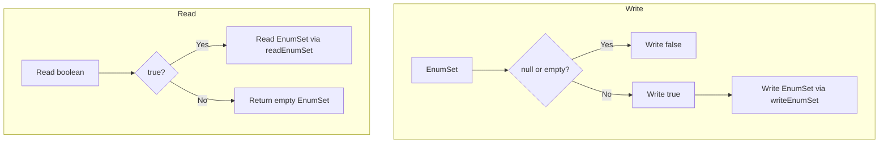

---
tags:
  - search
---

# Stream Input/Output

## Summary

OpenSearch v3.0.0 adds optional EnumSet read/write methods to `StreamInput` and `StreamOutput` classes. This enhancement provides a standardized way to serialize and deserialize optional `EnumSet` collections across the cluster, eliminating the need for plugin-specific helper methods.

## Details

### What's New in v3.0.0

Two new methods have been added to the core streaming API:

- `StreamInput.readOptionalEnumSet(Class<E> enumClass)` - Reads an optional EnumSet from the stream
- `StreamOutput.writeOptionalEnumSet(EnumSet<E> enumSet)` - Writes an optional EnumSet to the stream

### Technical Changes

#### New API Methods

| Class | Method | Description |
|-------|--------|-------------|
| `StreamInput` | `readOptionalEnumSet(Class<E> enumClass)` | Reads an optional EnumSet; returns empty set if null/empty was written |
| `StreamOutput` | `writeOptionalEnumSet(EnumSet<E> enumSet)` | Writes an optional EnumSet; writes `false` for null or empty sets |

#### Serialization Format



#### Implementation Details

The implementation follows the existing pattern for optional collection serialization:

**StreamOutput.writeOptionalEnumSet:**
```java
public <E extends Enum<E>> void writeOptionalEnumSet(@Nullable EnumSet<E> enumSet) throws IOException {
    if (enumSet != null && enumSet.size() > 0) {
        writeBoolean(true);
        writeEnumSet(enumSet);
    } else {
        writeBoolean(false);
    }
}
```

**StreamInput.readOptionalEnumSet:**
```java
public <E extends Enum<E>> EnumSet<E> readOptionalEnumSet(Class<E> enumClass) throws IOException {
    if (readBoolean()) {
        return readEnumSet(enumClass);
    } else {
        return EnumSet.noneOf(enumClass);
    }
}
```

### Usage Example

```java
// Define an enum
public enum NodeStat {
    CPU,
    MEMORY,
    DISK,
    NETWORK
}

// Writing optional EnumSet
EnumSet<NodeStat> stats = EnumSet.of(NodeStat.CPU, NodeStat.MEMORY);
streamOutput.writeOptionalEnumSet(stats);

// Writing null/empty
streamOutput.writeOptionalEnumSet(null);  // writes false
streamOutput.writeOptionalEnumSet(EnumSet.noneOf(NodeStat.class));  // writes false

// Reading optional EnumSet
EnumSet<NodeStat> readStats = streamInput.readOptionalEnumSet(NodeStat.class);
// Returns EnumSet with values if present, or empty EnumSet if null/empty was written
```

### Migration Notes

Plugins that previously implemented custom helper methods for optional EnumSet serialization can now use the core API methods:

**Before (plugin-specific):**
```java
// ml-commons MLStatsInput pattern
private void writeOptionalEnumSet(StreamOutput out, EnumSet<?> set) {
    if (set != null && !set.isEmpty()) {
        out.writeBoolean(true);
        out.writeEnumSet(set);
    } else {
        out.writeBoolean(false);
    }
}
```

**After (using core API):**
```java
out.writeOptionalEnumSet(enumSet);
EnumSet<MyEnum> result = in.readOptionalEnumSet(MyEnum.class);
```

## Limitations

- When reading a null or empty EnumSet, the method returns an empty `EnumSet.noneOf(enumClass)` rather than `null`. This is consistent with other optional collection readers in OpenSearch.
- The enum class must be provided when reading, as Java's type erasure prevents runtime type inference.

## References

### Documentation
- [ml-commons MLStatsInput](https://github.com/opensearch-project/ml-commons/blob/main/plugin/src/main/java/org/opensearch/ml/stats/MLStatsInput.java#L142): Example of plugin-specific implementation being consolidated
- [neural-search NeuralStatsInput PR](https://github.com/opensearch-project/neural-search/pull/1208): Related use case in neural-search plugin

### Pull Requests
| PR | Description |
|----|-------------|
| [#17556](https://github.com/opensearch-project/OpenSearch/pull/17556) | Add read and write optional enum sets methods to stream input and output |

## Related Feature Report

- [Full feature documentation](../../../features/opensearch/stream-inputoutput.md)
