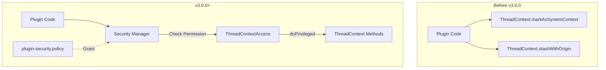

---
tags:
  - security
---

# Thread Context Permissions

## Summary

OpenSearch v3.0.0 introduces `ThreadContextPermission`, a new Java Security Manager permission class that protects sensitive methods in the `ThreadContext` class. This is a **breaking change** for plugins that directly call `markAsSystemContext()`, `stashWithOrigin()`, or `stashAndMergeHeaders()` methods—they must now declare explicit permissions in their `plugin-security.policy` file.

## Details

### What's New in v3.0.0

This release adds permission-based access control to three critical `ThreadContext` methods:

| Method | Permission Required |
|--------|---------------------|
| `markAsSystemContext()` | `ThreadContextPermission "markAsSystemContext"` |
| `stashWithOrigin(String)` | `ThreadContextPermission "stashWithOrigin"` |
| `stashAndMergeHeaders(Map)` | `ThreadContextPermission "stashAndMergeHeaders"` |

### Technical Changes

#### Architecture Changes



#### New Components

| Component | Description |
|-----------|-------------|
| `ThreadContextPermission` | New `BasicPermission` subclass in `org.opensearch.secure_sm` package for guarding ThreadContext methods |
| `ThreadContextAccess` | Internal helper class providing `doPrivileged()` and `doPrivilegedVoid()` wrappers for core code |

#### Security Policy Changes

The core OpenSearch server now includes these permissions in `security.policy`:

```
grant codeBase "${codebase.opensearch}" {
  permission org.opensearch.secure_sm.ThreadContextPermission "markAsSystemContext";
  permission org.opensearch.secure_sm.ThreadContextPermission "stashWithOrigin";
};
```

### Usage Example

Plugins that need to use these methods must:

1. Add permission declarations to `plugin-security.policy`:

```
grant {
  permission org.opensearch.secure_sm.ThreadContextPermission "markAsSystemContext";
  permission org.opensearch.secure_sm.ThreadContextPermission "stashWithOrigin";
  permission org.opensearch.secure_sm.ThreadContextPermission "stashAndMergeHeaders";
};
```

2. Wrap calls using `AccessController.doPrivileged()`:

```java
import java.security.AccessController;
import java.security.PrivilegedAction;

// Before (no longer works without permission)
threadContext.markAsSystemContext();

// After (with permission granted)
AccessController.doPrivileged((PrivilegedAction<Void>) () -> {
    threadContext.markAsSystemContext();
    return null;
});
```

### Migration Notes

**For Plugin Developers:**

1. Identify all usages of `markAsSystemContext()`, `stashWithOrigin()`, and `stashAndMergeHeaders()` in your plugin code
2. Add the required permissions to your `plugin-security.policy` file
3. Consider whether your plugin truly needs these capabilities—they allow bypassing security context checks

**Why This Change?**

- `markAsSystemContext()` marks the current thread as a system context, bypassing user authentication checks
- `stashWithOrigin()` sets an action origin that can affect authorization decisions
- These methods were previously public and accessible to any plugin without explicit permission
- The new permission model ensures plugins explicitly declare their need for these sensitive operations

## Limitations

- Plugins compiled against older OpenSearch versions will fail at runtime if they call these methods without the required permissions
- The Security Manager must be enabled for these permissions to be enforced (default in OpenSearch)

## References

### Documentation
- [OpenSearch Security Plugin Documentation](https://docs.opensearch.org/3.0/security/access-control/permissions/)

### Pull Requests
| PR | Description |
|----|-------------|
| [#15016](https://github.com/opensearch-project/OpenSearch/pull/15016) | Add ThreadContextPermission for markAsSystemContext |
| [#15039](https://github.com/opensearch-project/OpenSearch/pull/15039) | Add ThreadContextPermission for stashAndMergeHeaders and stashWithOrigin |

### Issues (Design / RFC)
- [Issue #14931](https://github.com/opensearch-project/OpenSearch/issues/14931): Feature request for higher-level APIs for plugins to switch contexts

## Related Feature Report

- [Full feature documentation](../../../../features/opensearch/opensearch-thread-context-permissions.md)
