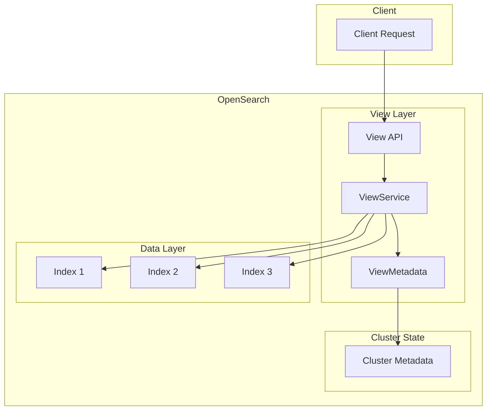
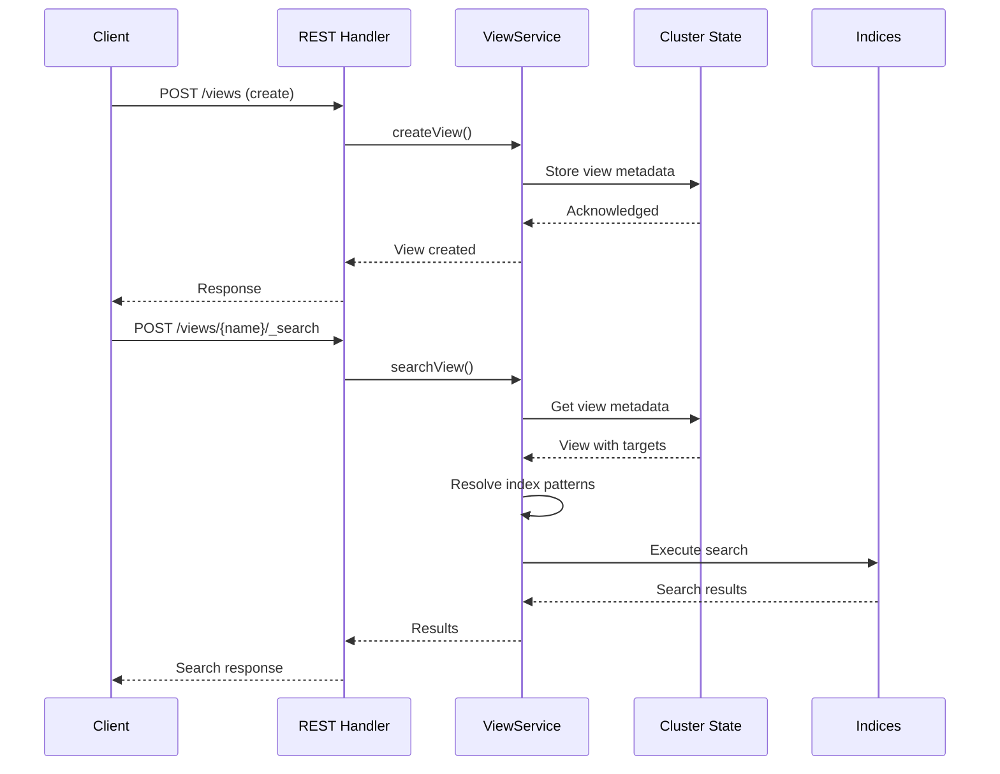

# Views

## Summary

Views is a new feature in OpenSearch 3.0.0 that provides a virtual layer over one or more indices, simplifying data access and manipulation. Views abstract the physical storage structure from search operations, allowing users to define logical groupings of indices that can be queried as a single entity.

## Details

### What's New in v3.0.0

OpenSearch 3.0.0 introduces the Views feature as an experimental API. Views provide a way to create named projections over indices, similar to SQL views, enabling:

- Logical grouping of multiple indices under a single name
- Simplified search operations across related indices
- Separation of data usage from physical storage structure
- Centralized management of index patterns

### Technical Changes

#### Architecture



#### New Components

| Component | Description |
|-----------|-------------|
| `View` | Core metadata class representing a view with name, description, and targets |
| `ViewMetadata` | Cluster metadata custom type for storing views |
| `ViewService` | Service handling CRUD operations and search for views |
| `CreateViewAction` | Transport action for creating views |
| `DeleteViewAction` | Transport action for deleting views |
| `GetViewAction` | Transport action for retrieving view details |
| `UpdateViewAction` | Transport action for updating views |
| `ListViewNamesAction` | Transport action for listing all view names |
| `SearchViewAction` | Transport action for searching through a view |
| `RestViewAction` | REST handlers for view API endpoints |

#### New REST API Endpoints

| Endpoint | Method | Description |
|----------|--------|-------------|
| `/views` | POST | Create a new view |
| `/views` | GET | List all view names |
| `/views/{view_name}` | GET | Get view details |
| `/views/{view_name}` | PUT | Update a view |
| `/views/{view_name}` | DELETE | Delete a view |
| `/views/{view_name}/_search` | GET/POST | Search through a view |

#### New Configuration

| Setting | Description | Default |
|---------|-------------|---------|
| View name | Unique identifier for the view | Required, max 64 chars |
| View description | Optional description | Empty string, max 256 chars |
| View targets | List of index patterns | Required, max 25 targets |

### Usage Example

```json
// Create a view
POST /views
{
  "name": "http-logs",
  "description": "All HTTP log indices",
  "targets": [
    { "indexPattern": "http-logs-*" }
  ]
}

// Search through the view
POST /views/http-logs/_search
{
  "query": {
    "match": {
      "status": "200"
    }
  }
}

// Get view details
GET /views/http-logs

// List all views
GET /views/

// Update a view
PUT /views/http-logs
{
  "description": "Updated description",
  "targets": [
    { "indexPattern": "http-logs-2024-*" },
    { "indexPattern": "http-logs-2025-*" }
  ]
}

// Delete a view
DELETE /views/http-logs
```

### Data Flow



## Limitations

- **Experimental API**: The Views feature is marked as `@ExperimentalApi` and may change in future releases
- **No scroll support**: Scroll queries are not supported when searching views
- **Read-only**: Views are for search operations only; write operations must target indices directly
- **No security integration**: Views do not yet integrate with document-level security or field-level security
- **Maximum limits**: Views are limited to 25 targets, 64-character names, and 64-character index patterns

## References

### Pull Requests
| PR | Description |
|----|-------------|
| [#11957](https://github.com/opensearch-project/OpenSearch/pull/11957) | Projected Views - Initial implementation |

### Issues (Design / RFC)
- [Issue #6181](https://github.com/opensearch-project/OpenSearch/issues/6181): RFC - Data projection with views
- [Issue #3888](https://github.com/opensearch-project/security/issues/3888): Related security plugin issue

## Related Feature Report

- [Full feature documentation](../../../../features/opensearch/views.md)
