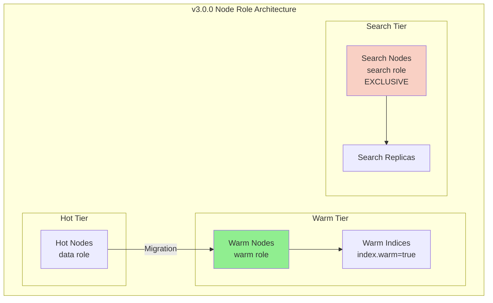

---
tags:
  - indexing
  - search
---

# Warm/Hot Tiering

## Summary

OpenSearch v3.0.0 introduces foundational changes to the warm/hot tiering architecture by updating nomenclature and introducing distinct node roles. The "search" node role is renamed to "warm" for nodes hosting warm indices with partial store locality, while a new exclusive "search" role is introduced specifically for search-only shards. These changes establish clear separation between writable warm indices and search replicas.

## Details

### What's New in v3.0.0

This release establishes the foundation for warm/hot tiering with three key changes:

1. **Warm Index Setting**: New `index.warm` boolean setting to identify warm indices
2. **Warm Node Role**: Renamed from "search" to "warm" for nodes hosting warm indices
3. **Search Node Role**: New exclusive role for dedicated search-only shard nodes

### Technical Changes

#### Architecture Changes



#### Node Role Changes

| Before v3.0.0 | v3.0.0+ | Purpose |
|---------------|---------|---------|
| `search` role | `warm` role | Hosts warm indices with partial store locality |
| N/A | `search` role (new) | Dedicated to search-only shards (exclusive) |

#### New Components

| Component | Description |
|-----------|-------------|
| `DiscoveryNodeRole.WARM_ROLE` | Node role for warm tier nodes (renamed from SEARCH_ROLE) |
| `DiscoveryNodeRole.SEARCH_ROLE` | New exclusive role for search-only shard nodes |
| `IS_WARM_INDEX_SETTING` | Index setting (`index.warm`) to identify warm indices |

#### New Configuration

| Setting | Description | Default |
|---------|-------------|---------|
| `index.warm` | Boolean setting to mark an index as warm | `false` |
| `node.roles: [warm]` | Configure node as warm tier node | - |
| `node.roles: [search]` | Configure node as search-only node (exclusive) | - |

#### API Changes

| Method | Before | After |
|--------|--------|-------|
| Node role check | `isSearchNode()` | `isWarmNode()` |
| Dedicated node check | `isDedicatedSearchNode()` | `isDedicatedWarmNode()` |
| Index locality check | `isStoreLocalityPartial()` | `isWarmIndex()` |
| Tiering utility | `TieringUtils.isPartialIndex()` | `TieringUtils.isWarmIndex()` |

#### Feature Flag

| Before | After |
|--------|-------|
| `TIERED_REMOTE_INDEX` | `WRITABLE_WARM_INDEX_EXPERIMENTAL_FLAG` |

The experimental feature flag is: `opensearch.experimental.feature.writable_warm_index.enabled`

### Usage Example

#### Configure a Warm Node

```yaml
# opensearch.yml
node.name: warm-node-1
node.roles: [ warm ]
```

#### Configure a Search-Only Node

```yaml
# opensearch.yml
node.name: search-node-1
node.roles: [ search ]
# Note: search role cannot be combined with other roles
```

#### Check if Index is Warm

```java
// In code
boolean isWarm = IndexMetadata.INDEX_WARM_SETTING.get(indexSettings);
```

### Migration Notes

**Breaking Change for Searchable Snapshots:**

If you were using the "search" node role for searchable snapshots in v2.x, you must update your configuration:

```yaml
# Before v3.0.0
node.roles: [ search ]

# v3.0.0+
node.roles: [ warm ]
```

**Search Role Exclusivity:**

The new `search` role in v3.0.0 is exclusive and cannot be combined with other roles:

```yaml
# Valid
node.roles: [ search ]

# Invalid - will fail
node.roles: [ search, data ]
```

## Limitations

- The `search` role is exclusive and cannot be combined with any other role on a node
- Warm indices require remote store to be enabled at the cluster level
- The writable warm index feature is experimental and requires enabling the feature flag

## References

### Documentation
- [Searchable Snapshots Documentation](https://docs.opensearch.org/3.0/tuning-your-cluster/availability-and-recovery/snapshots/searchable_snapshot/)
- [Creating a Cluster - Node Roles](https://docs.opensearch.org/3.0/tuning-your-cluster/)

### Pull Requests
| PR | Description |
|----|-------------|
| [#17490](https://github.com/opensearch-project/OpenSearch/pull/17490) | Added Warm index setting and updated nomenclature for hot/warm tiering |
| [#17573](https://github.com/opensearch-project/OpenSearch/pull/17573) | Renamed node role from search to warm |
| [#17620](https://github.com/opensearch-project/OpenSearch/pull/17620) | Introduced new search node role for search-only shards |

### Issues (Design / RFC)
- [Issue #17489](https://github.com/opensearch-project/OpenSearch/issues/17489): Update nomenclature for tiering indices for writable warm
- [Issue #13149](https://github.com/opensearch-project/OpenSearch/issues/13149): [META] Writable Warm Index
- [Issue #17422](https://github.com/opensearch-project/OpenSearch/issues/17422): Restrict Search Replica Allocation to Search-Dedicated Nodes

## Related Feature Report

- [Full feature documentation](../../../features/opensearch/opensearch-warm-storage-tiering.md)
