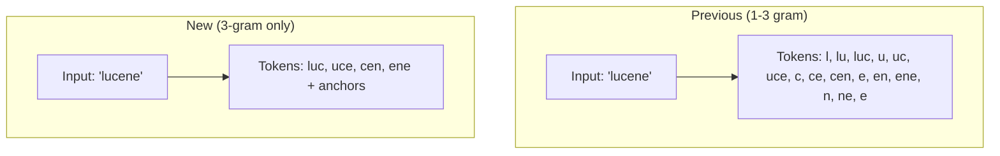

---
tags:
  - indexing
  - performance
  - search
---

# Wildcard Field 3-gram Indexing Optimization

## Summary

OpenSearch v3.0.0 optimizes the wildcard field type by changing the indexing strategy from 1-3 gram to 3-gram only. This reduces index size by approximately 20% and improves write throughput by 5-25%, while maintaining equivalent search performance for wildcard, prefix, and regexp queries.

## Details

### What's New in v3.0.0

The wildcard field type now indexes only 3-grams (trigrams) instead of the previous 1-3 gram approach. This optimization was driven by benchmark results showing that single and double character n-grams create long posting lists that don't significantly improve search performance but substantially increase storage requirements.

### Technical Changes

#### Indexing Strategy Change



#### Token Generation

For the string "lucene", the new tokenizer emits:
- `[0, 0, 'l']` - prefix anchor
- `[0, 'l', 'u']` - prefix anchor
- `['l', 'u', 'c']` - trigram
- `['u', 'c', 'e']` - trigram
- `['c', 'e', 'n']` - trigram
- `['e', 'n', 'e']` - trigram
- `['n', 'e', 0]` - suffix anchor
- `['e', 0, 0]` - suffix anchor

The `NGRAM_SIZE` constant is set to 3, and all tokens are now exactly 3 characters with zero-valued anchors for prefix/suffix boundaries.

#### Modified Components

| Component | Description |
|-----------|-------------|
| `WildcardFieldMapper.java` | Core mapper with updated tokenizer logic |
| `WildcardFieldTokenizer` | Simplified to emit only 3-grams |
| `getRequiredNGrams()` | Updated query term extraction for 3-gram matching |

#### Query Behavior Changes

When searching with patterns containing fewer than 3 non-wildcard characters, the query falls back to an existence check rather than attempting to match short n-grams:

```java
if (findNonWildcardSequence(value, 0) != value.length() || value.length() == 0 || value.contains("?")) {
    approximation = this.existsQuery(context);
}
```

### Performance Improvements

Based on benchmark testing from Issue #17099:

| Metric | 1-3 gram | 3-gram only | Improvement |
|--------|----------|-------------|-------------|
| Write throughput (http_logs) | 194,174 docs/s | 206,403 docs/s | +6.3% |
| Write throughput (treccovid) | 1,130 docs/s | 1,469 docs/s | +30% |
| Index size (doc files) | 9 GB | 4.69 GB | -48% |
| Total index size | 22.1 GB | 17.7 GB | -20% |

Search performance remains comparable, with some queries showing slight improvements due to shorter posting lists.

### Usage Example

The wildcard field type usage remains unchanged:

```json
PUT logs
{
  "mappings": {
    "properties": {
      "log_line": {
        "type": "wildcard"
      }
    }
  }
}
```

Queries work the same way:

```json
GET logs/_search
{
  "query": {
    "wildcard": {
      "log_line": {
        "value": "*Exception*"
      }
    }
  }
}
```

### Migration Notes

- **Breaking Change**: Indexes created with v3.0.0 use the new 3-gram only format
- **Rolling Upgrade**: The PR includes rolling upgrade tests to ensure compatibility during cluster upgrades
- Existing indexes created with previous versions will continue to work but won't benefit from the storage reduction until reindexed

## Limitations

- Search patterns with fewer than 3 consecutive non-wildcard characters may have slightly different performance characteristics
- The optimization is most beneficial for longer strings; very short field values may not see significant storage savings

## References

### Documentation
- [Wildcard Field Documentation](https://docs.opensearch.org/3.0/field-types/supported-field-types/wildcard/): Official documentation

### Blog Posts
- [OpenSearch 2.15 Blog](https://opensearch.org/blog/diving-into-opensearch-2-15/): Initial wildcard field introduction

### Pull Requests
| PR | Description |
|----|-------------|
| [#17349](https://github.com/opensearch-project/OpenSearch/pull/17349) | Wildcard field use only 3-gram to index |

### Issues (Design / RFC)
- [Issue #17099](https://github.com/opensearch-project/OpenSearch/issues/17099): Feature request with benchmark data

## Related Feature Report

- [Full feature documentation](../../../features/opensearch/wildcard-field.md)
