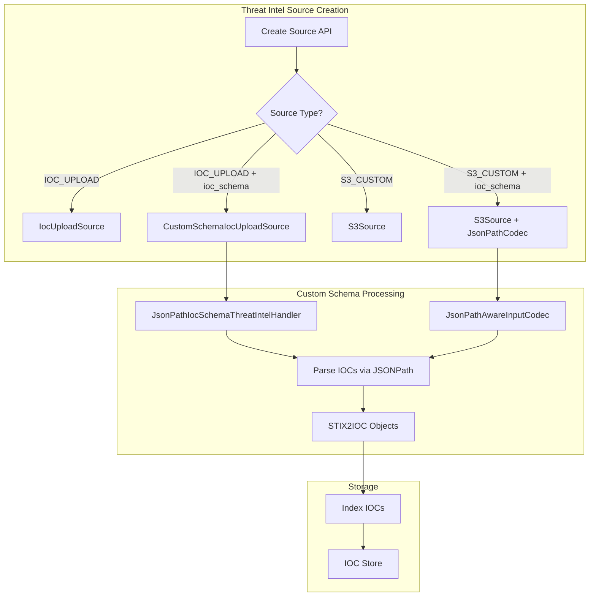

---
tags:
  - domain/security
  - component/server
  - indexing
  - security
---
# Threat Intelligence Custom Format Support

## Summary

OpenSearch v3.0.0 adds support for uploading threat intelligence Indicators of Compromise (IOCs) in custom JSON formats. Previously, users could only upload IOCs in a predefined STIX2 format. This enhancement allows users to define their own JSON schema using JSONPath notation, enabling integration with third-party security vendors and internally curated threat intelligence feeds without format conversion.

## Details

### What's New in v3.0.0

This release introduces the ability to upload threat intelligence IOCs using custom JSON schemas. Users can now:

- Upload IOCs in any JSON format by specifying JSONPath expressions to extract IOC fields
- Use the `custom_schema_ioc_upload` source type for local file uploads with custom schemas
- Define custom IOC types beyond the predefined STIX2 types
- Automatically compute IOC types from parsed data

### Technical Changes

#### Architecture Changes



#### New Components

| Component | Description |
|-----------|-------------|
| `JsonPathIocSchema` | Stores JSONPath expressions for extracting IOC fields from custom JSON |
| `JsonPathSchemaField` | Encapsulates a single JSONPath expression for a field |
| `CustomSchemaIocUploadSource` | New source type for uploading IOCs with custom schema |
| `JsonPathIocSchemaThreatIntelHandler` | Parses IOCs from JSON using JSONPath notation |
| `JsonPathAwareInputCodec` | Input codec for parsing S3 downloads with custom schema |

#### New Configuration

| Setting | Description | Default |
|---------|-------------|---------|
| `ioc_schema` | Object containing JSONPath schema definition | `null` |
| `ioc_schema.json_path_schema.type.json_path` | JSONPath to extract IOC type | Required |
| `ioc_schema.json_path_schema.value.json_path` | JSONPath to extract IOC value | Required |
| `ioc_schema.json_path_schema.id.json_path` | JSONPath to extract IOC ID | Optional |
| `ioc_schema.json_path_schema.name.json_path` | JSONPath to extract IOC name | Optional |
| `ioc_schema.json_path_schema.severity.json_path` | JSONPath to extract severity | Optional |
| `ioc_schema.json_path_schema.created.json_path` | JSONPath to extract creation time | Optional |
| `ioc_schema.json_path_schema.modified.json_path` | JSONPath to extract modification time | Optional |
| `ioc_schema.json_path_schema.description.json_path` | JSONPath to extract description | Optional |

#### API Changes

The Create Threat Intel Source API now accepts an optional `ioc_schema` field and a new `custom_schema_ioc_upload` source type.

### Usage Example

```json
POST _plugins/_security_analytics/threat_intel/sources/
{
  "name": "custom_threat_feed",
  "format": "STIX2",
  "type": "IOC_UPLOAD",
  "description": "Custom format threat intel feed",
  "enabled": false,
  "source": {
    "custom_schema_ioc_upload": {
      "file_name": "custom_iocs.json",
      "iocs": "{\"indicators\":[{\"indicator_type\":\"ipv4-addr\",\"indicator_value\":\"192.168.1.1\"},{\"indicator_type\":\"domain-name\",\"indicator_value\":\"malware.example.com\"}]}"
    }
  },
  "ioc_schema": {
    "json_path_schema": {
      "type": {
        "json_path": "$.indicators[*].indicator_type"
      },
      "value": {
        "json_path": "$.indicators[*].indicator_value"
      }
    }
  }
}
```

### S3 Custom Schema Example

```json
POST _plugins/_security_analytics/threat_intel/sources/
{
  "type": "S3_CUSTOM",
  "name": "s3-custom-format-feed",
  "format": "STIX2",
  "enabled": true,
  "schedule": {
    "interval": {
      "start_time": 1717097122,
      "period": "1",
      "unit": "DAYS"
    }
  },
  "source": {
    "s3": {
      "bucket_name": "my-threat-intel-bucket",
      "object_key": "custom-iocs.json",
      "region": "us-west-2",
      "role_arn": "arn:aws:iam::123456789012:role/threat_intel_role"
    }
  },
  "ioc_schema": {
    "json_path_schema": {
      "type": {
        "json_path": "$.*[*].ioc_type"
      },
      "value": {
        "json_path": "$.*[*].ioc_value"
      }
    }
  }
}
```

### Migration Notes

- Existing threat intel sources using `IOC_UPLOAD` or `S3_CUSTOM` types continue to work without changes
- The `ioc_types` field is now computed automatically from parsed IOCs when using custom schema
- IOC type validation has been relaxed to support custom IOC types beyond predefined STIX2 types

## Limitations

- JSONPath expressions must return equal numbers of type and value elements
- Custom schema parsing requires both `type` and `value` JSONPath expressions
- The `ioc_schema` field is only supported for `IOC_UPLOAD` and `S3_CUSTOM` source types
- Labels field parsing from custom schema is not yet supported

## References

### Documentation
- [Threat Intelligence Documentation](https://docs.opensearch.org/3.0/security-analytics/threat-intelligence/index/): Official docs
- [Source API Documentation](https://docs.opensearch.org/3.0/security-analytics/threat-intelligence/api/source/): API reference
- [JSONPath Wikipedia](https://en.wikipedia.org/wiki/JSONPath): JSONPath specification reference

### Pull Requests
| PR | Description |
|----|-------------|
| [#1493](https://github.com/opensearch-project/security-analytics/pull/1493) | Adds support for uploading threat intelligence in Custom Format (main branch) |
| [#1455](https://github.com/opensearch-project/security-analytics/pull/1455) | Original implementation for 2.x branch |

### Issues (Design / RFC)
- [Issue #1421](https://github.com/opensearch-project/security-analytics/issues/1421): Feature request for custom JSON schema support

## Related Feature Report

- [Full feature documentation](../../../features/security-analytics/security-analytics-threat-intelligence.md)
