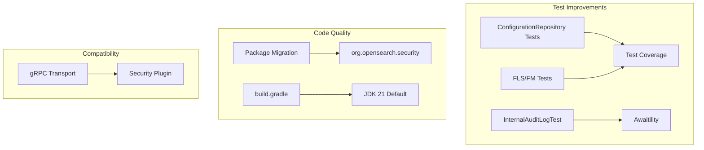

# Security Code Quality & Testing

## Summary

OpenSearch 3.0.0 includes significant code quality improvements and testing enhancements for the Security plugin. These changes focus on improving test coverage, refactoring legacy code, modernizing test utilities, and ensuring compatibility with the secure gRPC transport feature.

## Details

### What's New in v3.0.0

This release includes several maintenance and testing improvements:

1. **Test Coverage Improvements**: Added comprehensive tests for `ConfigurationRepository` class and FLS/field masking functionality
2. **Test Refactoring**: Migrated `InternalAuditLogTest` to use Awaitility for more reliable async testing
3. **Package Migration**: Moved classes from legacy `com.amazon.dlic` package to `org.opensearch.security`
4. **Build System Cleanup**: Removed obsolete Java version checks for reflection arguments
5. **gRPC Compatibility**: Fixed compilation issues after secure gRPC PR merged into core

### Technical Changes

#### Test Infrastructure Improvements



#### New Test Coverage

| Area | Description |
|------|-------------|
| `ConfigurationRepository` | Unit tests for security configuration management |
| `DlsFlsFilterLeafReader` | Integration tests for FLS/FM with various operations |
| `InternalAuditLogTest` | Refactored to use Awaitility for async assertions |

#### Package Migration

Classes migrated from `com.amazon.dlic` to `org.opensearch.security`:
- Originally from deprecated `security-advanced-modules` repository
- No behavioral changes, purely organizational refactoring

#### Build System Changes

```groovy
// Removed obsolete Java version check
// JDK 21 is now the default for OpenSearch 3.0.0
// Reflection args are applied unconditionally
```

### Usage Example

The FLS/FM test matrix covers:

```java
// Test matrix for FLS/FM functionality
// Different users with different FLS/FM configs
// Different operations: get, search, aggregation, terms vectors

@Test
public void testFlsFieldMasking() {
    // User with FLS config
    try (TestRestClient client = cluster.getRestClient(FLS_USER)) {
        // Verify field-level security is applied
        HttpResponse response = client.get("/_search");
        // Assert restricted fields are not visible
    }
    
    // User with field masking config
    try (TestRestClient client = cluster.getRestClient(FM_USER)) {
        // Verify field masking is applied
        HttpResponse response = client.get("/_search");
        // Assert masked fields show hashed values
    }
}
```

### Migration Notes

- No migration required for end users
- Plugin developers: Update imports from `com.amazon.dlic.*` to `org.opensearch.security.*`

## Limitations

- These are internal improvements with no user-facing changes
- Test improvements are for development/CI purposes only

## References

### Documentation
- [Security Plugin Documentation](https://docs.opensearch.org/3.0/security/index/): OpenSearch Security plugin docs
- [PR #5071](https://github.com/opensearch-project/security/pull/5071): Original flakiness fix for InternalAuditLogTest

### Pull Requests
| PR | Repository | Description |
|----|------------|-------------|
| [#5206](https://github.com/opensearch-project/security/pull/5206) | security | Tests for ConfigurationRepository class |
| [#5214](https://github.com/opensearch-project/security/pull/5214) | security | Refactor InternalAuditLogTest to use Awaitility |
| [#5218](https://github.com/opensearch-project/security/pull/5218) | security | Remove Java version check for reflection args |
| [#5223](https://github.com/opensearch-project/security/pull/5223) | security | Migrate from com.amazon.dlic to org.opensearch.security |
| [#5237](https://github.com/opensearch-project/security/pull/5237) | security | More tests for FLS and field masking |
| [#17796](https://github.com/opensearch-project/OpenSearch/pull/17796) | OpenSearch | Enable TLS for Netty4GrpcServerTransport |

### Issues (Design / RFC)
- [Issue #3255](https://github.com/opensearch-project/security/issues/3255): Test coverage improvement tracking

## Related Feature Report

- [Security Testing Framework](../../../features/security/security-testing-framework.md)
