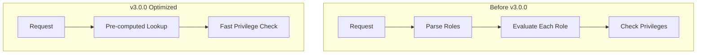

# Security Plugin Bugfixes

## Summary

OpenSearch v3.0.0 includes 26 changes to the Security plugin, comprising bug fixes, enhancements, and breaking changes. Key updates include optimized privilege evaluation for improved performance, removal of deprecated OpenSSL provider and whitelist settings, fixes for Blake2b hash implementation, and various DLS/FLS improvements.

## Details

### What's New in v3.0.0

This release focuses on security hardening, performance optimization, and code modernization for the Security plugin.

### Technical Changes

#### Breaking Changes

| Change | Description | Migration |
|--------|-------------|-----------|
| Blake2b Hash Fix | Corrected parameter passing in Blake2b hash implementation | Passwords must be re-hashed after upgrade |
| OpenSSL Provider Removal | Removed OpenSSL TLS provider (incompatible with JDK 21+) | Use JDK TLS provider |
| Whitelist → Allowlist | Removed deprecated `whitelist` settings | Migrate to `allowlist` settings |

#### Optimized Privilege Evaluation

PR [#4380](https://github.com/opensearch-project/security/pull/4380) introduces de-normalized data structures optimized for privilege evaluation checks. Key improvements:

- Pre-computed privilege structures for faster evaluation
- DLS queries prepared ahead of time
- Reduced overhead during indexing operations
- More detailed error messages for missing privileges
- DLS/FLS now defaults to "deny by default" for safety



#### New Configuration Options

| Setting | Description | Default |
|---------|-------------|---------|
| `password_score_based_validation_strength` | Now accepts `good` as valid value | `fair` |
| `ignore_hosts` | Now supports CIDR ranges (e.g., `127.0.0.0/8`) | - |

#### New Permissions

| Permission | Description |
|------------|-------------|
| `indices:admin/plugins/replication/index/stop` | Added to `index_management_full_access` role |
| `indices:data/read/cat/shards` | New cat shard API permission |

### Usage Example

```yaml
# config.yml - Rate limiting with CIDR support
config:
  dynamic:
    auth_failure_listeners:
      ip_rate_limiting:
        type: ip
        allowed_tries: 5
        time_window_seconds: 60
        block_expiry_seconds: 600
        ignore_hosts:
          - 127.0.0.0/8
          - 10.0.0.0/8
          - 192.168.0.0/16
```

### Migration Notes

1. **Blake2b Hash Migration**: After upgrading to v3.0.0, existing passwords hashed with Blake2b will no longer work. Users must reset passwords or re-hash them.

2. **OpenSSL Provider**: If using `plugins.security.ssl.transport.enable_openssl_if_available` or similar settings, remove them. JDK TLS is now the only option.

3. **Whitelist to Allowlist**: Replace all `whitelist` configuration keys with `allowlist`:
   ```yaml
   # Before
   plugins.security.restapi.whitelist_enabled: true
   
   # After
   plugins.security.restapi.allowlist_enabled: true
   ```

4. **Password Validation**: If using `password_score_based_validation_strength`, the value `good` is now valid in addition to `fair`, `strong`, and `very_strong`.

## Limitations

- Blake2b hash change is not backward compatible
- OpenSSL TLS provider no longer available
- Some configuration changes require cluster restart

## References

### Documentation
- [Documentation: Security Settings](https://docs.opensearch.org/3.0/install-and-configure/configuring-opensearch/security-settings/)
- [Documentation: Breaking Changes](https://docs.opensearch.org/3.0/breaking-changes/)

### Pull Requests
| PR | Description | Category |
|----|-------------|----------|
| [#4380](https://github.com/opensearch-project/security/pull/4380) | Optimized Privilege Evaluation | enhancement |
| [#5089](https://github.com/opensearch-project/security/pull/5089) | Fix Blake2b hash implementation | breaking |
| [#5220](https://github.com/opensearch-project/security/pull/5220) | Remove OpenSSL provider | breaking |
| [#5224](https://github.com/opensearch-project/security/pull/5224) | Remove whitelist settings in favor of allowlist | breaking |
| [#5099](https://github.com/opensearch-project/security/pull/5099) | Add support for CIDR ranges in ignore_hosts | enhancement |
| [#5119](https://github.com/opensearch-project/security/pull/5119) | Add 'good' as valid password validation strength | enhancement |
| [#5153](https://github.com/opensearch-project/security/pull/5153) | Replace password generator with secure action | enhancement |
| [#5160](https://github.com/opensearch-project/security/pull/5160) | Add stop-replication permission | enhancement |
| [#5175](https://github.com/opensearch-project/security/pull/5175) | Escape pipe character for injected users | bugfix |
| [#5193](https://github.com/opensearch-project/security/pull/5193) | Default to v7 models if _meta not present | bugfix |
| [#5217](https://github.com/opensearch-project/security/pull/5217) | Fix IllegalArgumentException in stateful index privileges | bugfix |
| [#5243](https://github.com/opensearch-project/security/pull/5243) | Fix DlsFlsFilterLeafReader termVectors assertion errors | bugfix |
| [#5304](https://github.com/opensearch-project/security/pull/5304) | Fix DlsFlsFilterLeafReader PointValues and object attributes | bugfix |
| [#4979](https://github.com/opensearch-project/security/pull/4979) | Only check validity of certs in node certificate chain | bugfix |
| [#5157](https://github.com/opensearch-project/security/pull/5157) | Fix version matcher in demo config installer | bugfix |
| [#2218](https://github.com/opensearch-project/security/pull/2218) | Remove tenant panels when multitenancy disabled | enhancement |
| [#2223](https://github.com/opensearch-project/security/pull/2223) | Add cat shard API permission | enhancement |
| [#4966](https://github.com/opensearch-project/security/pull/4966) | Run Security build on opensearch-build image | enhancement |
| [#1454](https://github.com/opensearch-project/security/pull/1454) | Java-agent gradle plugin for SecurityManager phase-off | bugfix |
| [#1414](https://github.com/opensearch-project/security/pull/1414) | Use testclusters when testing with security | enhancement |
| [#713](https://github.com/opensearch-project/security/pull/713) | Fetch certs from security repo, remove local demo certs | bugfix |
| [#1281](https://github.com/opensearch-project/security/pull/1281) | Fix custom rule creation | bugfix |
| [#1401](https://github.com/opensearch-project/security/pull/1401) | Fix Docker Security Tests qualifier parsing | bugfix |
| [#1467](https://github.com/opensearch-project/security/pull/1467) | Refactored flaky test | bugfix |
| [#1498](https://github.com/opensearch-project/security/pull/1498) | Remove overrides of preserveIndicesUponCompletion | bugfix |
| [#1503](https://github.com/opensearch-project/security/pull/1503) | Remove usage of deprecated batchSize() method | bugfix |

### Issues (Design / RFC)
- [Issue #4274](https://github.com/opensearch-project/security/issues/4274): Blake2b hash issue
- [Issue #3870](https://github.com/opensearch-project/security/issues/3870): Optimized privilege evaluation
- [Issue #4927](https://github.com/opensearch-project/security/issues/4927): CIDR range support
- [Issue #5238](https://github.com/opensearch-project/security/issues/5238): DlsFlsFilterLeafReader termVectors issue
- [Issue #1483](https://github.com/opensearch-project/OpenSearch/issues/1483): Deprecate non-inclusive terms

## Related Feature Report

- [Full feature documentation](../../../features/security/security-plugin.md)
