---
tags:
  - domain/security
  - component/server
  - performance
  - security
---
# Security Plugin Changes

## Summary

OpenSearch 3.0.0 introduces significant breaking changes to the Security plugin, including a corrected Blake2b hash implementation, removal of OpenSSL provider support, removal of deprecated whitelist settings in favor of allowlist, and optimized privilege evaluation. These changes improve security, performance, and align with inclusive terminology standards.

## Details

### What's New in v3.0.0

This release includes three breaking changes and several enhancements to the Security plugin.

### Technical Changes

#### Breaking Changes

```mermaid
graph TB
    subgraph "Breaking Changes in v3.0.0"
        B1[Blake2b Hash Fix]
        B2[OpenSSL Provider Removal]
        B3[Whitelist → Allowlist]
    end
    
    B1 --> |"Different hash values"| Migration1[Re-hash passwords]
    B2 --> |"JDK 21 requirement"| Migration2[Use JDK TLS]
    B3 --> |"Config rename"| Migration3[Update settings]
```



##### 1. Blake2b Hash Implementation Fix (PR #5089)

The Blake2b hash implementation was passing parameters incorrectly, resulting in wrong hash values. This fix produces correct but different hashes compared to previous versions.

**Impact:**
- Existing hashed passwords will no longer match
- Users must re-hash passwords after upgrade
- Affects internal user database authentication

**Resolution:** Resolves [Issue #4274](https://github.com/opensearch-project/security/issues/4274)

##### 2. OpenSSL Provider Removal (PR #5220)

Support for configuring OpenSSL as a TLS provider has been removed. OpenSSL was not supported with JDK > 11, and since OpenSearch 3.0.0 requires JDK 21 minimum, this configuration option is no longer applicable.

**Impact:**
- `plugins.security.ssl.transport.enable_openssl_if_available` setting removed
- `plugins.security.ssl.http.enable_openssl_if_available` setting removed
- All TLS operations now use JDK's built-in TLS implementation

**Migration:** Remove any OpenSSL-related settings from `opensearch.yml`.

##### 3. Whitelist Settings Removal (PR #5224)

Non-inclusive "whitelist" terminology has been removed in favor of "allowlist", completing the deprecation started in OpenSearch 2.0.

**Impact:**
- `whitelist.yml` configuration file renamed to `allowlist.yml`
- API endpoints using "whitelist" removed
- Settings with "whitelist" prefix removed

**Migration:** 
- Rename `whitelist.yml` to `allowlist.yml`
- Update any automation scripts using whitelist endpoints

#### Enhancements

| PR | Title | Description |
|----|-------|-------------|
| [#4380](https://github.com/opensearch-project/security/pull/4380) | Optimized Privilege Evaluation | De-normalized data structures for faster privilege checks |
| [#5099](https://github.com/opensearch-project/security/pull/5099) | CIDR Ranges in ignore_hosts | Support for CIDR notation in rate limiting configuration |
| [#5119](https://github.com/opensearch-project/security/pull/5119) | Password Validation Strength | Added 'good' as valid value for password strength validation |
| [#5160](https://github.com/opensearch-project/security/pull/5160) | Stop-Replication Permission | Added permission to index_management_full_access role |
| [#5153](https://github.com/opensearch-project/security/pull/5153) | Secure Password Generator | Replaced password generator step with secure action |
| [#2223](https://github.com/opensearch-project/security-dashboards-plugin/pull/2223) | Cat Shard API Permission | Added permission for cat shards API |

#### Optimized Privilege Evaluation (PR #4380)

A major performance enhancement that introduces de-normalized data structures optimized for privilege evaluation checks. Key improvements:

- Faster action privilege evaluation
- Optimized DLS/FLS/FM privilege evaluation
- DLS queries prepared ahead of time
- Reduced overhead during indexing operations

**Behavioral Changes:**
- `config.dynamic.multi_rolespan_enabled` is no longer evaluated (behaves as always `true`)
- More detailed error messages for missing privileges
- DLS/FLS defaults to "deny by default" implementation

#### CIDR Range Support in ignore_hosts (PR #5099)

The `ignore_hosts` setting in authentication failure listeners now supports CIDR notation:

```yaml
auth_failure_listeners:
  ip_rate_limiting:
    type: ip
    allowed_tries: 3
    time_window_seconds: 60
    block_expiry_seconds: 600
    ignore_hosts:
      - 127.0.0.0/8
      - 10.0.0.0/8
      - 192.168.0.0/16
```

### Migration Notes

1. **Blake2b Hash Migration:**
   - After upgrade, users with hashed passwords must reset their passwords
   - Use `securityadmin.sh` to update internal users

2. **OpenSSL Removal:**
   - Remove OpenSSL settings from configuration
   - Verify TLS works with JDK implementation before upgrade

3. **Whitelist to Allowlist:**
   - Rename configuration files
   - Update API calls in scripts

4. **Privilege Evaluation:**
   - No action required for most users
   - Review error messages if experiencing privilege issues

## Limitations

- Blake2b hash change requires password re-hashing for all internal users
- OpenSSL removal may affect performance in some high-throughput TLS scenarios
- Whitelist settings migration must be done before upgrade

## References

### Documentation
- [Documentation: Breaking Changes](https://docs.opensearch.org/3.0/breaking-changes/)
- [Documentation: Security Settings](https://docs.opensearch.org/3.0/install-and-configure/configuring-opensearch/security-settings/)

### Pull Requests
| PR | Description |
|----|-------------|
| [#5089](https://github.com/opensearch-project/security/pull/5089) | Fix Blake2b hash implementation |
| [#5220](https://github.com/opensearch-project/security/pull/5220) | Remove OpenSSL provider |
| [#5224](https://github.com/opensearch-project/security/pull/5224) | Remove whitelist settings in favor of allowlist |
| [#4380](https://github.com/opensearch-project/security/pull/4380) | Optimized Privilege Evaluation |
| [#5099](https://github.com/opensearch-project/security/pull/5099) | Add support for CIDR ranges in ignore_hosts |
| [#5119](https://github.com/opensearch-project/security/pull/5119) | Add 'good' as valid password validation strength |
| [#5160](https://github.com/opensearch-project/security/pull/5160) | Add stop-replication permission |
| [#5153](https://github.com/opensearch-project/security/pull/5153) | Replace password generator with secure action |

### Issues (Design / RFC)
- [Issue #4274](https://github.com/opensearch-project/security/issues/4274): Blake2b hash issue
- [Issue #3870](https://github.com/opensearch-project/security/issues/3870): Optimized privilege evaluation proposal
- [Issue #4927](https://github.com/opensearch-project/security/issues/4927): CIDR range support request
- [Issue #1483](https://github.com/opensearch-project/OpenSearch/issues/1483): Deprecate non-inclusive terms

## Related Feature Report

- [Full feature documentation](../../../../features/security/security-plugin.md)
