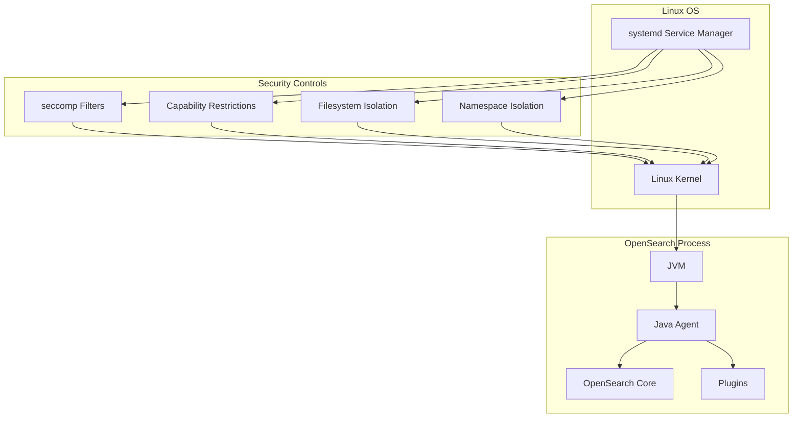

---
tags:
  - domain/security
  - component/server
  - ml
  - security
---
# Systemd Security Configurations

## Summary

OpenSearch 3.0.0 introduces systemd security configurations to strengthen OS-level security. This feature provides process-level sandboxing using native Linux security mechanisms including seccomp system call filtering, capability restrictions, and filesystem access controls. These configurations work alongside the Java agent to replace the deprecated Java Security Manager (JSM).

## Details

### What's New in v3.0.0

OpenSearch 3.0.0 ships with a hardened systemd unit file (`opensearch.service`) that applies comprehensive security restrictions to the OpenSearch process. This is part of the two-pronged strategy to replace JSM: the Java agent handles plugin-level access control, while systemd hardening provides operating system-level protection.

### Technical Changes

#### Architecture Changes



#### New Components

| Component | Description |
|-----------|-------------|
| `opensearch.service` | Hardened systemd unit file with security directives |
| `SystemdIntegTests.java` | Integration tests validating systemd security configurations |
| `terminate.sh` | Test script for process termination protection |

#### New Configuration

| Setting | Description | Default |
|---------|-------------|---------|
| `SystemCallFilter` | Restricts system calls via seccomp | `@system-service`, `~@reboot`, `~@swap` |
| `CapabilityBoundingSet` | Blocks dangerous Linux capabilities | Removes `CAP_SYS_ADMIN`, `CAP_SYS_PTRACE`, `CAP_NET_ADMIN` |
| `ReadWritePaths` | Directories with write access | `/var/log/opensearch`, `/var/lib/opensearch`, `/dev/shm/` |
| `ReadOnlyPaths` | Read-only system paths | `/etc/os-release`, `/proc/self/mountinfo`, cgroup paths |
| `ProtectSystem` | System directory protection | `full` |
| `PrivateTmp` | Isolated temporary directory | `true` |
| `NoNewPrivileges` | Prevent privilege escalation | `true` |
| `ProtectKernelModules` | Prevent kernel module loading | `true` |
| `ProtectKernelTunables` | Prevent sysctl modifications | `true` |
| `RestrictNamespaces` | Restrict namespace creation | `true` |
| `LockPersonality` | Prevent ABI personality changes | `true` |

#### System Call Filtering

The systemd unit file uses seccomp to restrict system calls:

```ini
# Allow system service calls
SystemCallFilter=@system-service
# Block reboot-related calls
SystemCallFilter=~@reboot
# Block swap-related calls
SystemCallFilter=~@swap
# Allow memory management calls needed by OpenSearch
SystemCallFilter=seccomp mincore madvise mlock mlock2 munlock
SystemCallFilter=get_mempolicy sched_getaffinity sched_setaffinity fcntl
# Return EPERM for blocked calls
SystemCallErrorNumber=EPERM
```

#### Capability Restrictions

```ini
# Remove dangerous capabilities
CapabilityBoundingSet=~CAP_BLOCK_SUSPEND
CapabilityBoundingSet=~CAP_LEASE
CapabilityBoundingSet=~CAP_SYS_PACCT
CapabilityBoundingSet=~CAP_SYS_TTY_CONFIG
CapabilityBoundingSet=~CAP_SYS_ADMIN ~CAP_SYS_PTRACE ~CAP_NET_ADMIN
```

#### Filesystem Access Controls

```ini
# Read-write paths for OpenSearch data
ReadWritePaths=/var/log/opensearch
ReadWritePaths=/var/lib/opensearch
ReadWritePaths=/dev/shm/
ReadWritePaths=-/etc/opensearch
ReadWritePaths=-/mnt/snapshots

# Read-only system information
ReadOnlyPaths=-/etc/os-release -/usr/lib/os-release -/etc/system-release
ReadOnlyPaths=/proc/self/mountinfo /proc/diskstats
ReadOnlyPaths=/proc/self/cgroup /sys/fs/cgroup/cpu /sys/fs/cgroup/memory
```

### Usage Example

The systemd security configurations are automatically applied when OpenSearch is installed via RPM or DEB packages and managed by systemd:

```bash
# Start OpenSearch with systemd (security configs applied automatically)
sudo systemctl start opensearch

# Verify security settings are active
sudo systemctl show opensearch --property=ProtectSystem,PrivateTmp,NoNewPrivileges

# Check seccomp status for the process
grep Seccomp /proc/$(systemctl show --property=MainPID opensearch | cut -d= -f2)/status
```

### Migration Notes

- Systemd security configurations are automatically applied for new installations
- Existing installations upgrading to 3.0.0 will receive the new unit file
- Custom systemd overrides may need adjustment if they conflict with security settings
- Snapshot paths outside default locations require adding to `ReadWritePaths`

## Limitations

- Only available on Linux distributions using systemd as the init system
- Security rules apply at process level, not per-plugin
- Custom data paths require manual configuration in systemd overrides
- Some monitoring tools may require additional capabilities

## References

### Documentation
- [systemd.exec documentation](https://www.freedesktop.org/software/systemd/man/systemd.exec.html)

### Blog Posts
- [Blog: Finding a replacement for JSM in OpenSearch 3.0](https://opensearch.org/blog/finding-a-replacement-for-jsm-in-opensearch-3-0/)

### Pull Requests
| PR | Description |
|----|-------------|
| [#17107](https://github.com/opensearch-project/security/pull/17107) | Add systemd configurations to strengthen OS core security |
| [#17410](https://github.com/opensearch-project/OpenSearch/pull/17410) | Added integ tests for systemd configs |
| [#17641](https://github.com/opensearch-project/OpenSearch/pull/17641) | Fix systemd integTest on deb regarding path ownership check |

### Issues (Design / RFC)
- [Issue #17614](https://github.com/opensearch-project/OpenSearch/issues/17614): Bug fix for deb package ownership check

## Related Feature Report

- Full feature documentation
