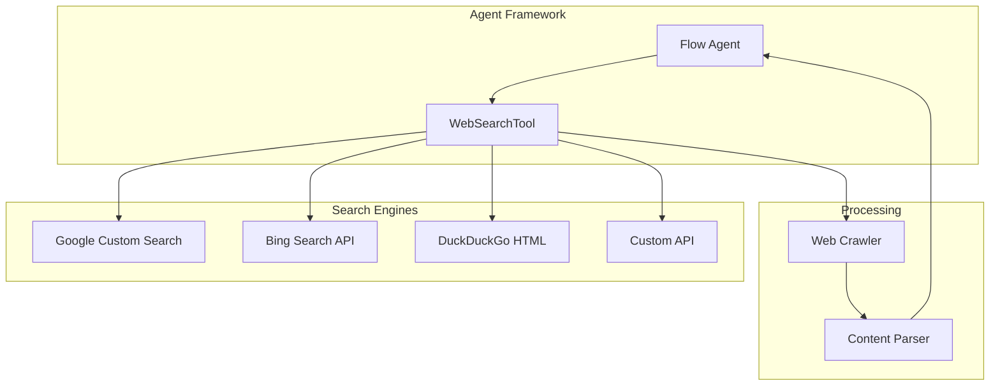

---
tags:
  - ml
  - search
---

# Skills / Tools Bugfixes and Enhancements

## Summary

OpenSearch 3.0.0 includes several improvements to the Skills plugin, which provides tools for the ML Commons agent framework. This release adds a new WebSearchTool for web search capabilities, fixes a bug in PPLTool when handling empty lists, updates build dependencies, and enhances developer documentation.

## Details

### What's New in v3.0.0

#### WebSearchTool (New Feature)

A new `WebSearchTool` has been added to enable web search capabilities within the agent framework. This tool supports multiple search engines and allows agents to retrieve information from the web to answer user questions.

**Supported Search Engines:**
- Google (requires API key and engine ID)
- Bing (requires API key)
- DuckDuckGo (no credentials required)
- Custom API endpoints

**Key Features:**
- Multi-engine support with configurable endpoints
- Pagination support via `next_page` parameter
- Web page crawling with content extraction using Jsoup
- CAPTCHA detection to skip protected pages
- Dedicated thread pool for web crawling operations

#### Architecture



#### New Components

| Component | Description |
|-----------|-------------|
| `WebSearchTool` | Main tool class implementing web search functionality |
| `WebSearchTool.Factory` | Factory class for tool instantiation |
| `websearch-crawler-threadpool` | Dedicated thread pool for web crawling operations |

#### New Configuration

| Setting | Description | Default |
|---------|-------------|---------|
| `engine` | Search engine to use | Required |
| `endpoint` | API endpoint URL | Engine-specific default |
| `api_key` | API key for authentication | None |
| `engine_id` | Google Custom Search Engine ID | None |
| `query` | Search query | Required |
| `next_page` | Pagination link | None |
| `token` | Authorization token for crawling | None |

### PPLTool Empty List Bug Fix

Fixed a bug in `PPLTool` where passing an empty list would cause an `IndexOutOfBoundsException`. The fix adds proper null and empty list checks before accessing list elements.

**Before (buggy):**
```java
while (v instanceof List<?>) {
    v = ((List<?>) v).get(0);  // Throws if list is empty
}
```

**After (fixed):**
```java
while (!Objects.isNull(v) && v instanceof List<?>) {
    List<?> listValue = (List<?>) v;
    if (!listValue.isEmpty()) {
        v = ((List<?>) v).get(0);
    } else {
        break;
    }
}
```

### Dependency Updates

Replaced `ml-common-client` build dependency with `ml-common-common` and `ml-common-spi`. This change reduces unnecessary dependencies since the skills plugin doesn't use any classes from the client library.

### Developer Guide Enhancement

Added a new section to the Developer Guide explaining how to build and test custom tools, including:
- Creating a new tool Java file
- Modifying ToolPlugin to register the tool
- Testing with remote connectors and agents

### Usage Example

```json
POST /_plugins/_ml/agents/_register
{
  "name": "WebSearch Agent",
  "type": "flow",
  "description": "Agent with web search capability",
  "tools": [
    {
      "type": "WebSearchTool",
      "name": "DuckduckgoWebSearchTool",
      "parameters": {
        "engine": "duckduckgo",
        "input": "${parameters.question}"
      }
    }
  ]
}
```

## Limitations

- WebSearchTool may be blocked by CAPTCHA or login pages
- DuckDuckGo uses HTML scraping which may break if page structure changes
- Web crawling is subject to rate limiting and robots.txt restrictions

## References

### Documentation
- [WebSearchTool Documentation](https://docs.opensearch.org/3.0/ml-commons-plugin/agents-tools/tools/web-search-tool/): Official documentation
- [Tools Documentation](https://docs.opensearch.org/3.0/ml-commons-plugin/agents-tools/tools/index/): Tools overview
- [PPL Tool Documentation](https://docs.opensearch.org/3.0/ml-commons-plugin/agents-tools/tools/ppl-tool/): PPL tool reference

### Pull Requests
| PR | Description |
|----|-------------|
| [#547](https://github.com/opensearch-project/skills/pull/547) | Add WebSearchTool |
| [#541](https://github.com/opensearch-project/skills/pull/541) | Fix list bug in PPLTool when passing empty list |
| [#529](https://github.com/opensearch-project/skills/pull/529) | Replace ml-common-client with ml-common-common and ml-common-spi |
| [#521](https://github.com/opensearch-project/skills/pull/521) | Add tutorial to build and test custom tool |

### Issues (Design / RFC)
- [Issue #538](https://github.com/opensearch-project/skills/issues/538): Feature request for WebSearchTool

## Related Feature Report

- [Full feature documentation](../../../features/skills/skills-tools.md)
