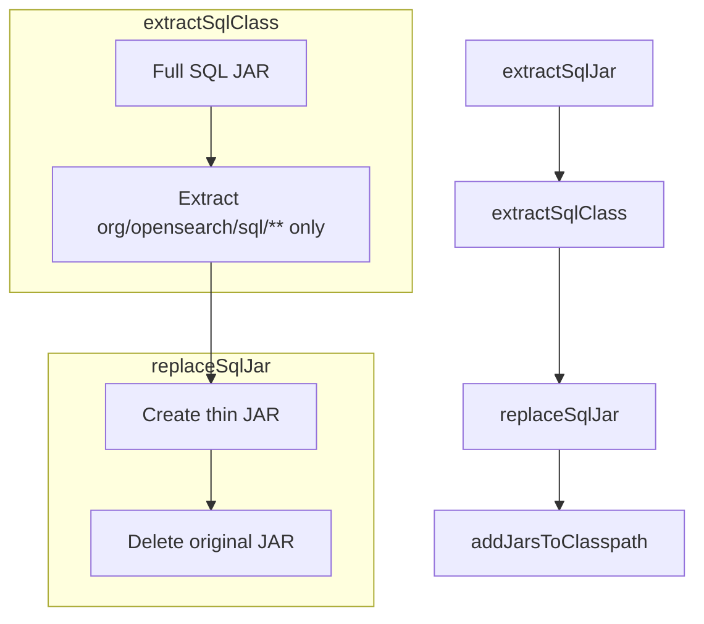

# SQL Plugin Jar Hell Fix

## Summary

This release fixes a jar hell issue in the Skills plugin caused by conflicting classes from the SQL plugin JAR. The fix excludes non-SQL related classes from the `opensearch-sql-xxx.jar` to prevent class conflicts during runtime.

## Details

### What's New in v3.0.0

The Skills plugin depends on SQL plugin classes for compilation and runtime type reference (not for SQL execution). However, the full SQL JAR included classes that conflicted with other dependencies, causing jar hell errors during plugin loading.

### Technical Changes

#### Build Configuration Changes

The fix introduces a new build process that creates a "thin" SQL JAR containing only the necessary SQL classes:

| Change | Description |
|--------|-------------|
| New `extractSqlClass` task | Extracts only `org/opensearch/sql/**` classes from the full SQL JAR |
| New `replaceSqlJar` task | Creates `opensearch-sql-thin-{version}.jar` with only SQL classes |
| Updated dependency | Changed from `opensearch-sql-{version}.jar` to `opensearch-sql-thin-{version}.jar` |

#### Build Process Flow

### Usage Example

The change is transparent to users. The Skills plugin now loads without jar hell errors when used alongside other plugins that may have conflicting dependencies.

### Migration Notes

No migration required. This is a build-time fix that does not affect plugin configuration or APIs.

## Limitations

- The thin JAR approach means Skills plugin cannot directly execute SQL queries (it relies on the SQL plugin for actual execution)
- Only `org/opensearch/sql/**` classes are included; other utility classes from the SQL JAR are excluded

## Related PRs

| PR | Description |
|----|-------------|
| [#545](https://github.com/opensearch-project/skills/pull/545) | Fix jar hell for sql jar |

## References

- [PR #543 Comment](https://github.com/opensearch-project/skills/pull/543#issuecomment-2773924634): Original issue discussion

## Related Feature Report

- [Skills Tools](../../../features/skills/skills-tools.md)
