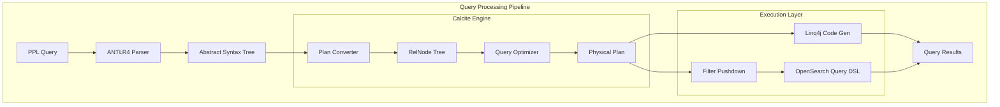

# Calcite Query Engine

## Summary

OpenSearch v3.0.0 introduces the Apache Calcite-based query engine for PPL (Piped Processing Language), enabling advanced analytical capabilities including joins, lookups, and subsearches. This major enhancement transforms PPL from a simple query language into a powerful tool for complex log analysis and data correlation workflows.

## Details

### What's New in v3.0.0

The Calcite Query Engine (V3) brings a complete query processing framework built on Apache Calcite, providing:

- **New PPL Commands**: `join`, `lookup`, and `subsearch` for cross-index data correlation
- **Query Optimization**: Automatic filter pushdown and query plan optimization
- **UDF Framework**: Extensible user-defined function interface for math, string, and condition functions
- **Type System**: Custom OpenSearch type system with support for date, time, timestamp, IP, geo_point, and binary types
- **Thread Pool Execution**: Queries execute in dedicated thread pool for better resource management
- **Enhanced Explain**: New explain endpoint output showing logical and physical query plans

### Technical Changes

#### Architecture Changes



#### New Components

| Component | Description |
|-----------|-------------|
| `CalcitePPLParser` | Converts PPL AST to Calcite RelNode tree |
| `OpenSearchTypeSystem` | Custom type system for OpenSearch data types |
| `OpenSearchTypeFactory` | Factory for creating OpenSearch-specific types |
| `PPLFuncImpTable` | Logical-level function implementation registry |
| `PPLBuiltinOperators` | Physical-level UDF implementations |
| `CalciteEnumerableIndexScan` | OpenSearch index scan operator |
| `OpenSearchEnumerableRel` | Base class for OpenSearch Calcite operators |

#### New Configuration

| Setting | Description | Default |
|---------|-------------|---------|
| `plugins.calcite.enabled` | Enable Calcite engine for PPL queries | `false` |

#### New PPL Commands

| Command | Syntax | Description |
|---------|--------|-------------|
| `join` | `source=a \| join [type] ON condition b` | Join two indexes with LEFT/RIGHT/INNER/OUTER/CROSS/SEMI/ANTI join types |
| `lookup` | `source=a \| lookup b field [AS alias]` | Enrich data by looking up values from reference index |
| `subsearch` | `where [NOT] exists/in [subquery]` | Filter using IN, EXISTS, SCALAR, or RELATION subqueries |

#### Supported UDFs

| Category | Functions |
|----------|-----------|
| Math | `atan`, `atan2`, `pow`, `sqrt`, `abs`, `ceil`, `floor`, `round`, `exp`, `ln`, `log`, `log10`, `log2` |
| String | `concat`, `length`, `lower`, `upper`, `trim`, `ltrim`, `rtrim`, `substring`, `replace`, `reverse`, `position` |
| Condition | `if`, `ifnull`, `nullif`, `coalesce`, `case` |
| Date/Time | `now`, `curdate`, `curtime`, `date`, `time`, `timestamp`, `date_add`, `date_sub`, `datediff` |
| Type | `typeof`, `cast` |

#### Supported Data Types (UDT)

| Type | Description |
|------|-------------|
| `DATE` | Date without time component |
| `TIME` | Time without date component |
| `TIMESTAMP` | Full date and time |
| `IP` | IPv4/IPv6 addresses |
| `GEO_POINT` | Geographic coordinates |
| `BINARY` | Binary data |
| `ALIAS` | Field aliases |

### Usage Example

```bash
# Enable Calcite engine
PUT _cluster/settings
{
  "transient": {
    "plugins.calcite.enabled": true
  }
}

# Or via query settings API
PUT _plugins/_query/settings
{
  "transient": {
    "plugins.calcite.enabled": true
  }
}

# Lookup: Enrich logs with user information
POST /_plugins/_ppl
{
  "query": "source=auth_logs | lookup user_info user_id | where status='failed'"
}

# Join: Correlate authentication and application logs
POST /_plugins/_ppl
{
  "query": "source=auth_logs | join left=l right=r ON l.user_id = r.user_id AND TIME_TO_SEC(TIMEDIFF(r.timestamp, l.timestamp)) <= 60 app_logs | fields timestamp, user_id, action"
}

# Subsearch with EXISTS: Find failed logins followed by successful app login
POST /_plugins/_ppl
{
  "query": "source=auth_logs | where status='failed' AND exists [source=app_logs | where user_id=auth_logs.user_id AND action='login']"
}

# Subsearch with IN: Filter by users in specific department
POST /_plugins/_ppl
{
  "query": "source=logs | where user_id in [source=users | where department='IT' | fields user_id]"
}

# Explain query plan
POST /_plugins/_ppl
{
  "query": "explain source=auth_logs | lookup user_info user_id | where status='failed'"
}

# Group by span over time
POST /_plugins/_ppl
{
  "query": "source=logs | stats count() by span(timestamp, 1h)"
}

# Parse command
POST /_plugins/_ppl
{
  "query": "source=logs | parse message '(?<ip>\\d+\\.\\d+\\.\\d+\\.\\d+)' | fields ip"
}

# Dedup command
POST /_plugins/_ppl
{
  "query": "source=logs | dedup user_id | fields user_id, timestamp"
}
```

### Migration Notes

1. **Enable Calcite**: Set `plugins.calcite.enabled: true` to use new commands
2. **PPL Only**: V3 engine currently optimizes PPL queries only; SQL uses existing engines
3. **Fallback**: If Calcite fails, queries automatically fall back to V2 engine
4. **Thread Pool**: Calcite queries run in dedicated thread pool for isolation

## Limitations

- Calcite engine is experimental in v3.0.0
- Only PPL queries are optimized by Calcite (SQL support planned for future)
- JOIN queries auto-terminate after 60 seconds by default
- Some PPL commands not yet supported: `trendline`, `top`, `rare`, `fillnull`, `dedup` with `consecutive=true`
- Pagination/cursor not supported in Calcite engine
- Aggregation over expressions has limited support

## References

### Documentation
- [SQL Settings Documentation](https://docs.opensearch.org/3.0/search-plugins/sql/settings/): Configuration reference

### Blog Posts
- [Enhanced Log Analysis Blog](https://opensearch.org/blog/enhanced-log-analysis-with-opensearch-ppl-introducing-lookup-join-and-subsearch/): Feature announcement

### Pull Requests
| PR | Description |
|----|-------------|
| [#3249](https://github.com/opensearch-project/sql/pull/3249) | Framework of Calcite Engine: Parser, Catalog Binding and Plan Converter |
| [#3258](https://github.com/opensearch-project/sql/pull/3258) | Make PPL execute successfully on Calcite engine |
| [#3318](https://github.com/opensearch-project/sql/pull/3318) | Make basic aggregation working |
| [#3327](https://github.com/opensearch-project/sql/pull/3327) | Push down project and filter operator into index scan |
| [#3349](https://github.com/opensearch-project/sql/pull/3349) | Register OpenSearchTypeSystem to OpenSearchTypeFactory |
| [#3364](https://github.com/opensearch-project/sql/pull/3364) | Implement PPL join command with Calcite |
| [#3366](https://github.com/opensearch-project/sql/pull/3366) | Enable push down optimization by default |
| [#3371](https://github.com/opensearch-project/sql/pull/3371) | Implement PPL IN subquery command with Calcite |
| [#3374](https://github.com/opensearch-project/sql/pull/3374) | Add UDF interface |
| [#3378](https://github.com/opensearch-project/sql/pull/3378) | Implement PPL relation subquery command with Calcite |
| [#3388](https://github.com/opensearch-project/sql/pull/3388) | Implement PPL exists subquery command with Calcite |
| [#3389](https://github.com/opensearch-project/sql/pull/3389) | Calcite enable pushdown aggregation |
| [#3390](https://github.com/opensearch-project/sql/pull/3390) | Add math UDF |
| [#3392](https://github.com/opensearch-project/sql/pull/3392) | Implement PPL scalar subquery command with Calcite |
| [#3393](https://github.com/opensearch-project/sql/pull/3393) | Add string builtin functions |
| [#3409](https://github.com/opensearch-project/sql/pull/3409) | Support multiple table and index pattern |
| [#3412](https://github.com/opensearch-project/sql/pull/3412) | Add condition UDFs |
| [#3416](https://github.com/opensearch-project/sql/pull/3416) | Implement PPL dedup command with Calcite |
| [#3419](https://github.com/opensearch-project/sql/pull/3419) | Implement lookup command |
| [#3421](https://github.com/opensearch-project/sql/pull/3421) | Support group by span over time based column with Span UDF |
| [#3429](https://github.com/opensearch-project/sql/pull/3429) | Support In expression in Calcite Engine |
| [#3433](https://github.com/opensearch-project/sql/pull/3433) | Support PPL BETWEEN operator within Calcite |
| [#3445](https://github.com/opensearch-project/sql/pull/3445) | Support metadata field |
| [#3446](https://github.com/opensearch-project/sql/pull/3446) | Support TYPEOF function with Calcite |
| [#3468](https://github.com/opensearch-project/sql/pull/3468) | Enable Calcite by default and refactor all related ITs |
| [#3471](https://github.com/opensearch-project/sql/pull/3471) | Add missing text function |
| [#3474](https://github.com/opensearch-project/sql/pull/3474) | Support parse command with Calcite |
| [#3476](https://github.com/opensearch-project/sql/pull/3476) | Support nested field |
| [#3483](https://github.com/opensearch-project/sql/pull/3483) | Support UDT for date, time, timestamp |
| [#3504](https://github.com/opensearch-project/sql/pull/3504) | Support UDT for IP |
| [#3508](https://github.com/opensearch-project/sql/pull/3508) | Execute Calcite PPL query in thread pool |
| [#3511](https://github.com/opensearch-project/sql/pull/3511) | Support GEO_POINT type |
| [#3521](https://github.com/opensearch-project/sql/pull/3521) | New output for explain endpoint with Calcite engine |
| [#3531](https://github.com/opensearch-project/sql/pull/3531) | Enable update calcite setting through _plugins/_query/settings API |
| [#3538](https://github.com/opensearch-project/sql/pull/3538) | Support alias type field |
| [#3549](https://github.com/opensearch-project/sql/pull/3549) | Support UDT for BINARY |
| [#3558](https://github.com/opensearch-project/sql/pull/3558) | Support CASE function |

### Issues (Design / RFC)
- [Issue #3250](https://github.com/opensearch-project/sql/issues/3250): Calcite Engine Framework
- [Issue #3356](https://github.com/opensearch-project/sql/issues/3356): PPL Join Command
- [Issue #3358](https://github.com/opensearch-project/sql/issues/3358): Lookup Command
- [Issue #3451](https://github.com/opensearch-project/sql/issues/3451): Enable Calcite by Default

## Related Feature Report

- [Full feature documentation](../../../../features/sql/calcite-query-engine.md)
