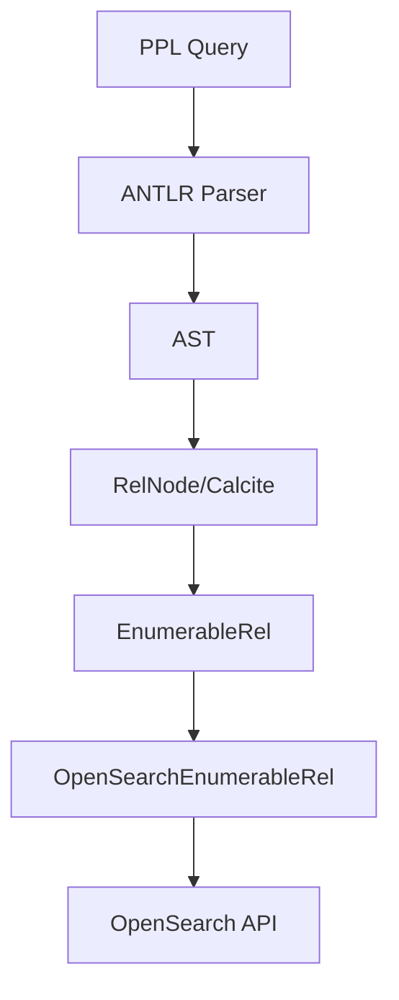

---
tags:
  - domain/search
  - component/server
  - performance
  - search
  - sql
---
# SQL/PPL Documentation

## Summary

This release item adds comprehensive documentation for the PPL V3 engine and its limitations in OpenSearch 3.0.0 Beta. The documentation covers the new Apache Calcite-based query engine architecture, new PPL commands (join, lookup, subquery), breaking changes from V2, and the fallback mechanism for unsupported queries.

## Details

### What's New in v3.0.0

This PR introduces developer and user documentation for the experimental PPL V3 engine, which integrates Apache Calcite for enhanced query processing capabilities.

### Technical Changes

#### New Documentation Files

| File | Description |
|------|-------------|
| `docs/dev/intro-v3-architecture.md` | V3 engine architecture overview with Calcite integration |
| `docs/dev/intro-v3-engine.md` | V3 engine features, limitations, and breaking changes |
| `docs/user/ppl/cmd/join.rst` | JOIN command documentation |
| `docs/user/ppl/cmd/lookup.rst` | LOOKUP command documentation |
| `docs/user/ppl/cmd/subquery.rst` | Subquery (subsearch) command documentation |

#### V3 Engine Architecture

The V3 engine integrates Apache Calcite to address key pain points:

1. **Complex Query Support**: Calcite provides industry-standard SQL parsing and optimization
2. **Unified PPL Experience**: Bridges the gap between PPL-on-OpenSearch and PPL-on-Spark
3. **Query Optimization**: Built-in RBO (Rule-Based Optimizer) and CBO (Cost-Based Optimizer)
4. **Robustness**: Leverages Calcite's mature, well-tested codebase

#### Query Processing Flow



#### New PPL Commands

| Command | Description | Syntax |
|---------|-------------|--------|
| `join` | Combines two datasets | `[joinType] JOIN left=l right=r ON <criteria> <dataset>` |
| `lookup` | Enriches data from lookup index | `LOOKUP <index> <mappingField> [REPLACE\|APPEND] <fields>` |
| `subquery` | Nested queries (InSubquery, ExistsSubquery, ScalarSubquery) | `where <field> [not] in [ source=... ]` |

#### Breaking Changes (V2 → V3)

| Item | V2 | V3 |
|------|-----|-----|
| Return type of `timestampdiff` | timestamp | int |
| Return type of `regexp` | int | boolean |
| Return type of `count`, `dc`, `distinct_count` | int | bigint |
| Return type of `ceiling`, `floor`, `sign` | int | same type as input |
| `like(firstname, 'Ambe_')` on "Amber JOHnny" | true | false |
| `cast(firstname as boolean)` | false | null |
| Sum of multiple `null` values (pushdown enabled) | 0 | null |

#### Configuration

| Setting | Description | Default |
|---------|-------------|---------|
| `plugins.calcite.enabled` | Enable V3 Calcite engine | `false` |

### Usage Example

Enable Calcite engine:
```bash
curl -H 'Content-Type: application/json' -X PUT localhost:9200/_plugins/_query/settings -d '{
  "transient": {
    "plugins.calcite.enabled": true
  }
}'
```

JOIN example:
```
source = state_country
| inner join left=a right=b ON a.name = b.name occupation
| stats avg(salary) by span(age, 10) as age_span, b.country
```

LOOKUP example:
```
source = worker
| LOOKUP work_information uid AS id REPLACE department
| fields id, name, occupation, country, salary, department
```

Subquery example:
```
source = outer | where a in [ source = inner | fields b ]
```

### Migration Notes

- V3 engine is experimental in 3.0.0-beta and disabled by default
- Unsupported queries automatically fall back to V2 engine
- Check OpenSearch logs for "Fallback to V2 query engine since..." messages
- Review breaking changes table before upgrading production workloads

## Limitations

The following functionalities fall back to V2 engine:
- All SQL queries (PPL only in V3)
- `trendline`, `top`, `rare`, `fillnull`, `patterns`
- `describe`, `explain`, `show datasource`
- `dedup` with `consecutive=true`
- Search-relevant commands (AD, ML, Kmeans)
- Commands with `fetch_size` parameter
- Queries with metadata fields (`_id`, `_doc`, etc.)
- JSON functions (`cast to json`, `json`, `json_valid`)
- Search functions (`match`, `match_phrase`, `query_string`, etc.)

## References

### Documentation
- [SQL and PPL Documentation](https://docs.opensearch.org/3.0/search-plugins/sql/index/): Official documentation
- [PPL V3 Engine Limitations](https://docs.opensearch.org/3.0/search-plugins/sql/limitation/): V3 limitations documentation

### Blog Posts
- [Enhanced Log Analysis Blog](https://opensearch.org/blog/enhanced-log-analysis-with-opensearch-ppl-introducing-lookup-join-and-subsearch/): Blog post on new PPL commands

### Pull Requests
| PR | Description |
|----|-------------|
| [#3488](https://github.com/opensearch-project/sql/pull/3488) | Documentation for PPL new engine (V3) and limitations of 3.0.0 Beta |

### Issues (Design / RFC)
- [Issue #3431](https://github.com/opensearch-project/sql/issues/3431): Documentation request for PPL V3 engine

## Related Feature Report

- Full feature documentation
