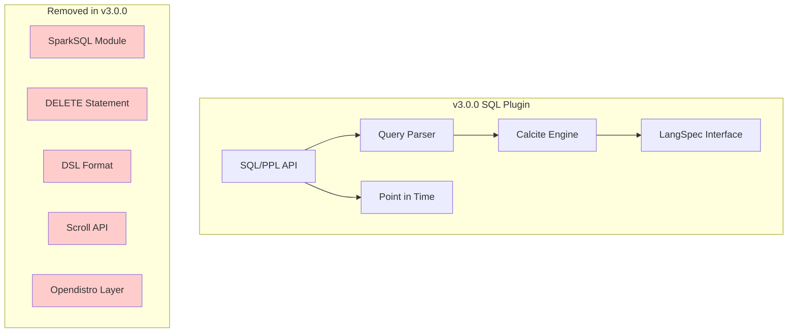

# SQL/PPL v3.0.0 Breaking Changes

## Summary

OpenSearch 3.0.0 introduces significant breaking changes to the SQL plugin, removing deprecated features and legacy compatibility layers. These changes include removal of SparkSQL support, deprecation of the DELETE statement, removal of OpenSearch DSL response format, deprecation of scroll API pagination, removal of opendistro settings/endpoints, unified PPL data types, and new Calcite-based function implementations.

## Details

### What's New in v3.0.0

The SQL plugin underwent major cleanup and modernization for v3.0.0, focusing on removing deprecated functionality and improving the query engine architecture.

### Technical Changes

#### Removed Features

| Feature | Description | Migration Path |
|---------|-------------|----------------|
| SparkSQL Support | Spark module removed entirely | Use JDBC connection or Spark's REST API |
| DELETE Statement | SQL DELETE no longer supported | Use OpenSearch Delete by Query API |
| DSL Response Format | OpenSearch query DSL format removed | Use SQL, PPL, or REST API |
| Scroll API Pagination | `plugins.sql.pagination.api` setting removed | Pagination defaults to Point in Time (PIT) |
| Opendistro Settings | All `opendistro.*` settings removed | Use `plugins.sql.*` settings |
| Opendistro Endpoints | Legacy `/_opendistro/_sql` endpoints removed | Use `/_plugins/_sql` endpoints |

#### Removed Settings

| Setting | Description |
|---------|-------------|
| `plugins.sql.delete.enabled` | DELETE statement toggle (removed with DELETE support) |
| `plugins.sql.pagination.api` | Pagination API selection (now defaults to PIT) |
| `opendistro.sql.*` | All legacy opendistro-prefixed settings |

#### New Features

| Feature | Description |
|---------|-------------|
| Unified PPL Data Types | New `LangSpec` interface for SQL/PPL type mapping |
| Calcite CAST Function | CAST function implemented with Calcite engine |
| Datetime Functions | New datetime functions with Calcite integration |
| Approximate Percentile | New approximate percentile functions |

#### Architecture Changes



### Usage Example

#### Before v3.0.0 (Deprecated)
```bash
# Opendistro endpoint (removed)
POST /_opendistro/_sql
{
  "query": "SELECT * FROM my_index"
}

# DSL format (removed)
POST /_plugins/_sql?format=json
{
  "query": "SELECT * FROM my_index"
}
```

#### v3.0.0 and Later
```bash
# Use plugins endpoint
POST /_plugins/_sql
{
  "query": "SELECT * FROM my_index"
}

# Use JDBC format (default)
POST /_plugins/_sql?format=jdbc
{
  "query": "SELECT * FROM my_index"
}
```

### Migration Notes

1. **SparkSQL Users**: Migrate to JDBC connections or use Spark's HTTP client library to interact with OpenSearch REST API
2. **DELETE Statement Users**: Use OpenSearch's Delete by Query API instead
3. **DSL Format Users**: Switch to SQL, PPL, or use OpenSearch REST API directly
4. **Scroll API Users**: No action needed - pagination automatically uses PIT
5. **Opendistro Settings**: Update all `opendistro.*` settings to `plugins.sql.*` equivalents
6. **Opendistro Endpoints**: Update API calls from `/_opendistro/_sql` to `/_plugins/_sql`

## Limitations

- Legacy code related to DELETE statement inherited from NLPChina remains but is non-functional
- Some Calcite-based functions may have different behavior than legacy implementations
- PIT-based pagination requires appropriate cluster permissions

## Related PRs

| PR | Description |
|----|-------------|
| [#3306](https://github.com/opensearch-project/sql/pull/3306) | Remove SparkSQL support |
| [#3319](https://github.com/opensearch-project/sql/pull/3319) | Bump gradle 8.10.2 / JDK23 on SQL plugin |
| [#3326](https://github.com/opensearch-project/sql/pull/3326) | Remove opendistro settings and endpoints |
| [#3337](https://github.com/opensearch-project/sql/pull/3337) | Deprecate SQL Delete statement |
| [#3345](https://github.com/opensearch-project/sql/pull/3345) | Unified OpenSearch PPL Data Type |
| [#3346](https://github.com/opensearch-project/sql/pull/3346) | Deprecate scroll API usage |
| [#3367](https://github.com/opensearch-project/sql/pull/3367) | Deprecate OpenSearch DSL format |
| [#3439](https://github.com/opensearch-project/sql/pull/3439) | Support CAST function with Calcite |
| [#3473](https://github.com/opensearch-project/sql/pull/3473) | Add datetime functions |

## References

- [Issue #3280](https://github.com/opensearch-project/sql/issues/3280): Deprecate DSL format
- [Issue #3281](https://github.com/opensearch-project/sql/issues/3281): Deprecate DELETE statement
- [Issue #3282](https://github.com/opensearch-project/sql/issues/3282): Remove opendistro settings
- [Issue #3283](https://github.com/opensearch-project/sql/issues/3283): Remove opendistro endpoints
- [Issue #3284](https://github.com/opensearch-project/sql/issues/3284): Deprecate scroll API
- [Issue #3286](https://github.com/opensearch-project/sql/issues/3286): Remove SparkSQL support
- [Issue #3339](https://github.com/opensearch-project/sql/issues/3339): Unified PPL data types
- [Issue #3417](https://github.com/opensearch-project/sql/issues/3417): CAST function with Calcite
- [Breaking Changes Documentation](https://docs.opensearch.org/3.0/breaking-changes/): Official v3.0.0 breaking changes
- [OpenSearch 3.0 Blog](https://opensearch.org/blog/opensearch-3-0-what-to-expect/): What to expect in OpenSearch 3.0

## Related Feature Report

- [Full feature documentation](../../../features/sql/sql-ppl-breaking-changes.md)
