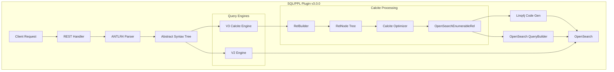

---
tags:
  - domain/search
  - component/server
  - observability
  - performance
  - search
  - sql
---
# SQL/PPL Engine

## Summary

OpenSearch 3.0.0 introduces a major evolution of the SQL/PPL plugin with the integration of Apache Calcite as the new query engine (V3). This release adds powerful new PPL commands (`lookup`, `join`, `subsearch`) for advanced log analysis, new functions (`json`, `cast to json`), improved `patterns` command with the Brain algorithm, and significant internal refactoring for better query optimization and execution.

## Details

### What's New in v3.0.0

The SQL/PPL plugin in v3.0.0 introduces:

1. **Apache Calcite Integration (V3 Engine)**: A new experimental query engine leveraging Apache Calcite for query optimization and execution
2. **New PPL Commands**: `lookup`, `join`, and `subsearch` for advanced log correlation and analysis
3. **New Functions**: `json()` function and `cast(x as json)` for JSON handling
4. **Improved Patterns Command**: New Brain algorithm for intelligent log pattern detection
5. **Function Framework Refactoring**: Cleaner architecture with `PPLFuncImpTable` and `PPLBuiltinOperators`
6. **Comment Support**: Line (`//`) and block (`/* */`) comments in PPL queries

### Technical Changes

#### Architecture Changes



#### New Components

| Component | Description |
|-----------|-------------|
| `PPLFuncImpTable` | Logical-level function implementation registry for resolving BuiltinFunctionName |
| `PPLBuiltinOperators` | Physical-level UDF implementations for Calcite operators |
| `CalciteFuncSignature` | Function signature resolution for different parameter types |
| Brain Algorithm | New log pattern detection algorithm for the `patterns` command |

#### New Configuration

| Setting | Description | Default |
|---------|-------------|---------|
| `plugins.calcite.enabled` | Enable V3 Calcite engine for advanced SQL/PPL features | `false` |

### Usage Example

#### Enable Calcite Engine
```bash
PUT _cluster/settings
{
  "transient": {
    "plugins.calcite.enabled": true
  }
}
```

#### New PPL Commands

**Lookup - Enrich logs with reference data:**
```sql
source=auth_logs | lookup user_info user_id | where status='failed'
```

**Join - Correlate logs from different indexes:**
```sql
source=auth_logs 
| join left=l right=r ON l.user_id = r.user_id AND TIME_TO_SEC(TIMEDIFF(r.timestamp, l.timestamp)) <= 60 app_logs 
| fields timestamp, user_id, action
```

**Subsearch - Dynamic filtering based on subquery results:**
```sql
source=auth_logs 
| where status='failed' AND exists [source=app_logs | where user_id=auth_logs.user_id AND action='login']
```

#### JSON Functions
```sql
source=json_test 
| where json_valid(json_string) 
| eval json=json(json_string) 
| fields test_name, json_string, json
```

#### PPL Comments
```sql
source=otel_logs /* OpenTelemetry logs */
| where kind = 'SPAN_KIND_CLIENT' // filter client spans
| eval r = 0.99 /* precision */
| stats sum(droppedEventsCount * r) as lostEvents
```

### Migration Notes

- V3 engine is experimental and disabled by default; enable with `plugins.calcite.enabled: true`
- Queries automatically fall back from V3 to V2 if V3 execution fails
- Some return types differ between V2 and V3 (see Limitations)
- New commands (`lookup`, `join`, `subsearch`) require Calcite to be enabled

## Limitations

- V3 engine is experimental in v3.0.0
- Some features not yet supported in V3: `trendline`, `top`, `rare`, `fillnull`, `patterns`, `dedup` with `consecutive=true`
- Return type differences between V2 and V3:
  - `timestampdiff`: V2 returns `timestamp`, V3 returns `int`
  - `regexp`: V2 returns `int`, V3 returns `boolean`
  - `count`/`dc`/`distinct_count`: V2 returns `int`, V3 returns `bigint`
- JOIN queries auto-terminate after 60 seconds by default (configurable via hint)

## References

### Documentation
- [SQL and PPL Documentation](https://docs.opensearch.org/3.0/search-plugins/sql/index/): Official documentation
- [SQL Settings](https://docs.opensearch.org/3.0/search-plugins/sql/settings/): Configuration reference
- [SQL Limitations](https://docs.opensearch.org/3.0/search-plugins/sql/limitation/): V3 engine limitations

### Blog Posts
- [Enhanced Log Analysis Blog](https://opensearch.org/blog/enhanced-log-analysis-with-opensearch-ppl-introducing-lookup-join-and-subsearch/): New PPL commands introduction

### Pull Requests
| PR | Description |
|----|-------------|
| [#3448](https://github.com/opensearch-project/sql/pull/3448) | Merge feature/calcite-engine to main |
| [#3243](https://github.com/opensearch-project/sql/pull/3243) | PPL: Add `json` function and `cast(x as json)` function |
| [#3263](https://github.com/opensearch-project/sql/pull/3263) | Improved patterns command with new Brain algorithm |
| [#2806](https://github.com/opensearch-project/sql/pull/2806) | Support line comment and block comment in PPL |
| [#3522](https://github.com/opensearch-project/sql/pull/3522) | Function framework refactoring |
| [#3304](https://github.com/opensearch-project/sql/pull/3304) | Add other functions to SQL query validator |
| [#3269](https://github.com/opensearch-project/sql/pull/3269) | Add SQLQuery Utils support for Vacuum queries |
| [#3278](https://github.com/opensearch-project/reporting/pull/3278) | Clean up syntax error reporting |

### Issues (Design / RFC)
- [Issue #154](https://github.com/tkykenmt/opensearch-feature-explorer/issues/154): SQL/PPL Engine tracking issue

## Related Feature Report

- Full feature documentation
