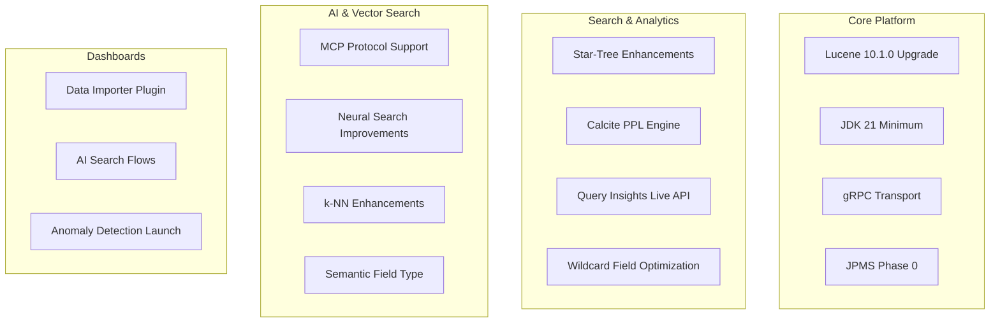

---
tags:
  - dashboards
  - indexing
  - k-nn
  - ml
  - neural-search
  - performance
  - search
  - security
  - sql
---

# OpenSearch v3.0.0 Release Summary

## Summary

OpenSearch 3.0.0 is a major release delivering significant upgrades across performance, data management, security, vector search, and AI capabilities. Key highlights include the upgrade to Apache Lucene 10.1.0 with JDK 21 as the minimum runtime, experimental gRPC transport support, enhanced star-tree indexing, a new Calcite-based PPL query engine with join/lookup/subsearch commands, Model Context Protocol (MCP) support for AI agent integration, and numerous neural search improvements including semantic sentence highlighting and Z-score normalization.

## Highlights

## New Features

| Feature | Description | Report |
|---------|-------------|--------|
| Lucene 10 Upgrade | Upgrade to Apache Lucene 10.1.0 with improved I/O parallelism, search execution, and vector search | Details |
| JDK 21 Minimum | JDK 21 becomes the minimum supported Java runtime | Details |
| gRPC Transport | Experimental high-performance gRPC transport with protocol buffers | Details |
| Calcite PPL Engine | Apache Calcite-based query engine with join, lookup, and subsearch commands | Details |
| MCP Support | Model Context Protocol for AI agent integration (client and server) | Details |
| Semantic Field | New field type for automatic text-to-vector transformation | Details |
| Data Importer | New Dashboards plugin for importing CSV, JSON, NDJSON files | Details |
| Live Queries API | Real-time monitoring of in-flight search queries | Details |
| Remote Vector Index Build | Experimental GPU-accelerated vector index building | Details |
| Threat Intel Custom Format | Upload IOCs in custom JSON formats with JSONPath | Details |

## Improvements

| Area | Description | Report |
|------|-------------|--------|
| Star-Tree Index | Support for terms/range aggregations, boolean queries, unsigned-long | Details |
| Hybrid Query | Z-score normalization, lower bounds for min-max, filter support, inner hits | Details |
| Wildcard Field | 3-gram only indexing reduces storage by ~20% | Details |
| Tiered Caching | Single cache manager, took-time policy for heap tier | Details |
| k-NN | Node-level circuit breakers, explain API, Lucene-on-Faiss mode | Details |
| Security | Optimized privilege evaluation, CIDR ranges in ignore_hosts | Details |
| Workspace | Saved objects isolation fix, stale workspace error handling | Details |
| AI Search Flows | Simplified RAG presets, model suggestions, JSON Lines ingestion | Details |

## Breaking Changes

| Change | Migration | Report |
|--------|-----------|--------|
| JDK 21 Required | Upgrade to JDK 21+ before upgrading to OpenSearch 3.0.0 | Details |
| Lucene 10 API Changes | Update plugins using Lucene APIs directly | Details |
| JPMS Split Package Elimination | Update imports for relocated classes | Details |
| k-NN Settings Removed | `ef_construction`, `m`, `space_type` removed from index settings | Details |
| SQL/PPL Changes | SparkSQL removed, opendistro endpoints deprecated, scroll API deprecated | Details |
| Security Changes | Blake2b hash fix, OpenSSL provider removed, whitelist→allowlist | Details |
| ML Commons | CatIndexTool uses `_list/indices` API, batch ingestion REST API deprecated | Details |
| Bulk API | 512 byte `_id` size limit enforced | Details |

## Experimental Features

| Feature | Description | Report |
|---------|-------------|--------|
| gRPC Transport | High-performance binary transport using protocol buffers | Details |
| Remote Vector Index Build | GPU-accelerated vector index construction | Details |
| MCP Protocol | Model Context Protocol for AI agent integration | Details |
| Plan-Execute-Reflect Agent | Autonomous multi-step problem-solving agent | Details |
| Pull-Based Ingestion | Fetch data directly from Kafka/Kinesis | N/A |

## Bug Fixes

| Fix | Description | PR |
|-----|-------------|-----|
| Workspace Saved Objects | Fix `_find` API returning all workspaces | [#9420](https://github.com/opensearch-project/OpenSearch-Dashboards/pull/9420) |
| Hybrid Query Scores | Fix null score for single shard sorting | [#1277](https://github.com/opensearch-project/neural-search/pull/1277) |
| k-NN PUT Mappings | Prevent NullPointerException during PUT mappings | [#2556](https://github.com/opensearch-project/k-NN/issues/2556) |
| XGBoost Model Parser | Add parser for correct XGBoost serialization format | [#151](https://github.com/opensearch-project/opensearch-learning-to-rank-base/pull/151) |
| Security Privilege Evaluation | Fix IllegalArgumentException for stateful index privileges | [#5217](https://github.com/opensearch-project/security/pull/5217) |

## Dependencies

Notable dependency updates in this release:

| Dependency | Previous | New |
|------------|----------|-----|
| Apache Lucene | 9.12.1 | 10.1.0 |
| Minimum JDK | 11 | 21 |
| Build JDK | 17 | 21 |
| Shadow Plugin | `com.github.johnrengelman.shadow` | `com.gradleup.shadow:8.3.5` |
| ZSTD Library | - | 1.5.6-1 |

## Deprecation Notices

- **Ubuntu 20.04**: Support will be deprecated in an upcoming version (EOL April 2025)
- **Amazon Linux 2 (Dashboards)**: Support will be deprecated due to Node.js 18 EOL
- **SQL DELETE Statement**: Deprecated in v3.0.0
- **SQL Scroll API**: Deprecated in v3.0.0
- **OpenSearch DSL Format**: Deprecated in v3.0.0

## PGP Key Update

A new PGP public key (release@opensearch.org) is available for artifact verification on OpenSearch 3.0.0 and above. The previous key (opensearch@amazon.com) will be reserved for 2.x releases only. The new key expires March 6, 2027.

## References

- [Official Release Notes](https://github.com/opensearch-project/opensearch-build/blob/main/release-notes/opensearch-release-notes-3.0.0.md)
- [OpenSearch Core Release Notes](https://github.com/opensearch-project/OpenSearch/blob/main/release-notes/opensearch.release-notes-3.0.0.md)
- [OpenSearch Dashboards Release Notes](https://github.com/opensearch-project/OpenSearch-Dashboards/blob/main/release-notes/opensearch-dashboards.release-notes-3.0.0.md)
- [Breaking Changes Meta Issue](https://github.com/opensearch-project/opensearch-build/issues/5243)
- [OpenSearch 3.0 Blog](https://opensearch.org/blog/opensearch-3-0-what-to-expect/)
- [Feature Reports](features/)
