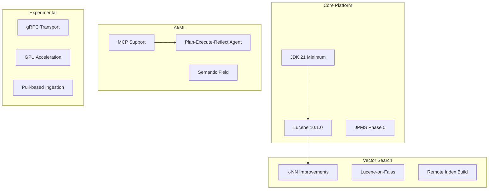

# OpenSearch v3.0.0 Release Summary

## Summary

OpenSearch 3.0.0 is a major release that delivers significant upgrades across performance, data management, security, and AI/ML capabilities. The release is built on Apache Lucene 10.1.0 and requires JDK 21 as the minimum runtime, enabling access to modern Java features and improved performance. Key themes include enhanced vector search capabilities, new agentic AI features with Model Context Protocol (MCP) support, experimental gRPC transport, and extensive breaking changes to remove deprecated functionality.

## Highlights

## New Features

| Feature | Description | Report |
|---------|-------------|--------|
| Lucene 10 Upgrade | Upgrade to Apache Lucene 10.1.0 with improved I/O parallelism, search execution, and vector search | [Details](features/opensearch/lucene-10-upgrade.md) |
| JDK 21 Minimum | JDK 21 as minimum runtime with JPMS Phase 0 split package elimination | [Details](features/opensearch/java-runtime-and-jpms.md) |
| gRPC Transport (Experimental) | High-performance binary transport using protocol buffers with TLS support | [Details](features/opensearch/grpc-transport--services.md) |
| MCP Support | Model Context Protocol client/server for AI agent integration | [Details](features/ml-commons/ml-commons-mcp.md) |
| Plan-Execute-Reflect Agent | New agent type for complex multi-step autonomous problem-solving | [Details](features/ml-commons/ml-commons-mcp.md) |
| Semantic Field | Automatic text-to-vector transformation at index time | [Details](features/neural-search/semantic-field.md) |
| Lucene-on-Faiss | Memory-optimized vector search for FAISS indexes | [Details](features/k-nn/lucene-on-faiss.md) |
| Remote Vector Index Build | Build k-NN indexes on remote infrastructure (Experimental) | [Details](features/k-nn/remote-vector-index-build.md) |
| Explain API for k-NN | Detailed insights into k-NN query scoring for Faiss engine | [Details](features/k-nn/explain-api-support.md) |
| Node-Level Circuit Breakers | Heterogeneous memory limits for k-NN in mixed-hardware clusters | [Details](features/k-nn/vector-search-k-nn.md) |
| Semantic Sentence Highlighting | Context-aware highlighting based on meaning, not just keywords | [Details](features/neural-search/neural-search-compatibility.md) |
| Z-Score Normalization | Statistical approach for hybrid search score normalization | [Details](features/neural-search/neural-search-compatibility.md) |
| PPL Join/Lookup/Subsearch | New PPL commands backed by Apache Calcite | [Details](features/sql/sqlppl-engine.md) |
| Tiered Caching Improvements | Unified cache manager and took-time policy for heap tier | [Details](features/opensearch/tiered-caching.md) |
| Cross-Cluster Search UI | Cross-cluster support in Dashboards Search Relevance | [Details](features/opensearch-dashboards/cross-cluster-search.md) |
| Anomaly Detection Contextual Launch | Launch anomaly detector from main dashboard | [Details](features/anomaly-detection/anomaly-detection.md) |
| Maps Cluster Layer | New cluster layer in Maps Dashboards | [Details](features/dashboards-maps/maps-geospatial.md) |

## Breaking Changes

| Change | Impact | Migration |
|--------|--------|-----------|
| JDK 21 Minimum | JDK 11/17 no longer supported | Upgrade to JDK 21+ before upgrading |
| Lucene 10 API Changes | `TotalHits.value` → `TotalHits.value()` | Update plugin code using Lucene APIs |
| k-NN Index Settings Removed | `index.knn.algo_param.*`, `index.knn.space_type` removed | Use method-level parameters in field mapping |
| SQL SparkSQL Removed | Spark module removed entirely | Use JDBC or Spark REST API |
| SQL DELETE Deprecated | SQL DELETE statement no longer supported | Use Delete by Query API |
| SQL Opendistro Removed | `opendistro.*` settings/endpoints removed | Use `plugins.sql.*` settings |
| Security Blake2b Hash Fix | Existing hashed passwords won't match | Re-hash passwords after upgrade |
| Security OpenSSL Removed | OpenSSL TLS provider removed | Use JDK TLS implementation |
| Security Whitelist Removed | `whitelist.yml` renamed to `allowlist.yml` | Rename configuration files |
| JPMS Split Packages | Package relocations (e.g., `org.opensearch.bootstrap`) | Update imports in plugins |
| Removed Stemmers | `dutch_kp`, `lovins`, `german2` stemmers removed | Migrate to alternative stemmers |
| Observability Legacy Notebooks | Legacy notebooks support removed | Use new notebooks format |

## Improvements

| Area | Description | Report |
|------|-------------|--------|
| Security Privilege Evaluation | Optimized de-normalized data structures for faster privilege checks | [Details](features/security/security-plugin-changes.md) |
| k-NN Graph Loading | Concurrency optimizations with 2-step parallel loading | [Details](features/k-nn/vector-search-k-nn.md) |
| Query Insights | Live queries API, verbose parameter, dynamic columns | [Details](features/multi-plugin/ci-cd-testing-infrastructure.md) |
| Monaco Editor | Upgraded from 0.17.0 to 0.52.0 | [Details](features/opensearch-dashboards/monaco-editor-upgrade.md) |
| AI Assistant UI | Updated chatbot UI, streaming output, conversation management | [Details](features/dashboards-assistant/ai-assistant-chatbot.md) |
| Workspace Improvements | Enhanced workspace functionality in Dashboards | [Details](features/opensearch-dashboards/workspace-improvements.md) |
| Flow Framework | Per-tenant provisioning throttling, fine-grained error handling | [Details](features/flow-framework/flow-framework-templates.md) |
| Mapping Transformer | New mapping transformation capabilities | [Details](features/opensearch/mapping-transformer.md) |
| Cluster Manager Throttling | Improved cluster manager task throttling | [Details](features/opensearch/cluster-manager-throttling.md) |

## Bug Fixes

| Fix | Description | PR |
|-----|-------------|-----|
| k-NN NullPointerException | Fix NPE during PUT mappings | [#2556](https://github.com/opensearch-project/k-NN/pull/2556) |
| k-NN Rescoring | Fix enable rescoring when dimensions > 1000 | [#2671](https://github.com/opensearch-project/k-NN/pull/2671) |
| k-NN Snapshot Restore | Prevent index.knn setting modification on restore | [#2445](https://github.com/opensearch-project/k-NN/pull/2445) |
| Indexing Buffer Format | Fix interchanged formats of total_indexing_buffer fields | [#17070](https://github.com/opensearch-project/OpenSearch/pull/17070) |
| Security Pipe Escape | Escape/Unescape pipe in UserInfo ThreadContext | [common-utils#801](https://github.com/opensearch-project/common-utils/pull/801) |
| Neural Search Score | Fix score value as null for single shard | [#1277](https://github.com/opensearch-project/neural-search/pull/1277) |
| SQL CSV Handling | Fix CSV handling of embedded CRLF | [#3515](https://github.com/opensearch-project/sql/pull/3515) |

## Experimental Features

| Feature | Description | Status |
|---------|-------------|--------|
| gRPC Transport | Protocol buffers over gRPC for high-performance data transport | Experimental |
| GPU Acceleration | GPU acceleration for vector search operations (up to 9.3x faster indexing) | Experimental |
| Pull-based Ingestion | Fetch data directly from Kafka/Kinesis with native backpressure | Experimental |
| MCP Support | Model Context Protocol for AI agent integration | Experimental |
| Plan-Execute-Reflect Agent | Autonomous multi-step problem-solving agent | Experimental |
| Remote Vector Index Build | Build k-NN indexes on remote infrastructure | Experimental |

## Dependencies

Notable dependency updates in this release:

| Dependency | Previous | New |
|------------|----------|-----|
| Apache Lucene | 9.12.1 | 10.1.0 |
| Minimum JDK | 11 | 21 |
| Build JDK | 17 | 21 |
| Monaco Editor | 0.17.0 | 0.52.0 |
| ZSTD Library | - | 1.5.6-1 |
| Shadow Plugin | - | com.gradleup.shadow:8.3.5 |

## Deprecation Notices

- **Ubuntu Linux 20.04**: Support will be deprecated in an upcoming version (EOL April 2025)
- **Amazon Linux 2 (Dashboards)**: Support will be deprecated due to Node.js 18 EOL (April 2025)
- **PGP Key Update**: New PGP public key for v3.0.0+ (valid through March 6, 2027)

## References

- [Official Release Notes](https://github.com/opensearch-project/opensearch-build/blob/main/release-notes/opensearch-release-notes-3.0.0.md)
- [OpenSearch 3.0 Blog](https://opensearch.org/blog/opensearch-3-0-what-to-expect/)
- [Breaking Changes Documentation](https://docs.opensearch.org/3.0/breaking-changes/)
- [Migration Guide](https://github.com/opensearch-project/opensearch-build/issues/5243)
- [Feature Reports](features/)
