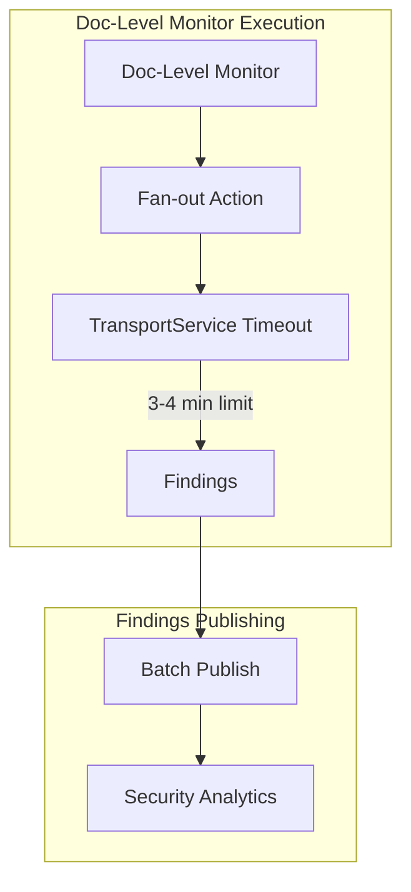

# Alerting Improvements

## Summary

OpenSearch v3.1.0 includes several improvements to the Alerting plugin focused on doc-level monitor stability, performance optimization, and dashboard enhancements. Key changes include timeboxing doc-level monitor execution to prevent duplicate job runs, batch publishing of findings for improved performance, index pattern validation for doc-level monitors, and alert insight integration in the dashboards overview page.

## Details

### What's New in v3.1.0

#### Doc-Level Monitor Execution Timeboxing

Doc-level monitor fan-out operations can now be timeboxed to prevent execution from running beyond the job scheduler lock lease expiry, which previously caused duplicate job executions.

- Execution timeboxed to 3-4 minutes
- Uses `TransportService`'s built-in timeout via `TransportOptions` instead of custom implementation
- Prevents duplicate monitor executions when fan-out takes too long

#### Batch Findings Publishing

Findings are now published in batches instead of individually, significantly reducing transport thread contention.

- `PublishFindingsRequest` updated to accept a list of findings
- Reduces deadlocks and contention on transport threadpool
- Improves performance when monitors generate many findings

#### Index Pattern Validation

Doc-level monitors now validate that index patterns are not allowed during create/update operations.

- Prevents configuration errors with index patterns in doc-level monitors
- Validation added in both alerting plugin and common-utils

#### Threat Intel Monitor Check Fix

Fixed the `isDocLevelMonitor` check to properly account for threat intel monitors.

### Technical Changes

#### Architecture Changes



#### New Components

| Component | Description |
|-----------|-------------|
| Timebox Execution | Limits doc-level monitor execution to prevent lock expiry issues |
| Batch Findings Publisher | Publishes findings in batches for improved performance |
| Index Pattern Validator | Validates index patterns are not used in doc-level monitors |

### Usage Example

Doc-level monitors now automatically benefit from timeboxed execution. No configuration changes are required.

```json
POST _plugins/_alerting/monitors
{
  "type": "monitor",
  "name": "doc-level-monitor",
  "monitor_type": "doc_level_monitor",
  "enabled": true,
  "schedule": {
    "period": {
      "interval": 5,
      "unit": "MINUTES"
    }
  },
  "inputs": [{
    "doc_level_input": {
      "description": "Monitor for specific documents",
      "indices": ["logs-*"],
      "queries": [{
        "id": "query1",
        "name": "error-query",
        "query": "level:ERROR",
        "tags": ["error"]
      }]
    }
  }],
  "triggers": [{
    "name": "error-trigger",
    "severity": "1",
    "condition": {
      "script": {
        "source": "true",
        "lang": "painless"
      }
    },
    "actions": []
  }]
}
```

### Dashboard Enhancements

#### Alert Insight on Overview Page

Alert insight component has been refactored and added to the alerts card on the overview page, providing quick visibility into alert status.

#### Error Handling for Log Pattern Extraction

Added error handling for log pattern extraction in alert insights, gracefully ignoring errors when patterns cannot be extracted.

## Limitations

- Timeboxed execution may cause monitors to complete before processing all documents in very large datasets
- Batch findings publishing requires corresponding updates in Security Analytics for correlation processing

## References

### Documentation
- [Alerting Documentation](https://docs.opensearch.org/3.0/observing-your-data/alerting/index/): Official alerting documentation
- [Per Document Monitors](https://docs.opensearch.org/3.0/observing-your-data/alerting/per-document-monitors/): Per-document monitor documentation

### Pull Requests
| PR | Repository | Description |
|----|------------|-------------|
| [#1850](https://github.com/opensearch-project/alerting/pull/1850) | alerting | Timebox doc level monitor execution |
| [#1854](https://github.com/opensearch-project/alerting/pull/1854) | alerting | Prevent dry run execution of doc level monitor with index pattern |
| [#1856](https://github.com/opensearch-project/alerting/pull/1856) | alerting | Use transport service timeout instead of custom impl |
| [#1860](https://github.com/opensearch-project/alerting/pull/1860) | alerting | Publish list of findings instead of individual ones |
| [#829](https://github.com/opensearch-project/common-utils/pull/829) | common-utils | Validate index patterns not allowed in doc level monitor |
| [#832](https://github.com/opensearch-project/common-utils/pull/832) | common-utils | Update PublishFindingsRequest to use list of findings |
| [#835](https://github.com/opensearch-project/common-utils/pull/835) | common-utils | Fix isDocLevelMonitor check for threat intel monitor |
| [#1248](https://github.com/opensearch-project/alerting-dashboards-plugin/pull/1248) | alerting-dashboards-plugin | Add alert insight to alerts card on overview page |
| [#1256](https://github.com/opensearch-project/alerting-dashboards-plugin/pull/1256) | alerting-dashboards-plugin | Add error handling for extract log pattern |

### Issues (Design / RFC)
- [Issue #1853](https://github.com/opensearch-project/alerting/issues/1853): Timebox doc level monitor to avoid duplicate executions
- [Issue #1859](https://github.com/opensearch-project/alerting/issues/1859): Change publish findings to accept a list of findings

## Related Feature Report

- [Full feature documentation](../../../../features/alerting/alerting.md)
