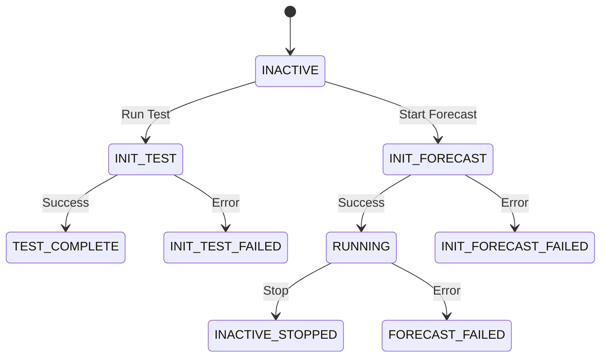

# Anomaly Detection Forecasting

## Summary

OpenSearch v3.1.0 introduces significant bug fixes and improvements to the Forecasting feature within the Anomaly Detection plugin. This release focuses on stabilizing the forecasting state machine, improving task state handling, fixing date format issues in range queries, refining cold-start and window delay calculations, and enhancing the Dashboards UI for better error display and validation.

## Details

### What's New in v3.1.0

This release primarily addresses bug fixes and stability improvements for the Forecasting feature:

1. **Task State Handling Fixes**: Corrected incorrect task state handling in `ForecastRunOnceTransportAction` to properly transition to failure states
2. **Date Format Compatibility**: Fixed `LatestTimeRetriever` range query failures on non-epoch date mappings
3. **Cold-Start and Window Delay Refinements**: Improved window delay calculation from multiplicative padding to bucket-based approach
4. **UI Validation Improvements**: Enhanced validation, error display, and run-once state handling in Dashboards
5. **Missing Data Error Surfacing**: Added dedicated error display for "missing data" conditions in test mode
6. **Create Forecaster UI Improvements**: Added spacing, removed unsupported options, cleaned up logs

### Technical Changes

#### State Machine Improvements

The forecasting state machine now properly handles failure transitions:



Previously, task state was not updated to failure state if it was non-empty, even when representing an incomplete task (e.g., `INIT_TEST`). The fix ensures proper transition to `INIT_TEST_FAILED` unless already in an ended state.

#### Bug Fixes

| Issue | Fix | PR |
|-------|-----|-----|
| Range query fails on non-epoch date mappings | Added explicit `epoch_millis` format to `RangeQueryBuilder` | [#1493](https://github.com/opensearch-project/anomaly-detection/pull/1493) |
| Incorrect task state handling | Update to failure state unless already ended | [#1489](https://github.com/opensearch-project/anomaly-detection/pull/1489) |
| Window delay inflated for large ingest gaps | Switched to bucket-based calculation | [#1496](https://github.com/opensearch-project/anomaly-detection/pull/1496) |
| Checkpoint writes during historical/run-once | Skip checkpoint writes for these modes | [#1496](https://github.com/opensearch-project/anomaly-detection/pull/1496) |
| Task update version conflicts | Added `retryOnConflict` to task updates | [#1496](https://github.com/opensearch-project/anomaly-detection/pull/1496) |

#### UI Improvements

| Change | Description | PR |
|--------|-------------|-----|
| History validation | Minimum "history" window enforced at 40 | [#1047](https://github.com/opensearch-project/anomaly-detection-dashboards-plugin/pull/1047) |
| Error display | Nested object errors now visible in Forecaster Detail | [#1047](https://github.com/opensearch-project/anomaly-detection-dashboards-plugin/pull/1047) |
| Missing data callout | Dedicated `EuiCallOut` for insufficient data errors | [#1050](https://github.com/opensearch-project/anomaly-detection-dashboards-plugin/pull/1050) |
| Sparse data option removed | Unsupported option removed from forecasting UI | [#1052](https://github.com/opensearch-project/anomaly-detection-dashboards-plugin/pull/1052) |
| Form spacing | Added spacing between form and footer | [#1052](https://github.com/opensearch-project/anomaly-detection-dashboards-plugin/pull/1052) |

### Usage Example

The forecasting feature uses the same security framework as anomaly detection. Create a forecaster via the API:

```json
POST _plugins/_forecast/forecasters
{
  "name": "cpu-forecast",
  "description": "Forecast CPU usage",
  "time_field": "timestamp",
  "indices": ["server-metrics-*"],
  "feature_attributes": [
    {
      "feature_name": "avg_cpu",
      "feature_enabled": true,
      "aggregation_query": {
        "avg_cpu": {
          "avg": {
            "field": "cpu_usage"
          }
        }
      }
    }
  ],
  "forecast_interval": {
    "period": {
      "interval": 10,
      "unit": "Minutes"
    }
  },
  "horizon": 24
}
```

### Migration Notes

- No breaking changes in this release
- Existing forecasters will benefit from improved state handling automatically
- UI improvements are available immediately after upgrade

## Limitations

- Forecasting shares the same memory constraints as anomaly detection
- Maximum 2 category fields per high-cardinality forecaster
- Model training requires sufficient historical data (minimum 40 data points)

## References

### Documentation
- [Forecasting Documentation](https://docs.opensearch.org/3.1/observing-your-data/forecast/index/): Official documentation
- [Getting Started with Forecasting](https://docs.opensearch.org/3.1/observing-your-data/forecast/getting-started/): Setup guide
- [Forecasting API](https://docs.opensearch.org/3.1/observing-your-data/forecast/api/): API reference
- [Forecasting Security](https://docs.opensearch.org/3.1/observing-your-data/forecast/security/): Security configuration

### Pull Requests
| PR | Repository | Description |
|----|------------|-------------|
| [#1489](https://github.com/opensearch-project/anomaly-detection/pull/1489) | anomaly-detection | Fix incorrect task state handling in ForecastRunOnceTransportAction |
| [#1493](https://github.com/opensearch-project/anomaly-detection/pull/1493) | anomaly-detection | Fix LatestTimeRetriever range query failing on non-epoch date mappings |
| [#1496](https://github.com/opensearch-project/anomaly-detection/pull/1496) | anomaly-detection | Refine cold-start, window delay, and task updates |
| [#1038](https://github.com/opensearch-project/anomaly-detection-dashboards-plugin/pull/1038) | anomaly-detection-dashboards-plugin | Forecasting frontend |
| [#1039](https://github.com/opensearch-project/anomaly-detection-dashboards-plugin/pull/1039) | anomaly-detection-dashboards-plugin | Fix MDS bug |
| [#1041](https://github.com/opensearch-project/anomaly-detection-dashboards-plugin/pull/1041) | anomaly-detection-dashboards-plugin | Enable contextual launch in MDS OpenSearch UI |
| [#1047](https://github.com/opensearch-project/anomaly-detection-dashboards-plugin/pull/1047) | anomaly-detection-dashboards-plugin | Improve validation, error display, and run-once state handling |
| [#1050](https://github.com/opensearch-project/anomaly-detection-dashboards-plugin/pull/1050) | anomaly-detection-dashboards-plugin | Surface "missing data" error in test mode |
| [#1052](https://github.com/opensearch-project/anomaly-detection-dashboards-plugin/pull/1052) | anomaly-detection-dashboards-plugin | Improve Create Forecaster UI and cleanup logs |

## Related Feature Report

- [Full feature documentation](../../../features/anomaly-detection/anomaly-detection-forecasting.md)
