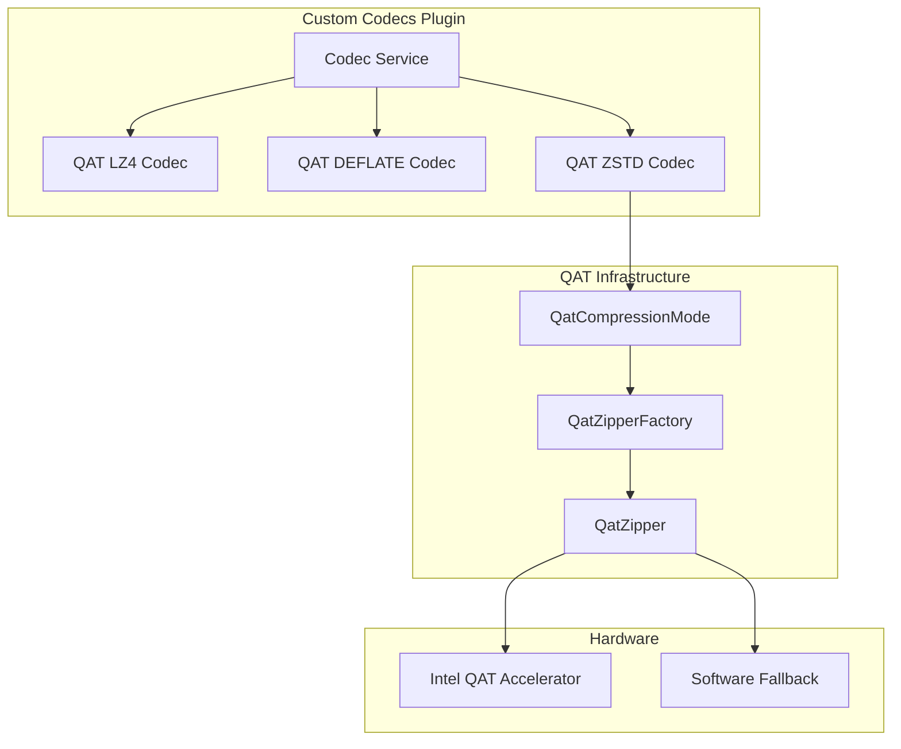

# QAT-Accelerated Zstandard Compression

## Summary

OpenSearch v3.1.0 adds a new hardware-accelerated compression codec `qat_zstd` to the Custom Codecs plugin. This codec leverages Intel® QuickAssist Technology (QAT) to accelerate Zstandard (ZSTD) compression, combining the excellent compression ratio of ZSTD with hardware acceleration for improved performance.

## Details

### What's New in v3.1.0

This release introduces the `qat_zstd` codec, which provides:

- Hardware-accelerated ZSTD compression using Intel QAT
- Configurable compression levels (1-6)
- Automatic fallback to software compression when QAT hardware is unavailable (with `qatmode: auto`)
- Full integration with existing QAT codec infrastructure

### Technical Changes

#### Architecture Changes



#### New Components

| Component | Description |
|-----------|-------------|
| `QatZstd101Codec` | Main codec class for QAT-accelerated ZSTD compression |
| `Lucene101QatCodec.Mode.QAT_ZSTD` | New mode enum for ZSTD algorithm selection |

#### New Configuration

| Setting | Description | Default |
|---------|-------------|---------|
| `index.codec` | Set to `qat_zstd` to enable QAT ZSTD compression | N/A |
| `index.codec.compression_level` | Compression level (1-6) | 3 |
| `index.codec.qatmode` | `auto` (fallback to software) or `hardware` (QAT only) | `auto` |

### Usage Example

```json
PUT /my-index
{
  "settings": {
    "index": {
      "codec": "qat_zstd",
      "codec.compression_level": 3,
      "codec.qatmode": "auto"
    }
  }
}
```

### Migration Notes

- Existing indexes using other codecs can be migrated by closing the index, updating the codec setting, and reopening
- Alternatively, reindex data into a new index with `qat_zstd` codec
- The `qat_zstd` codec requires Intel 4th/5th Gen Xeon processors with QAT support for hardware acceleration
- Use `qatmode: auto` for environments where QAT hardware may not be available

### Dependencies

| Library | Version | Change |
|---------|---------|--------|
| `com.intel.qat:qat-java` | 2.3.2 | Upgraded from 1.1.1 to support ZSTD algorithm |

## Limitations

- Requires Intel QAT hardware for hardware acceleration (falls back to software with `qatmode: auto`)
- Cannot be used for k-NN or Security Analytics indexes
- Compression levels limited to range [1, 6]
- QAT `hardware` mode will fail if hardware is unavailable

## References

### Documentation
- [Index Codecs Documentation](https://docs.opensearch.org/3.0/im-plugin/index-codecs/): Official documentation
- [Custom Codecs Repository](https://github.com/opensearch-project/custom-codecs): Source code
- [Intel QAT Overview](https://www.intel.com/content/www/us/en/developer/topic-technology/open/quick-assist-technology/overview.html): Hardware acceleration
- [qat-java Library](https://github.com/intel/qat-java): Intel QAT Java bindings
- [Zstandard](https://github.com/facebook/zstd): ZSTD compression algorithm

### Pull Requests
| PR | Description |
|----|-------------|
| [#238](https://github.com/opensearch-project/custom-codecs/pull/238) | Add QAT-Accelerated Zstandard Compression Support |

## Related Feature Report

- [Full feature documentation](../../../../features/custom-codecs/custom-codecs.md)
