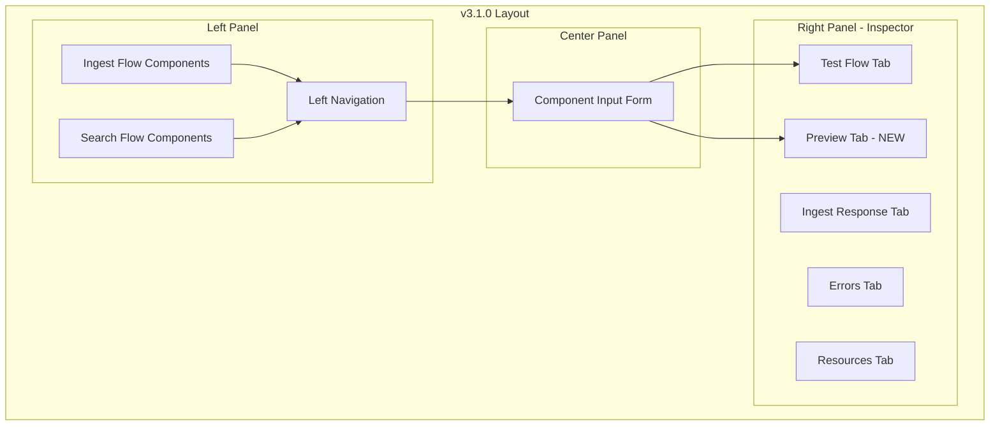

---
tags:
  - domain/ml
  - component/dashboards
  - dashboards
  - neural-search
  - search
---
# Flow Framework UI Enhancements

## Summary

OpenSearch v3.1.0 introduces significant UI/UX improvements to the AI Search Flows plugin (dashboards-flow-framework). Key changes include a major refactor of the form navigation to a left panel layout, integration of the preview panel into the inspector panel for better vertical space utilization, a new workflow template for Semantic Search using Sparse Encoders, configurable thread pool sizes in the backend, and various UI polish improvements.

## Details

### What's New in v3.1.0

#### Form Navigation Refactor
The workflow editor has been refactored from a multi-stepped form into a single-page layout with left panel navigation. All ingest and search form components are now accessible within a unified navigation view, providing a more streamlined user experience.

#### Inspector Panel Integration
The Preview panel has been integrated as a tab within the Inspector panel, consolidating the workflow visualization and testing tools into a single resizable panel. This change provides more vertical space for viewing search results, testing queries, and inspecting errors.

### Technical Changes

#### Architecture Changes



#### New Components

| Component | Description |
|-----------|-------------|
| `ComponentInput` | New central component for dynamic rendering of selected components from left nav |
| `INSPECTOR_TAB_ID.PREVIEW` | New tab ID for the integrated preview panel |
| `COMPONENT_ID` enum | New enum for left nav component IDs (SOURCE_DATA, ENRICH_DATA, etc.) |
| `LEFT_NAV_SELECTED_STYLE` | Style constant for selected left nav items |

#### New Configuration

| Setting | Description | Default |
|---------|-------------|---------|
| `plugins.flow_framework.workflow_thread_pool_size` | Max size of workflow thread pool | 4 |
| `plugins.flow_framework.provision_thread_pool_size` | Max size of provision thread pool | 8 |
| `plugins.flow_framework.deprovision_thread_pool_size` | Max size of deprovision thread pool | 4 |

#### New Workflow Template

A new preset template for **Semantic Search using Sparse Encoders** has been added, enabling neural sparse search workflows with models like `opensearch-neural-sparse-encoding-v2-distill`.

### Usage Example

The new left panel navigation provides quick access to all workflow components:

```
Left Navigation:
├── Ingest Flow
│   ├── Sample Data
│   ├── Enrich Data (ML Processors)
│   └── Index
└── Search Flow
    ├── Sample Query
    ├── Enrich Request (ML Processors)
    ├── Run Query
    ├── Enrich Response (ML Processors)
    └── Search Results
```

### UI Improvements

- Hidden scrollbar by default for left nav to maintain consistent width across resolutions
- Increased vertical space for source data modal JSON editor
- Increased vertical space for test query panel in Inspector
- Removed overflow on delete modal from workflow list page
- Fixed README.md broken link

## Limitations

- The Preview tab in Inspector requires remounting when becoming active due to ReactFlow rendering constraints
- Models must have defined interfaces for simplified ML processor forms

## References

### Documentation
- [AI Search Flows Documentation](https://docs.opensearch.org/3.0/vector-search/ai-search/workflow-builder/)
- [Documentation PR #9881](https://github.com/opensearch-project/documentation-website/pull/9881): Thread pool configuration docs
- [dashboards-flow-framework Repository](https://github.com/opensearch-project/dashboards-flow-framework)
- [flow-framework Repository](https://github.com/opensearch-project/flow-framework)

### Pull Requests
| PR | Description |
|----|-------------|
| [#722](https://github.com/opensearch-project/dashboards-flow-framework/pull/722) | Integrate preview panel into inspector panel |
| [#737](https://github.com/opensearch-project/dashboards-flow-framework/pull/737) | Refactor form navigation to left panel |
| [#742](https://github.com/opensearch-project/dashboards-flow-framework/pull/742) | Added workflow template for Semantic Search using Sparse Encoders |
| [#743](https://github.com/opensearch-project/dashboards-flow-framework/pull/743) | Misc improvements IV (UI polish) |
| [#744](https://github.com/opensearch-project/dashboards-flow-framework/pull/744) | Update README.md (fix broken link) |
| [#1139](https://github.com/opensearch-project/flow-framework/pull/1139) | Make thread pool sizes configurable (backend) |

## Related Feature Report

- Full feature documentation
