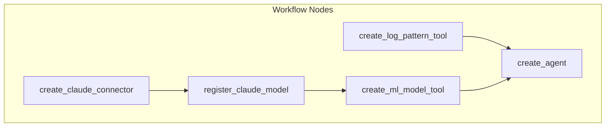

---
tags:
  - domain/ml
  - component/server
  - ml
  - search
---
# Flow Framework Dependencies

## Summary

This release includes infrastructure improvements and new sample templates for the Flow Framework plugin. The main changes are conditional inclusion of the DynamoDB client dependency based on environment variables, and a new agent template for data summary with log pattern analysis.

## Details

### What's New in v3.1.0

#### Conditional DynamoDB Client Dependency

PR #1141 introduces conditional inclusion of the `opensearch-remote-metadata-sdk-ddb-client` dependency. This dependency is only included when the `REMOTE_METADATA_SDK_IMPL` environment variable is set to `ddb-client`, reducing the plugin's footprint in environments that don't require DynamoDB-based remote metadata storage.

#### New Data Summary with Log Pattern Agent Template

PR #1137 adds a new sample template for creating a Query Assist Data Summary with Log Pattern Agent. This template:
- Uses Claude on Amazon Bedrock for LLM capabilities
- Combines the LogPatternTool with MLModelTool in a flow agent
- Analyzes log patterns and provides data insights from OpenSearch queries
- Supports both JSON and YAML template formats

### Technical Changes

#### Build Configuration Changes

The `build.gradle` file was updated to:
- Extract dependency versions into named variables for better maintainability
- Conditionally include DynamoDB client based on environment variable
- Add resolution strategy for dependency conflicts when DynamoDB client is included

```groovy
// Conditional dependency inclusion
if (System.getenv('REMOTE_METADATA_SDK_IMPL') == 'ddb-client') {
    api("org.opensearch:opensearch-remote-metadata-sdk:${opensearch_build}")
    implementation("org.opensearch:opensearch-remote-metadata-sdk-ddb-client:${opensearch_build}") {
        exclude group: "jakarta.json", module: "jakarta.json-api"
    }
} else {
    implementation("org.opensearch:opensearch-remote-metadata-sdk:${opensearch_build}")
}
```

#### New Configuration Variables

| Variable | Version | Description |
|----------|---------|-------------|
| `awsEncryptionSdkVersion` | 3.0.1 | AWS Encryption SDK |
| `awsCryptoMaterialProvidersVersion` | 1.10.1 | AWS Cryptographic Material Providers |
| `dafnyRuntimeVersion` | 4.10.0 | Dafny Runtime |
| `smithyDafnyVersion` | 0.1.1 | Smithy Dafny Conversion |
| `gsonVersion` | 2.13.1 | Google Gson |
| `junitJupiterVersion` | 5.12.2 | JUnit Jupiter |
| `jakartaJsonBindVersion` | 3.0.1 | Jakarta JSON Bind API |
| `jakartaJsonVersion` | 2.0.1 | Jakarta JSON |
| `yassonVersion` | 3.0.4 | Eclipse Yasson |
| `parssonVersion` | 1.1.7 | Eclipse Parsson |

#### New Agent Template

The new `query-assist-data-summary-with-log-pattern-agent` template creates:



| Node | Type | Description |
|------|------|-------------|
| create_claude_connector | create_connector | Creates Bedrock connector for Claude |
| register_claude_model | register_remote_model | Registers Claude model |
| create_ml_model_tool | create_tool | Creates MLModelTool with summary prompt |
| create_log_pattern_tool | create_tool | Creates LogPatternTool for pattern analysis |
| create_agent | register_agent | Registers flow agent combining both tools |

### Usage Example

To build with DynamoDB client support:

```bash
export REMOTE_METADATA_SDK_IMPL=ddb-client
./gradlew build
```

To use the new agent template:

```bash
POST /_plugins/_flow_framework/workflow?provision=true
Content-Type: application/yaml

name: Query Assist Data Summary With Log Pattern Agent
description: Create Query Assist Data Summary With Log Pattern Agent using Claude on BedRock
use_case: REGISTER_AGENT
version:
  template: 1.0.0
  compatibility:
  - 2.17.0
  - 3.0.0
# ... (see sample-templates directory for full template)
```

## Limitations

- DynamoDB client dependency requires explicit environment variable to be included
- The log pattern agent template requires Amazon Bedrock access with Claude model
- Template credentials must be configured with valid AWS access keys

## References

### Documentation
- [Flow Framework Documentation](https://docs.opensearch.org/3.0/automating-configurations/workflow-templates/)
- [LogPatternTool Documentation](https://docs.opensearch.org/3.0/ml-commons-plugin/agents-tools/tools/log-pattern-tool/)
- [Flow Agents Documentation](https://docs.opensearch.org/3.0/ml-commons-plugin/agents-tools/agents/flow/)

### Pull Requests
| PR | Description |
|----|-------------|
| [#1141](https://github.com/opensearch-project/flow-framework/pull/1141) | Conditionally include ddb-client dependency only if env variable set |
| [#1137](https://github.com/opensearch-project/flow-framework/pull/1137) | Add data summary with log pattern agent template |

## Related Feature Report

- [Full feature documentation](../../../features/flow-framework/flow-framework.md)
