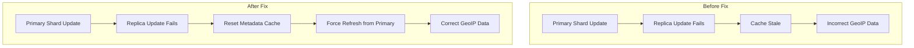
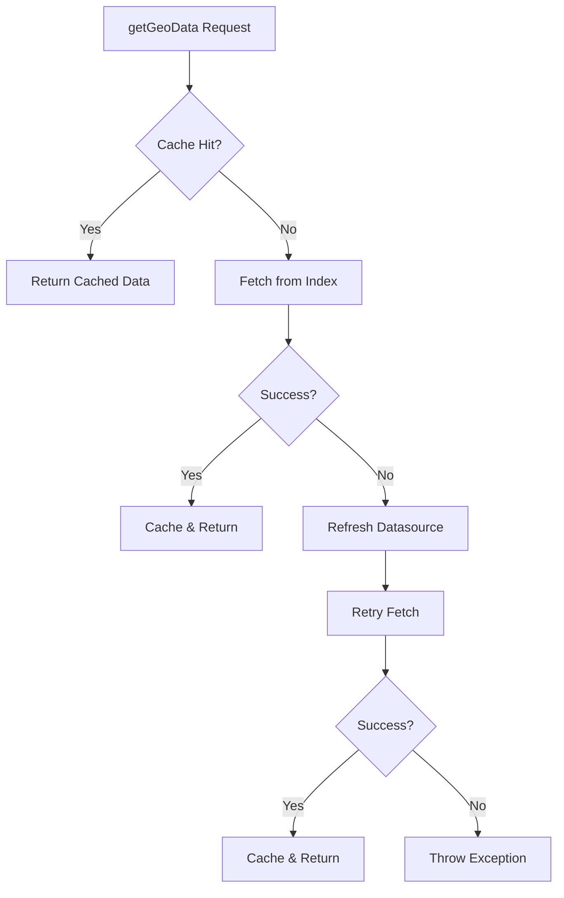

---
tags:
  - indexing
  - performance
---

# Geospatial Ip2Geo Fixes

## Summary

This release includes two bug fixes for the IP2Geo processor in the geospatial plugin. These fixes address cache synchronization issues between primary and replica shards, improving reliability when datasource metadata updates fail or when cache becomes stale.

## Details

### What's New in v3.1.0

Two bug fixes improve the resilience of the IP2Geo cache mechanism:

1. **Metadata Reset on Failure** (PR #761): When datasource metadata updates fail in `postIndex` or `postDelete` operations, the cache is now reset to force a refresh from the primary index shard.

2. **Cache Refresh with Retry** (PR #766): When operations encounter errors, the system now refreshes the IP2Geo cache and retries once before failing.

### Technical Changes

#### Problem Addressed

The IP2Geo processor caches datasource metadata locally on each node. When updates succeed on the primary shard but fail to propagate to replica shards, the cache can become stale. Even after replica recovery from the primary shard, the cache update logic was not triggered, leaving outdated metadata in the cache.

#### Solution Architecture



#### Key Changes in Ip2GeoCachedDao

| Method | Change | Purpose |
|--------|--------|---------|
| `postIndex(ShardId, Index, Exception)` | New override | Reset cache on indexing exception |
| `postIndex(ShardId, Index, IndexResult)` | Enhanced | Reset cache on failure result, add logging |
| `postDelete(ShardId, Delete, Exception)` | New override | Reset cache on delete exception |
| `postDelete(ShardId, Delete, DeleteResult)` | Enhanced | Reset cache on failure result, add logging |
| `clearMetadata()` | New method | Reset all datasource metadata |
| `refreshDatasource(String)` | New method | Refresh specific datasource from index |
| `getGeoData(String, String, String)` | New signature | Added datasourceName parameter for retry logic |

#### Retry Logic Flow



#### Thread Safety Improvement

The `getMetadata()` method was updated to use a local variable pattern to prevent null pointer exceptions when another thread clears the metadata during access:

```java
// Before: Direct field access could return null unexpectedly
if (metadata != null) {
    return metadata;
}

// After: Local variable ensures non-null return
Map<String, DatasourceMetadata> currentMetadata = metadata;
if (currentMetadata != null) {
    return currentMetadata;
}
```

### Usage Example

No configuration changes required. The fixes are automatic improvements to the existing IP2Geo processor behavior.

```json
PUT /_ingest/pipeline/my-pipeline
{
  "processors": [
    {
      "ip2geo": {
        "field": "client_ip",
        "datasource": "my-datasource",
        "target_field": "geo"
      }
    }
  ]
}
```

### Migration Notes

- No migration required
- Existing pipelines automatically benefit from improved reliability
- The `getGeoData` method signature changed internally (added `datasourceName` parameter), but this is an internal API

## Limitations

- Retry logic adds one additional attempt, which may slightly increase latency on first failure
- Cache reset affects all datasources on the node, not just the failing one

## References

### Documentation
- [IP2Geo Documentation](https://docs.opensearch.org/3.0/ingest-pipelines/processors/ip2geo/): Official IP2Geo processor documentation

### Pull Requests
| PR | Description |
|----|-------------|
| [#761](https://github.com/opensearch-project/geospatial/pull/761) | Reset datasource metadata when failed to update it in postIndex and postDelete |
| [#766](https://github.com/opensearch-project/geospatial/pull/766) | Refresh the Ip2Geo cache and retry one more time when we run into an issue |

## Related Feature Report

- [Full feature documentation](../../../features/geospatial/geospatial-ip2geo.md)
