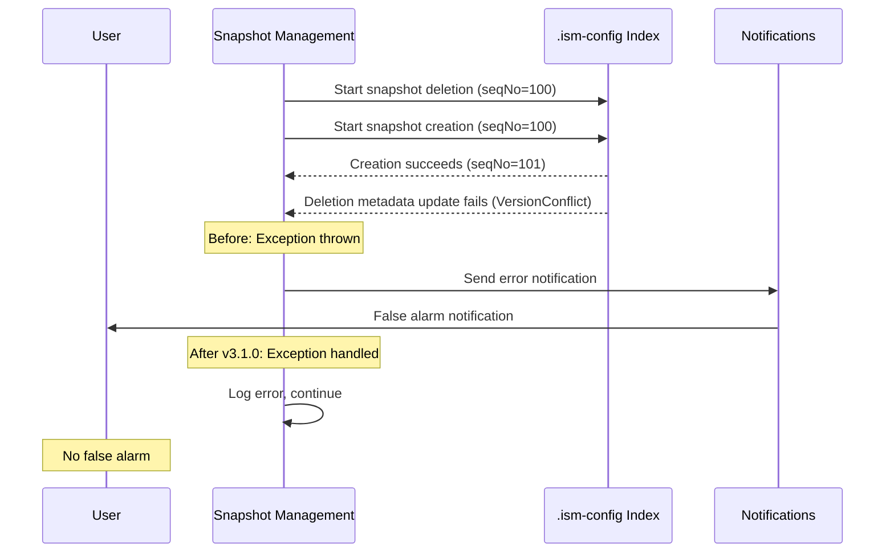

---
tags:
  - domain/data
  - component/server
  - indexing
---
# Notifications Improvements

## Summary

This bugfix eliminates false positive notifications in Snapshot Management by suppressing user notifications for internal `VersionConflictEngineException` errors that occur during concurrent snapshot operations. Users no longer receive misleading error notifications for race conditions that don't affect actual snapshot functionality.

## Details

### What's New in v3.1.0

The Snapshot Management state machine now handles `VersionConflictEngineException` gracefully by logging the error instead of throwing an exception that triggers user notifications.

### Technical Changes

#### Problem Background

When a manual snapshot policy runs, it creates and deletes snapshots based on configured cron jobs. These operations update state in the `.ism-config` system index. Due to race conditions during concurrent operations:

1. A snapshot deletion starts and holds a lock on the system index
2. Another snapshot creation begins while the deletion is in progress
3. When the deletion completes, it fails to update metadata due to version conflict
4. Previously, this triggered a notification to users despite the snapshot operation succeeding



#### Code Changes

The fix modifies `SMStateMachine.kt` to catch and handle `VersionConflictEngineException` separately:

```kotlin
} catch (ex: Exception) {
    val unwrappedException = ExceptionsHelper.unwrapCause(ex) as Exception
    if (unwrappedException is VersionConflictEngineException) {
        // Don't throw the exception
        log.error("Version conflict exception while updating metadata.", ex)
        return
    }
    // Other exceptions still trigger notifications
    val smEx = SnapshotManagementException(ExceptionKey.METADATA_INDEXING_FAILURE, ex)
    log.error(smEx.message, ex)
    throw smEx
}
```

#### Changed Files

| File | Changes |
|------|---------|
| `SMStateMachine.kt` | Added exception handling for `VersionConflictEngineException` |
| `SMStateMachineTests.kt` | Added unit tests for graceful handling and exception propagation |

### Migration Notes

No migration required. This is a transparent bugfix that improves notification accuracy.

## Limitations

- The underlying race condition still exists; only the notification behavior is changed
- A future enhancement (noted in TODO) could extract seqNo from the exception and retry the metadata update

## References

### Documentation
- [Snapshot Management Documentation](https://docs.opensearch.org/3.0/tuning-your-cluster/availability-and-recovery/snapshots/snapshot-management/)

### Pull Requests
| PR | Description |
|----|-------------|
| [#1413](https://github.com/opensearch-project/index-management/pull/1413) | Removed unnecessary user notifications for version conflict exception |

### Issues (Design / RFC)
- [Issue #1371](https://github.com/opensearch-project/index-management/issues/1371): Eliminate False Positive Notifications in Manual Snapshot Policy

## Related Feature Report

- [Index Management](../../../features/index-management/index-management.md)
