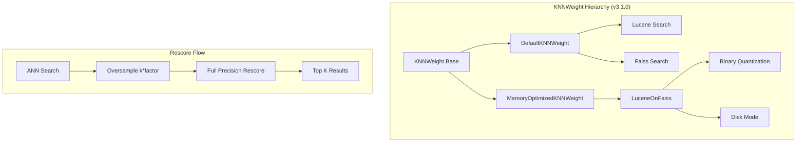

---
tags:
  - domain/search
  - component/server
  - indexing
  - k-nn
  - performance
  - search
---
# k-NN Vector Search Improvements

## Summary

OpenSearch v3.1.0 introduces significant improvements to k-NN vector search, including memory-optimized search for Faiss binary indexes, rescore support for Lucene engine, performance optimizations for derived source indexing, and internal refactoring for better alignment with Lucene's TopDocs interface. These changes improve search accuracy, reduce memory consumption, and enhance overall system performance.

## Details

### What's New in v3.1.0

#### Memory-Optimized Search for Faiss Binary Index (LuceneOnFaiss)

PR [#2735](https://github.com/opensearch-project/k-NN/pull/2735) integrates memory-optimized search (LuceneOnFaiss) into KNNWeight, enabling transparent switching to optimized search algorithms while preserving consistent user experience.

Key changes:
- **Layered KNNWeight architecture**: Common logic in base class with `DefaultKNNWeight` and `MemoryOptimizedKNNWeight` subclasses
- **Extended compression support**: Now supports binary + disk mode compressions (32x, 16x, 8x)
- **Nested document support**: Custom KnnCollector and parent ID grouper for nested queries
- **Removed Lucene query dependency**: LuceneOnFaiss no longer relies on Lucene queries, fixing issues with options like `index.knn.advanced.approximate_threshold`

#### Rescore Support for Lucene Engine

PR [#2709](https://github.com/opensearch-project/k-NN/pull/2709) adds `RescoreKnnVectorQuery` to support rescoring after executing approximate k-NN search with the Lucene engine, bringing feature parity with Faiss.

PR [#2750](https://github.com/opensearch-project/k-NN/pull/2750) updates the rescore context for 4x compression to use 1x oversampling factor, optimizing the balance between recall and performance.

#### Derived Source Optimization

PR [#2704](https://github.com/opensearch-project/k-NN/pull/2704) optimizes CPU and memory usage by applying mask operations in the preindex listener rather than the codec writer. Benchmark results on 10M vectors show significant reduction in resource utilization by avoiding redundant map deserialization.

#### Script Scoring Performance

PR [#2351](https://github.com/opensearch-project/k-NN/pull/2351) removes redundant type conversions (byte[] → float[] → byte[]) for script scoring with binary vectors using Hamming space, reducing query latency.

### Technical Changes

#### Architecture Changes



#### New Components

| Component | Description |
|-----------|-------------|
| `RescoreKnnVectorQuery` | Query wrapper for rescoring ANN results with full precision vectors |
| `MemoryOptimizedKNNWeight` | KNNWeight subclass for memory-optimized search path |
| `DefaultKNNWeight` | KNNWeight subclass for standard search path |

#### Configuration Updates

| Setting | Description | Default |
|---------|-------------|---------|
| `rescore.oversample_factor` | Oversampling factor for 4x compression | `1.0` (updated from previous default) |

### Usage Example

#### Rescore with Lucene Engine

```json
GET /my-knn-index/_search
{
  "size": 10,
  "query": {
    "knn": {
      "my_vector": {
        "vector": [0.1, 0.2, 0.3, ...],
        "k": 10,
        "rescore": {
          "oversample_factor": 2.0
        }
      }
    }
  }
}
```

#### Binary Vector with Hamming Space (Optimized)

```json
PUT /binary-index
{
  "settings": {
    "index.knn": true
  },
  "mappings": {
    "properties": {
      "my_vector": {
        "type": "knn_vector",
        "dimension": 128,
        "data_type": "binary",
        "space_type": "hamming",
        "method": {
          "name": "hnsw",
          "engine": "faiss"
        }
      }
    }
  }
}
```

## Limitations

- Memory-optimized search is only supported for Faiss engine with binary and disk mode compressions
- Rescore is only supported for `faiss` and `lucene` engines (not `nmslib`)
- The derived source optimization requires the preindex listener to be called before writeField

## References

### Documentation
- [Memory-optimized vectors documentation](https://docs.opensearch.org/3.0/field-types/supported-field-types/knn-memory-optimized/): Official docs on compression and rescoring
- [k-NN query documentation](https://docs.opensearch.org/3.0/query-dsl/specialized/k-nn/index/): k-NN query reference

### Pull Requests
| PR | Description |
|----|-------------|
| [#2735](https://github.com/opensearch-project/k-NN/pull/2735) | Integrate LuceneOnFaiss memory-optimized search into KNNWeight |
| [#2709](https://github.com/opensearch-project/k-NN/pull/2709) | Add rescore to Lucene Vector Search Query |
| [#2750](https://github.com/opensearch-project/k-NN/pull/2750) | Update rescore context for 4X Compression |
| [#2704](https://github.com/opensearch-project/k-NN/pull/2704) | Apply mask operation in preindex to optimize derived source |
| [#2351](https://github.com/opensearch-project/k-NN/pull/2351) | Remove redundant type conversions for script scoring with binary vectors |
| [#2727](https://github.com/opensearch-project/k-NN/pull/2727) | Refactor Knn Search Results to use TopDocs |

### Issues (Design / RFC)
- [Issue #1827](https://github.com/opensearch-project/k-NN/issues/1827): Remove double converting for script scoring with binary vector

## Related Feature Report

- Full feature documentation
