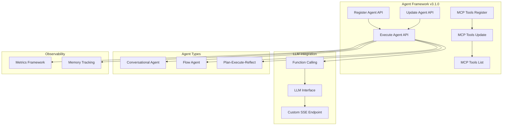

---
tags:
  - indexing
  - ml
  - observability
---

# ML Commons Agent Framework

## Summary

OpenSearch v3.1.0 brings significant enhancements and bug fixes to the ML Commons Agent Framework, including new APIs for agent management, MCP (Model Context Protocol) integration improvements, function calling support for LLM interfaces, metrics framework integration, and multiple stability fixes for agent execution.

## Details

### What's New in v3.1.0

This release focuses on three major areas:

1. **Agent Management APIs**: New Update Agent API and MCP tools persistence
2. **LLM Integration**: Function calling support and custom SSE endpoints for MCP
3. **Stability & Observability**: Metrics framework integration, error handling improvements, and multiple bug fixes

### Technical Changes

#### Architecture Changes



#### New Components

| Component | Description |
|-----------|-------------|
| Update Agent API | `PUT /_plugins/_ml/agents/{agent_id}` - Modify existing agents without re-registration |
| MCP Tools Persistence | Store MCP tools in system index with update and list APIs |
| Function Calling | Native function calling support for Bedrock/Claude, DeepSeek, and OpenAI interfaces |
| Custom SSE Endpoint | Configurable Server-Sent Events endpoint for MCP client connections |
| Metrics Framework | Integration with OpenSearch metrics framework for adoption and operational metrics |

#### New APIs

**Update Agent API**
```
PUT /_plugins/_ml/agents/{agent_id}
{
  "name": "updated_agent_name",
  "description": "updated description",
  "llm": {
    "model_id": "model_id"
  },
  "tools": [...]
}
```

**MCP Tools Update API**
```
POST /_plugins/_ml/mcp/tools/_update
{
  "tools": [
    {
      "type": "PPLTool",
      "name": "My_PPLTool",
      "description": "Tool description",
      "parameters": {...},
      "attributes": {
        "input_schema": {...}
      }
    }
  ]
}
```

**MCP Tools List API**
```
GET /_plugins/_ml/mcp/tools/_list
```

#### New Configuration

| Setting | Description | Default |
|---------|-------------|---------|
| `plugins.ml_commons.metrics.enabled` | Enable/disable metrics collection | `true` |
| `_llm_interface` | LLM interface for function calling (e.g., `bedrock/converse/claude`) | - |

### Usage Example

**Creating an agent with function calling:**
```json
POST /_plugins/_ml/agents/_register
{
  "name": "Function Calling Agent",
  "type": "conversational",
  "llm": {
    "model_id": "bedrock_model_id",
    "parameters": {
      "prompt": "${parameters.question}"
    }
  },
  "memory": {
    "type": "conversation_index"
  },
  "parameters": {
    "_llm_interface": "bedrock/converse/claude"
  },
  "tools": [
    { "type": "ListIndexTool" },
    { "type": "SearchIndexTool" },
    { "type": "IndexMappingTool" }
  ]
}
```

### Bug Fixes

| Issue | Fix |
|-------|-----|
| Private IP validation | Fixed connector private IP validation when executing agent without remote model |
| Inline connector name | Connector name no longer required for inline model connectors |
| AIConnectorHelper tutorial | Fixed domain_name fetching in tutorial |
| Nested object JSON parsing | Fixed JSON parsing for nested objects during update query step |
| Valid character handling | Added `/` as a valid character in tool parameters |
| Guava NoClassDefFoundError | Quick fix for Guava class loading issue |
| Python MCP client | Fixed Python client connection to MCP server |
| Circuit breaker bypass | Excluded agent execution from circuit breaker checks |
| Tenant ID handling | Added tenantId to connector executor for inline connectors |

### Migration Notes

- Existing agents continue to work without modification
- To use function calling, add `_llm_interface` parameter when registering agents
- MCP tools can now be persisted and managed via new APIs

## Limitations

- Function calling currently supports Bedrock/Claude, DeepSeek R1, and OpenAI interfaces
- Simultaneous tool use with handle/supply not yet supported (planned for future release)
- Circuit breaker bypass for agents may impact cluster stability under heavy load

## References

### Documentation
- [Agent APIs Documentation](https://docs.opensearch.org/3.0/ml-commons-plugin/api/agent-apis/index/)
- [Plan-Execute-Reflect Agents](https://docs.opensearch.org/3.0/ml-commons-plugin/agents-tools/agents/plan-execute-reflect/)

### Pull Requests
| PR | Description |
|----|-------------|
| [#3820](https://github.com/opensearch-project/ml-commons/pull/3820) | Expose Update Agent API |
| [#3874](https://github.com/opensearch-project/ml-commons/pull/3874) | Support persisting MCP tools in system index |
| [#3888](https://github.com/opensearch-project/ml-commons/pull/3888) | Use function calling for existing LLM interfaces |
| [#3891](https://github.com/opensearch-project/ml-commons/pull/3891) | Add custom SSE endpoint for MCP Client |
| [#3884](https://github.com/opensearch-project/ml-commons/pull/3884) | PlanExecuteReflect: Return memory early to track progress |
| [#3810](https://github.com/opensearch-project/ml-commons/pull/3810) | Support customized message endpoint |
| [#3845](https://github.com/opensearch-project/ml-commons/pull/3845) | Add error handling for plan&execute agent |
| [#3661](https://github.com/opensearch-project/ml-commons/pull/3661) | Metrics framework integration with ml-commons |
| [#3786](https://github.com/opensearch-project/ml-commons/pull/3786) | Add space type mapping for pre-trained embedding models |
| [#3862](https://github.com/opensearch-project/ml-commons/pull/3862) | Fix connector private IP validation when executing agent |
| [#3882](https://github.com/opensearch-project/ml-commons/pull/3882) | For inline model connector name isn't required |
| [#3852](https://github.com/opensearch-project/ml-commons/pull/3852) | Fix AIConnectorHelper tutorial domain_name fetching |
| [#3856](https://github.com/opensearch-project/ml-commons/pull/3856) | Add JSON parsing for nested objects during update query |
| [#3854](https://github.com/opensearch-project/ml-commons/pull/3854) | Add `/` as a valid character |
| [#3844](https://github.com/opensearch-project/ml-commons/pull/3844) | Quick fix for Guava NoClassDefFoundError |
| [#3822](https://github.com/opensearch-project/ml-commons/pull/3822) | Fix Python client MCP server connection |
| [#3814](https://github.com/opensearch-project/ml-commons/pull/3814) | Exclude circuit breaker for Agent |
| [#3837](https://github.com/opensearch-project/ml-commons/pull/3837) | Add tenantId to connector executor for inline connectors |

### Issues (Design / RFC)
- [Issue #3748](https://github.com/opensearch-project/ml-commons/issues/3748): Update Agent API feature request
- [Issue #2172](https://github.com/opensearch-project/ml-commons/issues/2172): Original Update Agent API request
- [Issue #3816](https://github.com/opensearch-project/ml-commons/issues/3816): Custom SSE endpoint for MCP
- [Issue #3841](https://github.com/opensearch-project/ml-commons/issues/3841): MCP tools persistence
- [Issue #3847](https://github.com/opensearch-project/ml-commons/issues/3847): Function calling for LLM interfaces
- [Issue #3881](https://github.com/opensearch-project/ml-commons/issues/3881): PlanExecuteReflect memory tracking
- [Issue #3839](https://github.com/opensearch-project/ml-commons/issues/3839): Private IP validation fix
- [Issue #3635](https://github.com/opensearch-project/ml-commons/issues/3635): Metrics framework integration
- [Documentation Issue #9865](https://github.com/opensearch-project/documentation-website/issues/9865): Update Agent API documentation

## Related Feature Report

- [Full feature documentation](../../../features/ml-commons/ml-commons-agent-framework.md)
