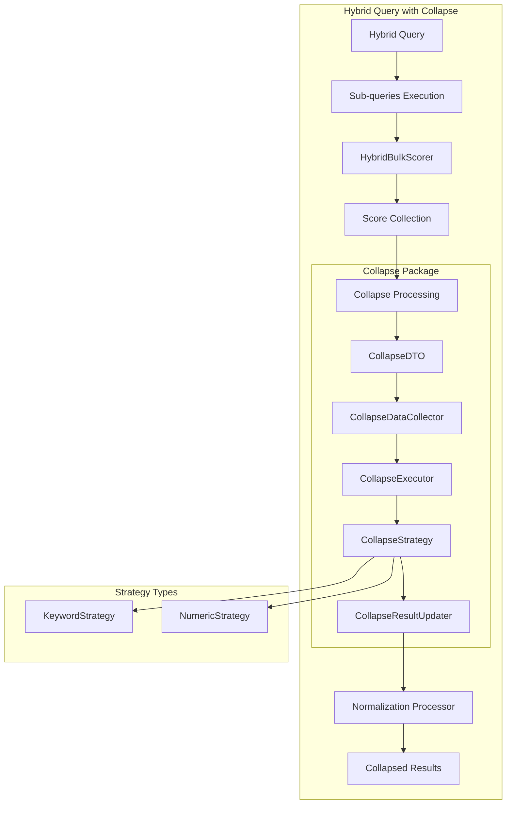

---
tags:
  - domain/search
  - component/server
  - neural-search
  - performance
  - search
---
# Hybrid Query Collapse

## Summary

OpenSearch v3.1.0 introduces collapse functionality for hybrid queries, enabling result deduplication by grouping search results based on a field value. This highly requested feature (21 +1 reactions on Issue #665) allows users to return only the highest-scoring document for each unique field value when combining lexical and neural search. The implementation includes support for sorting, explain, and pagination with collapsed results.

## Details

### What's New in v3.1.0

- **Collapse parameter support**: Hybrid queries now accept the `collapse` parameter to group results by a `keyword` or numeric field
- **Sort integration**: Collapsed results can be sorted using standard sort syntax
- **Explain support**: The `explain` parameter works with collapsed hybrid queries for debugging
- **Pagination support**: Use `from`, `size`, and `pagination_depth` parameters with collapsed results
- **Custom bulk scorer**: 2-3x performance improvement for hybrid query execution (PR #1289)
- **RRF custom weights**: Support for custom weights in RRF normalization technique (PR #1322)

### Technical Changes

#### Architecture Changes



#### New Components

| Component | Description |
|-----------|-------------|
| `CollapseDTO` | Data transfer object for collapse configuration |
| `CollapseDataCollector` | Collects data for collapse processing |
| `CollapseExecutor` | Executes collapse logic on hybrid query results |
| `CollapseStrategy` | Strategy pattern for field type handling |
| `CollapseResultUpdater` | Updates results after collapse processing |
| `HybridCollapsingTopDocsCollector` | Collector for keyword and numeric field collapse |
| `HybridBulkScorer` | Custom bulk scorer with window-based collection |
| `HybridQueryDocIdStream` | Document ID stream for bulk scoring |
| `HybridSubQueryScorer` | Sub-query scorer for hybrid execution |
| `HybridScorerSupplier` | Supplier for hybrid scorers |

#### New Configuration

| Setting | Description | Default |
|---------|-------------|---------|
| `collapse.field` | Field to collapse results on (keyword or numeric) | Required |
| `pagination_depth` | Maximum documents per shard before collapse | 10 |
| `weights` (RRF) | Custom weights for RRF combination (must sum to 1.0) | Equal weights |

### Usage Example

```json
GET /my-index/_search?search_pipeline=norm-pipeline
{
  "query": {
    "hybrid": {
      "queries": [
        {
          "match": {
            "title": "search terms"
          }
        },
        {
          "neural": {
            "embedding": {
              "query_text": "semantic query",
              "model_id": "model-id",
              "k": 10
            }
          }
        }
      ]
    }
  },
  "collapse": {
    "field": "category"
  },
  "sort": "price"
}
```

### Collapse with Pagination

```json
GET /my-index/_search?search_pipeline=norm-pipeline
{
  "query": {
    "hybrid": {
      "pagination_depth": 10,
      "queries": [
        { "match": { "title": "cake" } },
        { "bool": { "must": { "match": { "category": "desserts" } } } }
      ]
    }
  },
  "from": 5,
  "size": 2,
  "collapse": {
    "field": "item"
  }
}
```

### Performance Benchmark Results (PR #1289)

| Query Type | Improvement |
|------------|-------------|
| Large subset queries | 115% faster |
| 3 sub-queries | 253.6% faster |
| Response time p99 | 28-78% improvement |

### Migration Notes

To use collapse with hybrid queries:
1. Ensure the collapse field is of type `keyword` or numeric
2. Create a search pipeline with normalization processor
3. Add the `collapse` parameter to your hybrid query
4. Adjust `pagination_depth` if using pagination with collapse

## Limitations

- **Inner hits not supported**: Cannot retrieve inner hits with collapsed hybrid queries
- **Performance impact**: Large result sets may experience performance degradation
- **Aggregations**: Run on pre-collapsed results, not final output
- **Pagination behavior**: Collapse reduces total results, affecting page distribution
- **Differs from collapse processor**: Results may differ from the `collapse` response processor which applies post-query

## References

### Documentation
- [Collapsing Hybrid Query Results Documentation](https://docs.opensearch.org/3.1/vector-search/ai-search/hybrid-search/collapse/)
- [Collapse Search Results Documentation](https://docs.opensearch.org/3.1/search-plugins/searching-data/collapse-search/)

### Pull Requests
| PR | Description |
|----|-------------|
| [#1345](https://github.com/opensearch-project/neural-search/pull/1345) | Add collapse functionality to hybrid query |
| [#1289](https://github.com/opensearch-project/neural-search/pull/1289) | Custom bulk scorer for hybrid query (2-3x performance) |
| [#1322](https://github.com/opensearch-project/neural-search/pull/1322) | Support custom weights in RRF normalization processor |

### Issues (Design / RFC)
- [Issue #665](https://github.com/opensearch-project/neural-search/issues/665): Feature request for hybrid search and collapse compatibility
- [Issue #1152](https://github.com/opensearch-project/neural-search/issues/1152): Feature request for custom weights in RRF
- [Issue #1290](https://github.com/opensearch-project/neural-search/issues/1290): RFC for speeding up score collecting for hybrid query

## Related Feature Report

- [Full feature documentation](../../../../features/neural-search/neural-search-hybrid-query.md)
