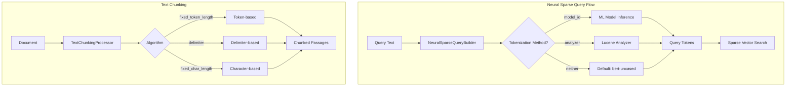

# Neural Search Enhancements

## Summary

OpenSearch v3.1.0 introduces significant enhancements to the neural-search plugin, including analyzer-based neural sparse queries for lightweight tokenization without ML model inference, a new character-based text chunking algorithm for non-space-delimited languages, and improved validation for neural sparse query parameters.

## Details

### What's New in v3.1.0

This release adds three key improvements to neural search capabilities:

1. **Analyzer-based Neural Sparse Query**: Enables neural sparse search using Lucene analyzers instead of ML models for query tokenization
2. **FixedCharLengthChunker**: New text chunking algorithm that splits text by character count rather than tokens
3. **Model ID and Analyzer Validation**: Prevents configuration conflicts by validating that both parameters aren't provided simultaneously

### Technical Changes

#### Architecture Changes



#### New Components

| Component | Description |
|-----------|-------------|
| `NeuralSparseQueryBuilder.analyzer` | New field to specify Lucene analyzer for query tokenization |
| `NeuralSparseQueryTwoPhaseInfo` | Encapsulates two-phase execution state for neural sparse queries |
| `FixedCharLengthChunker` | Chunker implementation that splits text by character count |

#### New Configuration

| Setting | Description | Default |
|---------|-------------|---------|
| `analyzer` (neural_sparse query) | Lucene analyzer name for tokenization | `bert-uncased` |
| `char_limit` (fixed_char_length) | Maximum characters per chunk | `2048` |
| `overlap_rate` (fixed_char_length) | Overlap percentage between chunks (0-0.5) | `0.0` |

### Usage Example

#### Analyzer-based Neural Sparse Query

```json
GET my-nlp-index/_search
{
  "query": {
    "neural_sparse": {
      "passage_embedding": {
        "query_text": "Hello world",
        "analyzer": "standard"
      }
    }
  }
}
```

#### Fixed Character Length Chunking

```json
PUT _ingest/pipeline/char-chunking-pipeline
{
  "processors": [
    {
      "text_chunking": {
        "algorithm": {
          "fixed_char_length": {
            "char_limit": 500,
            "overlap_rate": 0.2
          }
        },
        "field_map": {
          "content": "content_chunks"
        }
      }
    }
  ]
}
```

### Migration Notes

- If using neural sparse queries without specifying `model_id` or `analyzer`, the default `bert-uncased` analyzer is now used automatically on clusters running v3.0+
- Cannot specify both `model_id` and `analyzer` in the same query - choose one tokenization method
- The `neural_query_enricher` processor can set default model IDs, which may conflict with analyzer settings

## Limitations

- Analyzer-based queries require the analyzer to be available in the index settings
- The `bert-uncased` default analyzer is only available on clusters running OpenSearch 3.0+
- `fixed_char_length` chunker `overlap_rate` is limited to 0-0.5 range
- Token weights from analyzers must be encoded as 4-byte floats in the payload attribute

## References

### Documentation
- [Neural Sparse Query Documentation](https://docs.opensearch.org/3.0/query-dsl/specialized/neural-sparse/): Official docs
- [Text Chunking Processor Documentation](https://docs.opensearch.org/3.0/ingest-pipelines/processors/text-chunking/): Official docs

### Pull Requests
| PR | Description |
|----|-------------|
| [#1088](https://github.com/opensearch-project/neural-search/pull/1088) | Implement analyzer-based neural sparse query |
| [#1342](https://github.com/opensearch-project/neural-search/pull/1342) | Add FixedCharLengthChunker for character length-based chunking |
| [#1359](https://github.com/opensearch-project/neural-search/pull/1359) | Validate model_id and analyzer mutual exclusivity |

### Issues (Design / RFC)
- [Issue #1052](https://github.com/opensearch-project/neural-search/issues/1052): RFC for analyzer-based neural sparse query
- [Issue #1261](https://github.com/opensearch-project/neural-search/issues/1261): Proposal for RecursiveCharacterTextSplitter

## Related Feature Report

- [Text Chunking](../../../../features/neural-search/text-chunking.md)
- [Neural Sparse Search](../../../../features/neural-search/neural-sparse-search.md)
