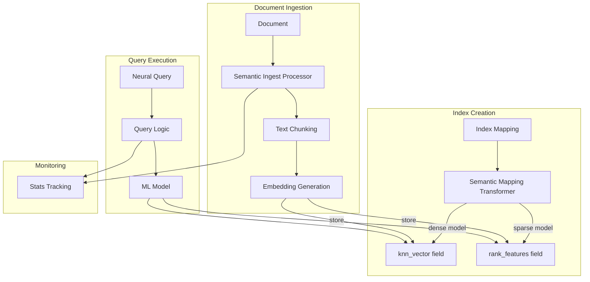

---
tags:
  - domain/search
  - component/server
  - indexing
  - k-nn
  - ml
  - neural-search
  - observability
  - search
---
# Semantic Field

## Summary

OpenSearch 3.1.0 introduces the `semantic` field type as a generally available feature, simplifying semantic search setup by automatically handling embedding generation, field mapping, and query execution. This release adds support for text chunking, search analyzers, configurable chunking/embedding options, and comprehensive stats tracking.

## Details

### What's New in v3.1.0

The semantic field type, introduced as a feature-flagged capability in v3.0.0, receives significant enhancements in v3.1.0:

1. **Semantic Mapping Transformer**: Automatically transforms index mappings to create the necessary embedding fields (`knn_vector` for dense models, `rank_features` for sparse models)
2. **Semantic Ingest Processor**: Handles text chunking and embedding generation during document ingestion
3. **Query Logic Implementation**: Enables `neural` queries directly on semantic fields without specifying model IDs
4. **Chunking Support**: Optional text chunking for long-form content with configurable algorithms
5. **Search Analyzer Support**: Built-in analyzers for sparse model queries at both field creation and query time
6. **Stats Tracking**: Comprehensive metrics for semantic field operations

### Technical Changes

#### Architecture



#### New Components

| Component | Description |
|-----------|-------------|
| Semantic Mapping Transformer | Transforms semantic field mappings to create underlying embedding fields |
| Semantic Ingest Processor | Handles chunking and embedding generation during ingestion |
| Query Logic | Resolves model configuration and executes neural queries on semantic fields |
| Search Analyzer Support | Enables built-in analyzers (`standard`, `bert-uncased`, `mbert-uncased`) for sparse queries |
| Stats Tracking | Tracks `semantic_field_executions` and `semantic_field_chunking_executions` |

#### New Configuration

| Setting | Description | Default |
|---------|-------------|---------|
| `chunking` | Enable/disable text chunking | `false` |
| `semantic_field_search_analyzer` | Analyzer for sparse query tokenization | None |
| `dense_embedding_config` | Custom settings for knn_vector field | Auto from model |
| `sparse_encoding_config` | Pruning configuration for sparse vectors | `max_ratio: 0.1` |
| `skip_existing_embedding` | Skip embedding generation if unchanged | `false` |
| `index.neural_search.semantic_ingest_batch_size` | Documents per batch during ingestion | `10` |

### Usage Example

```json
// Create index with semantic field (dense model)
PUT /my-nlp-index
{
  "settings": {
    "index.knn": true
  },
  "mappings": {
    "properties": {
      "text": {
        "type": "semantic",
        "model_id": "No0hhZcBnsM8JstbBkjQ"
      }
    }
  }
}

// Create index with chunking enabled
PUT /my-nlp-index-chunked
{
  "settings": {
    "index.knn": true
  },
  "mappings": {
    "properties": {
      "text": {
        "type": "semantic",
        "model_id": "No0hhZcBnsM8JstbBkjQ",
        "chunking": true
      }
    }
  }
}

// Create index with sparse model and search analyzer
PUT /my-sparse-index
{
  "mappings": {
    "properties": {
      "text": {
        "type": "semantic",
        "model_id": "R42oiZcBnsM8JstbUUgc",
        "semantic_field_search_analyzer": "bert-uncased"
      }
    }
  }
}

// Index document (embedding generated automatically)
PUT /my-nlp-index/_doc/1
{
  "text": "A wild animal races across an uncut field."
}

// Search using neural query (no model_id needed)
GET /my-nlp-index/_search
{
  "query": {
    "neural": {
      "text": {
        "query_text": "wild west",
        "k": 10
      }
    }
  }
}
```

### Migration Notes

- The semantic field is now generally available without feature flags
- Existing indexes with semantic fields from v3.0.0 continue to work
- To enable chunking on existing indexes, reindex with the new mapping

## Limitations

- Remote cluster support: Neural queries on semantic fields are not supported in cross-cluster search
- Mapping constraints: Does not support dynamic mapping; cannot use in `fields` section
- Repeated inference: Updates rerun inference even if content unchanged (unless `skip_existing_embedding` enabled)
- Two-phase processor: `neural_sparse_two_phase_processor` not supported when querying semantic field directly

## References

### Documentation
- [Documentation: Semantic Field Type](https://docs.opensearch.org/3.1/field-types/supported-field-types/semantic/)
- [Documentation: Semantic Search](https://docs.opensearch.org/3.1/vector-search/ai-search/semantic-search/)

### Blog Posts
- [Blog: The new semantic field](https://opensearch.org/blog/the-new-semantic-field-simplifying-semantic-search-in-opensearch/)
- [Blog: Advanced usage of the semantic field](https://opensearch.org/blog/advanced-usage-of-the-semantic-field-in-opensearch/)

### Pull Requests
| PR | Description |
|----|-------------|
| [#1276](https://github.com/opensearch-project/neural-search/pull/1276) | Add semantic mapping transformer |
| [#1309](https://github.com/opensearch-project/neural-search/pull/1309) | Add semantic ingest processor |
| [#1315](https://github.com/opensearch-project/neural-search/pull/1315) | Implement query logic for semantic field |
| [#1337](https://github.com/opensearch-project/neural-search/pull/1337) | Enable/disable chunking support |
| [#1341](https://github.com/opensearch-project/neural-search/pull/1341) | Add search analyzer support at query time |
| [#1367](https://github.com/opensearch-project/neural-search/pull/1367) | Support analyzer at semantic field creation time |
| [#1362](https://github.com/opensearch-project/neural-search/pull/1362) | Add stats tracking for semantic field |

### Issues (Design / RFC)
- [Issue #803](https://github.com/opensearch-project/neural-search/issues/803): Neural Search field type proposal

## Related Feature Report

- Full feature documentation
