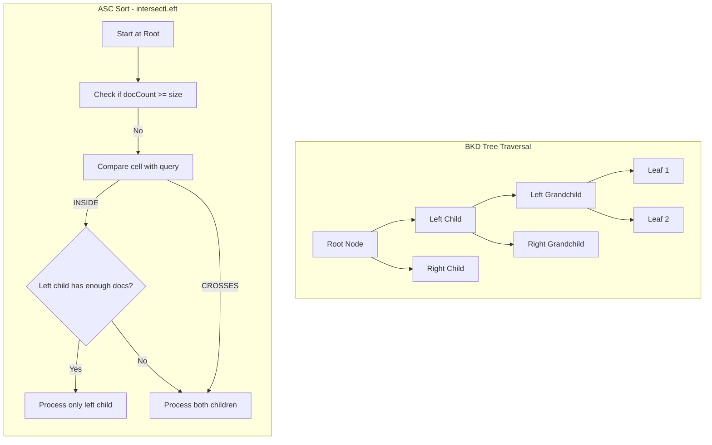

---
tags:
  - performance
  - search
---

# Approximation Framework Enhancement

## Summary

This release enhances the Approximation Framework by updating the BKD tree traversal logic to improve performance on skewed datasets. The enhancement introduces a DFS-based traversal strategy that enables early termination when collecting top-N results, significantly reducing query latency for sorted range queries on datasets with uneven data distribution like `http_logs`.

## Details

### What's New in v3.1.0

The v3.1.0 release improves the BKD tree traversal algorithm in `ApproximatePointRangeQuery` to handle skewed datasets more efficiently. The key changes include:

- **DFS-based traversal**: Replaced BFS-like traversal with depth-first search that naturally produces results in sorted order
- **Smart child skipping**: Added logic to skip subtrees when the current subtree contains enough documents to satisfy the query
- **Optimized cloning**: Reduced unnecessary `PointTree` cloning by only cloning when both children need to be visited

### Technical Changes

#### Architecture Changes



#### Key Algorithm Changes

| Aspect | Before v3.1.0 | After v3.1.0 |
|--------|---------------|--------------|
| Traversal Strategy | BFS-like, level by level | DFS, depth-first with early termination |
| Child Processing | Always visit both children | Skip right child if left has enough docs |
| Cloning | Clone before checking | Clone only when needed |
| Leaf Handling | Mixed with internal node logic | Separate early return for leaf nodes |

#### Modified Components

| Component | Description |
|-----------|-------------|
| `ApproximatePointRangeQuery.intersectLeft()` | Optimized for ASC sort with smart subtree skipping |
| `ApproximatePointRangeQuery.intersectRight()` | Optimized for DESC sort with smart subtree skipping |

### Usage Example

The optimization is automatically applied to range queries with sorting:

```json
{
  "query": {
    "range": {
      "@timestamp": {
        "gte": "2023-01-01T00:00:00",
        "lt": "2023-01-03T00:00:00"
      }
    }
  },
  "sort": [{ "@timestamp": "asc" }],
  "size": 100
}
```

For skewed datasets like `http_logs`, the DFS traversal finds the required documents in the leftmost leaves (for ASC) or rightmost leaves (for DESC) without visiting unnecessary subtrees.

### Performance Improvements

Based on benchmark results:

| Query Type | Dataset | Before | After | Improvement |
|------------|---------|--------|-------|-------------|
| `desc_sort_timestamp` (single segment) | http_logs | ~2,111 ms | ~6.1 ms | >99% |
| `asc_sort_timestamp` | http_logs | ~15 ms | ~8 ms | ~47% |
| `desc_sort_size` | http_logs | - | - | >80% |

### Migration Notes

No migration required. The optimization is applied automatically to eligible queries.

## Limitations

- The optimization is most effective on skewed datasets where data is unevenly distributed across the BKD tree
- Queries with `track_total_hits: true` or aggregations do not benefit from this optimization
- Performance gains depend on the data distribution and query selectivity

## References

### Documentation
- [Nightly Benchmark Dashboard](https://benchmarks.opensearch.org/): Performance metrics

### Blog Posts
- [OpenSearch Approximation Framework Blog](https://opensearch.org/blog/opensearch-approximation-framework/): Detailed explanation of the framework

### Pull Requests
| PR | Description |
|----|-------------|
| [#18439](https://github.com/opensearch-project/OpenSearch/pull/18439) | Approximation Framework Enhancement: Update the BKD traversal logic to improve the performance on skewed data |

### Issues (Design / RFC)
- [Issue #18341](https://github.com/opensearch-project/OpenSearch/issues/18341): Feature request for improving ApproximatePointRangeQuery traversal

## Related Feature Report

- [Full feature documentation](../../../../features/opensearch/opensearch-approximation-framework.md)
