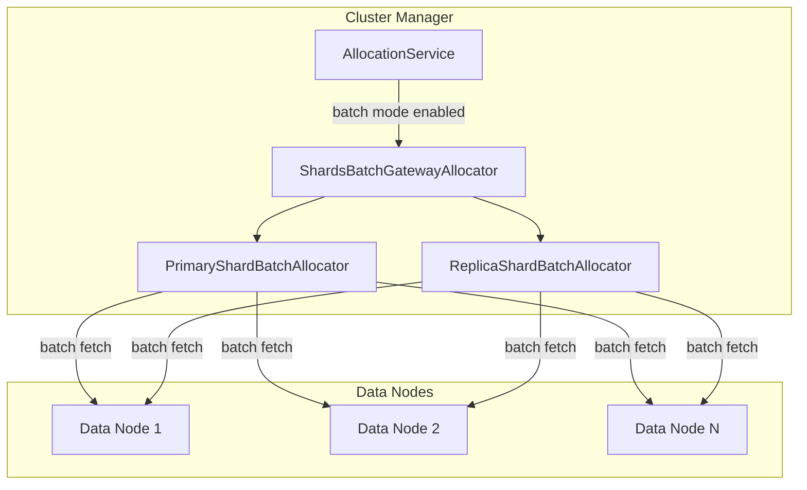

---
tags:
  - domain/core
  - component/server
  - indexing
---
# Async Shard Batch Fetch

## Summary

OpenSearch v3.1.0 enables Async Shard Batch Fetch by default, improving cluster manager resilience and reducing memory pressure during node restarts. This feature batches shard metadata fetch operations instead of fetching per-shard, significantly reducing the load on the cluster manager when handling large numbers of shards.

## Details

### What's New in v3.1.0

- **Enabled by default**: The `cluster.allocator.existing_shards_allocator.batch_enabled` setting now defaults to `true`
- **Updated timeout defaults**: Both `primary_allocator_timeout` and `replica_allocator_timeout` now default to 20 seconds (previously `-1` meaning no timeout)

### Technical Changes

#### Configuration Changes

| Setting | Old Default | New Default | Description |
|---------|-------------|-------------|-------------|
| `cluster.allocator.existing_shards_allocator.batch_enabled` | `false` | `true` | Enable batch mode for shard allocation |
| `cluster.allocator.shard.batch.primary_allocator_timeout` | `-1` (disabled) | `20s` | Timeout for primary shard batch allocation |
| `cluster.allocator.shard.batch.replica_allocator_timeout` | `-1` (disabled) | `20s` | Timeout for replica shard batch allocation |

#### Architecture



### Usage Example

The feature is now enabled by default. To disable it (not recommended):

```yaml
# opensearch.yml
cluster.allocator.existing_shards_allocator.batch_enabled: false
```

To adjust timeout settings:

```yaml
# opensearch.yml
cluster.allocator.shard.batch.primary_allocator_timeout: 30s
cluster.allocator.shard.batch.replica_allocator_timeout: 30s
```

### Migration Notes

- **Automatic enablement**: Clusters upgrading to v3.1.0 will automatically use batch mode
- **No action required**: The default settings are optimized for most use cases
- **Timeout behavior**: The 20-second default timeout prevents indefinite blocking during allocation

## Limitations

- **Known issue**: When multiple replica shards exist for the same shard ID (one INITIALIZING, one UNASSIGNED), the UNASSIGNED shard may be temporarily blocked until the INITIALIZING shard completes or times out ([#18098](https://github.com/opensearch-project/OpenSearch/issues/18098))
- **Minimum timeout**: The allocator timeout cannot be set below 20 seconds when enabled

## References

### Pull Requests
| PR | Description |
|----|-------------|
| [#18139](https://github.com/opensearch-project/OpenSearch/pull/18139) | Enabled Async Shard Batch Fetch by default |

### Issues (Design / RFC)
- [Issue #17713](https://github.com/opensearch-project/OpenSearch/issues/17713): Feature request to enable by default
- [Issue #18098](https://github.com/opensearch-project/OpenSearch/issues/18098): Known issue with replica shard assignment
- [Issue #8098](https://github.com/opensearch-project/OpenSearch/issues/8098): META - Cluster Manager Async Shard Fetch Revamp
- [Issue #5098](https://github.com/opensearch-project/OpenSearch/issues/5098): Original issue - Async shard fetches causing memory spikes

## Related Feature Report

- Async Shard Batch Fetch feature documentation
