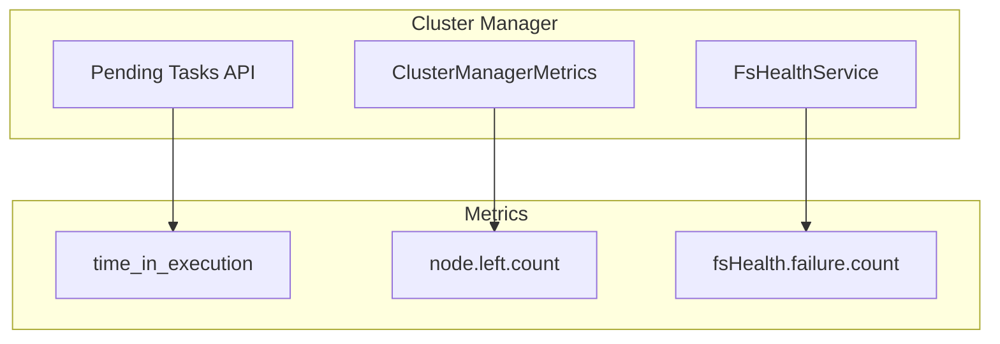

---
tags:
  - observability
---

# Cluster Manager Metrics

## Summary

OpenSearch v3.1.0 introduces three new metrics for cluster manager monitoring: task execution time in the pending tasks API, node-left counter with detailed reason tags, and filesystem health check failure counter. These metrics provide better visibility into cluster manager operations and help diagnose cluster stability issues.

## Details

### What's New in v3.1.0

This release adds three distinct metrics to improve cluster manager observability:

1. **Task Execution Time** (`time_in_execution`): Shows how long a pending task has been executing
2. **Node Left Counter** (`node.left.count`): Tracks when nodes leave the cluster with reason tags
3. **FS Health Check Failure Counter** (`fsHealth.failure.count`): Counts filesystem health check failures

### Technical Changes

#### Architecture Changes



#### New Components

| Component | Description |
|-----------|-------------|
| `TaskMetrics` | Tracks task execution start time in `PrioritizedOpenSearchThreadPoolExecutor` |
| `nodeLeftCounter` | Counter in `ClusterManagerMetrics` for node departure events |
| `fsHealthFailCounter` | Counter in `FsHealthService` for health check failures |

#### New API Response Fields

The `/_cluster/pending_tasks` API response now includes execution time:

| Field | Type | Description |
|-------|------|-------------|
| `time_in_execution_millis` | Long | Execution time in milliseconds (0 if not executing) |
| `time_in_execution` | String | Human-readable execution time |

#### New Metrics Tags

The `node.left.count` metric includes tags for detailed tracking:

| Tag | Description | Values |
|-----|-------------|--------|
| `follower_node_id` | ID of the node that left | Node ID string |
| `reason` | Reason for node departure | `disconnected`, `lagging`, `follower.check.fail`, `health.check.fail` |

### Usage Example

#### Pending Tasks with Execution Time

```bash
GET /_cluster/pending_tasks?pretty
```

Response:
```json
{
  "tasks": [
    {
      "insert_order": 5,
      "priority": "URGENT",
      "source": "create-index [my_new_index], cause [api]",
      "executing": true,
      "time_in_queue_millis": 19703,
      "time_in_queue": "19.7s",
      "time_in_execution_millis": 19701,
      "time_in_execution": "19.7s"
    },
    {
      "insert_order": 6,
      "priority": "URGENT",
      "source": "create-index [my_new_index_2], cause [api]",
      "executing": false,
      "time_in_queue_millis": 8999,
      "time_in_queue": "8.9s",
      "time_in_execution_millis": 0,
      "time_in_execution": "0s"
    }
  ]
}
```

#### Monitoring Node Left Events

The `node.left.count` metric can be monitored through the metrics framework with tags:
- `follower_node_id`: Identifies which node left
- `reason`: Explains why the node was removed (disconnected, lagging, follower check failure, health check failure)

#### Monitoring FS Health Failures

The `fsHealth.failure.count` metric increments each time a filesystem health check fails, helping identify storage issues affecting cluster stability.

### Migration Notes

- The new `time_in_execution` fields are automatically available in the pending tasks API
- Metrics are available through the OpenSearch metrics framework
- No configuration changes required to enable these metrics

## Limitations

- `time_in_execution` is only meaningful for tasks with `executing: true`
- Node left metrics require the metrics framework to be enabled
- FS health check metrics are only emitted when health checks are enabled

## References

### Documentation
- [CAT Pending Tasks API](https://docs.opensearch.org/3.0/api-reference/cat/cat-pending-tasks/): API documentation
- [Metrics Reference](https://docs.opensearch.org/3.0/monitoring-your-cluster/pa/reference/): Performance Analyzer metrics

### Pull Requests
| PR | Description |
|----|-------------|
| [#17780](https://github.com/opensearch-project/OpenSearch/pull/17780) | Added time_in_execution attribute to /_cluster/pending_tasks response |
| [#18421](https://github.com/opensearch-project/OpenSearch/pull/18421) | Added node-left metric to cluster manager |
| [#18435](https://github.com/opensearch-project/OpenSearch/pull/18435) | Added FS Health Check Failure metric |

### Issues (Design / RFC)
- [Issue #11818](https://github.com/opensearch-project/OpenSearch/issues/11818): Feature request for latency metrics of task execution

## Related Feature Report

- [Full feature documentation](../../../features/opensearch/opensearch-cluster-manager-metrics.md)
